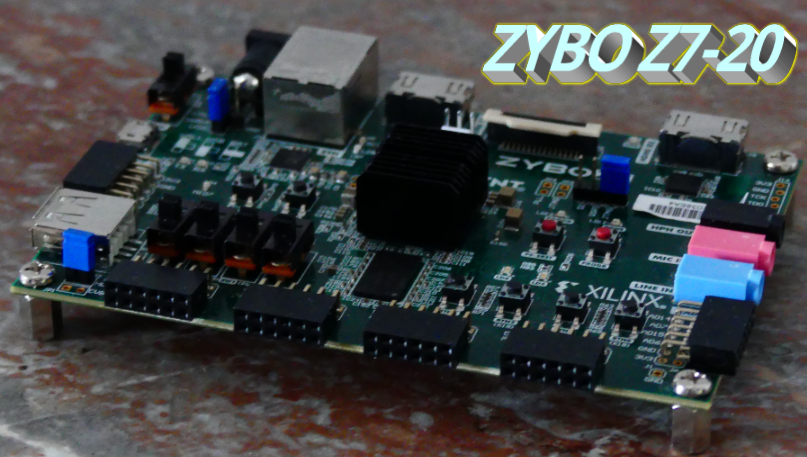
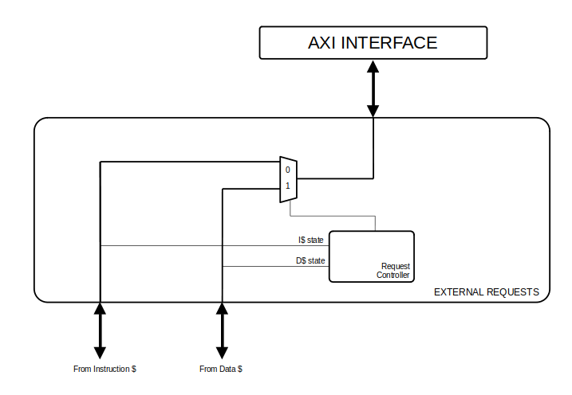
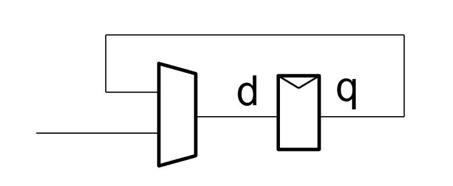
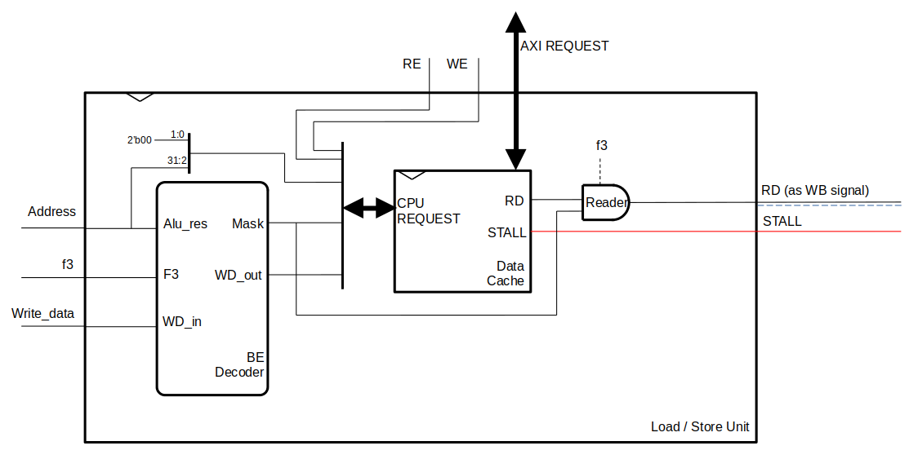
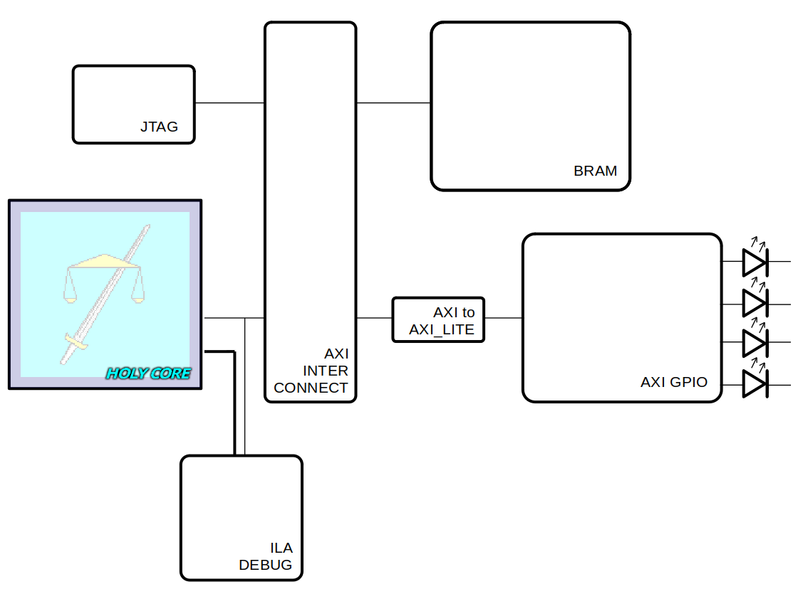
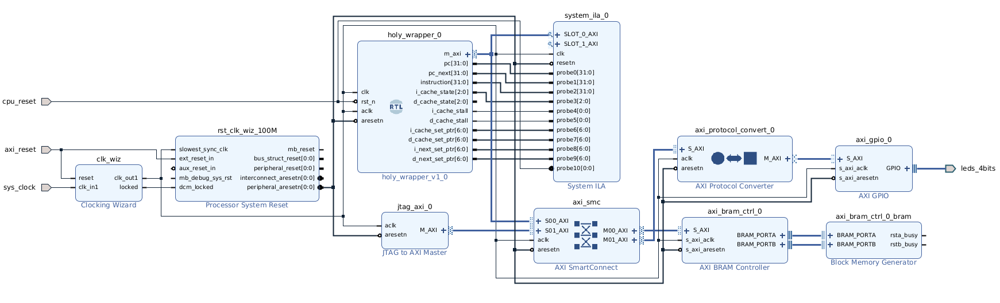
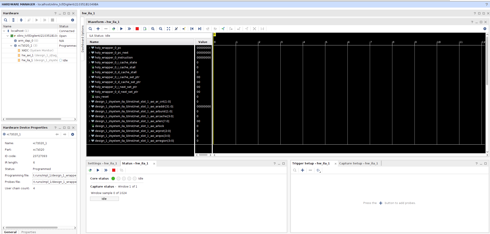

<!--
FPGA EDITION TUTORIAL 

AUTHOR :  BABIN-RIBY Hugo a.k.a. BRH

Plese refer to the LICENSE for legal details on this document

LAST EDIT : 12/2024
-->

# FPGA EDITION

Oh boy, making a whole core sure was a thing ! But now, the real part is about to start !

Making a RISC-V is a project many students do, but doing it by implementing the whole RV32I ISA and then actually start using it on FPGA is going beyond that !

Regardless of the fact that you made your own core or that you followed the HOLY CORE (single cycle edition) course, porting your core on FPGA is another story and will really deepen our understanding of the design by tackling the "*memory problem*".

Course Summary :

- Create an AXI Interface
- Create a cache that uses the AXI interface
- Integrate 2 cache in the CPU (data and instructions)
- Test the whole design
- Use the design on FPGA using external BRAM

We have a lot of work to do so let's get started !

## Prerequesites

Before starting, understand this course is not for complete beginners (even though I give as musch details as possible).

You will need to make sure you understood all the concepts given in the single cycle editions of the HOLY CORE course.

### Software

Regarding the software we'll use :

- Testbench : just like the single cycle
  - [cocotb](https://docs.cocotb.org/en/stable/) for assertions (Python)
  - [Verilator](https://docs.cocotb.org/en/stable/) for simulation (handled by cocotb, no need to learn it)
  - [cocotb AXI extension](https://github.com/alexforencich/cocotbext-axi) to simulate our AXI interfaces in cocotb (here is a [blog post](https://0bab1.github.io/BRH/posts/TIPS_FOR_COCOTB/) for tips on the subject)
  - GTKWave for waves debugging (simple wave viewer to open ```dump.vcd```, you can use whatever you like for this purpose)
- Synthesis and Implementation : Vivado (2023.2 on my side)

I really encourage you to read the [blog post](https://0bab1.github.io/BRH/posts/TIPS_FOR_COCOTB/) tips and the **setup manual** from the single edition of you stuggle with the sofware tech stack. Take a moment to setup everything right.

### Hardware

Towards the end of this *fpga editionù, I'll use a ZYBO Z7-20 embedding a Zynq. I won't use the Zynq's processing system and anything works just fine as long as it's programable logic so your average FPGA shall do.



Just note that even if I give a lot of details, the actual vivado TCL scripts and constraints file are for my board. It sould not be musch of a problem adapting these to your own needs though.

### More prerequesites

You also need to get up to speed on [AXI](https://youtu.be/1zw1HBsjDH8?feature=shared) if you did not already.

> You will find more resources at the end of this document.
> Note : some file names were changed and some new files were added for this *fpga edition*. I do **not** go over the adapation of ```Makefile```s and imports for simulation in this course.
> If you strugge on this technical matter, refer to the single cycle edition guide, the setup file or the resources. Happy learning !

## 0 : Before we start

Before we start, please refer to the **setup manual** at the root of the tutorials repo to setup the environement correctly.

Please also note that this is a follow-up to the *cingle cycle* edition of the holy core course. If you did not complete this first edition,
please consider completing it before the *fpga edition*.

As stated in the **setup manual**, we'll use some advanced cocotb features like extensions for testing a custom AXI interface. You can refer to [this blog post](https://0bab1.github.io/BRH/posts/TIPS_FOR_COCOTB/) to learn more.

## 1 : What do we need to use the core on FPGA

Using the core on FPGA is not trivial. I personally though it was *but it's not* :/ . **It is an entire problem on its own** !

Let's think about what our CPU needs to do for it to be "usable" on FPGA :

- We need to make a synthesizable design
- We need a way to do I/Os with
  - Memory
  - General purpose peripherals (LED, GPIO, UART, ...)

The first main problem we'll tackle in this course is the one of memory to have a working FPGA solution
and then hack our way around to play with GPIO towards the end.

You see, until now we mainly focused on the underlying logic of our core by trying to really understand what each instruction is supposed to do, thus
not paying any attetion to memory (Until now we implement memory as a simple array of words, **accessible in only 1 clock cycle**).

We conviniently forgot that memory is one of the largest problem in computer design (if not the actual largest) and is often the main bottleneck to improving computer nowdays.

Why is that ? Well I can only encourage you to read about it on the internet or in the *Digital Design and Computer Architecture: RISC-V Edition,
(section 8 MEMORY SYSTEMS)* book from sarrah & David Harris (I'll let you find a pdf ;) ).

In a nutshell, memory is slow. Like very slow. Between the time we request a memory operation on a piece of data (using ```lw```, ```sw```, ...) and the time the operation is successful, it can take 10, 100 or even more clock cycles ! (given our core is fast enough...)

We need some sort of actual substantial memory to call our core a core, and we might as well make it external ! This will allow us to :

- Use way more data and instructions.
- Initiate memory with whatever program we want on boot.
- Use whatever memory we want outside the core to store data & instructions.
- Learn a lot of things.

We can use whatever memory we want because the time it takes for data to come back (memory speed) is not really relevant.

Why ?

This is because all we'll do is simply **wait for it to arrive** by **stalling** the cpu when we are retrieving or writing data from said external memory ! (Thus making memory operation especially costly in terms of delay !).

To replace our old `memory.sv` logic and interface between the core and external memory, we'll use a **cache** (`$`) system :


> If you don't know what a cache is, refer to the resources to learn more and get yourself up to speed.

Before jumping into any form of design to make the stalling happen, we need to think about what does the cache do and how it actually holds data behind the scenes.

## 2 : Requierements for an "*extremely simple*" cache system

### Requirements

The cache is a way to keep some data in **tighly coupled memory** that we can access in 1 clock cycle, just like before in the *single cycle edition*'s `memory.sv`.

But we can't make this piece of memory very large.
Which is why we need to still be able to request data from external memory (aka *main memory*) when the requested data is not in the cache,
in which case the cache shall **stall** the core and start moving data around.

> Vocabulary : If we request memory operations on data that is not availible in the cache, it is called a **cache miss**, as opposed to a **cache hit**.

So, here is a recap of the requierments of our cache system :

- Have a small set of data (we'll use 128 32bits words).
- Shall be able to request external data if it does not have it.
- Shal be able to **STALL** the cpu when he is doing memory transactions with the main memory.

There are **many ways** to design a cache. Because this course is for learning purpose, we'll go for a very simple one, here is how it will work :

- The cache has 128 words slots called **cache lines** (i will also refer to it as **sets**). This forms a **cache table**, a whole memory block made 128 words (32bits) we can operate instantly without a stall.
- The cache table has a **valid** flag
  - This is because the **cache is invalid on startup**.
- The cache table has a **dirty** flag
  - If we write to the cache table, the data is nom **dirty**, meaning we'll have to write it back to main memory.
- The cache has a **tag** (also called **block**), which indicates what block of memory is actually stored in cache. More on that in the later sub-section.

> The way I descibed this cache makes it a **one way, direct mapped** cache with a **write-back** policy. I encourage you to do some reasearch on different cache policies to deepen your understandin of these terms.

### Concept of tag

When I say **tag**, I refer to the **memory region** (or **memory block**) contained in the cache.

An address is composed of 32bits so when the cache gets an address from the CPU, we decompose the address like so :

tag / block = address[31:9]     | set = address[8:2]    | offset = address[1:0]      |
------ | ------------ | ------- |
The main memory blocks from which the current 128 words in cache comes from  | 128 words in cache, (cache lines / sets) 7bites addresable | byte off set in the word |

So when the cpu asks to read the data in a certain addres, in order to know whether wa have the said data in the cache, we just check the the **incoming** request tag is the same as the one **currently loaded** into the cache (if yes, it's a **hit** !).

Here is the logic to determine the stall signal using the **CPU request** alongside the **cache table** signals.
Note that there is a **register** at the end to ensure that the stall assertion is asynchronous but the de-assertion is synchronous to ensure all AXI transactions (we'll go over that in the next section) are finished before starting fetching new instructions.


### Requesting data from main memory using AXI

So, how do we get our cache do get data from main memory ? Well for this kind of purpose, we need a standard interface to make sure we have support for a broad range of memory solution and controllers.

**AXI** sounds like the perfect solution for that. Even though it is not trivial, it is doable if we put our minds to it.

**AXI** is a standard interface that is covered by many documentation out there so I won't describe it extensively here. AXI is not extremely complex on paper and I **recommend** [this series of video](https://youtu.be/1zw1HBsjDH8?feature=shared) to really get up to speed on how it works (and check out the resources for more learning material).

**AXI** serves as a good on-chip communication interface. It is not meant for communications that goes beyond the chip
but this type of communication can still be done by using AXI to drive a controler that will in turn ensure
comunication with the outside world.

> I encourage you get yourself up to speed on AXI or at least get a refresher before actually implementing it in the later sections.

In this course, we'll use a minimal AXI implementation by using system verilog's ```interface``` syntax.

By "*minimal*" I mean we'll discard all of the ```lock, qos, cache, ....``` signals from AXI that are pretty much useless in small design.
They are also optional meaning it's bloat anyway.

We'll drive this axi interface by using a Finite State Machine that can modify the cache using a pointer and that produces a `cache_state` signal which we'll be able to use to know what the cache's AXI interface is currently doing :


We'll go over this design in more details later (Note this scheme is a simplification).

### Cache system integration to the core

The cache system now has a set of requirements on how it shall work and on how it shall comunicate with the external memory.
**But** how do we actually use it in our core ?

Well, just like the single cycle edition, we'll have :

- An **instructions** cache (Also called ```i_cache``` or ```i$```)
- A **data** cache (A lso called ```d_cache``` or ```d$```)

They both operate separatly and hold their own cache table. Here is what such an integration look like :


On this scheme I also added the stalling logic that simply makes sures the next PC is set to the current PC whenever the core stalls.

We also group all the **data memory** modules (*reader*, *BE_Decoder*, *d$*) in a same sub-module called `load/store unit` to make it more readable.

This integration raises a problem : we have 2 master axi interfaces going out of the core : one for the `i$`; and the other for the `d$`.

To address this problem, we can add a simple ```external_request_arbitrer``` module that will "*merge*" both M_AXI into one.

The ```external_request_arbitrer``` will simply work by probing the different cache state to route on or another cache M_AXI interface to the main core's M_AXI.



And here is the integration with the new external request arbitrer :


And that was the full core ! Now that we know the *why*, let's do the *howù shall we ?

## 3 : Actual cache design

Without further ado, with all these requirements in mind for our cache, let's start laying down the HDL design.

### Declaring an axi interface in system verilog

Before doing anything, we'll declare an axi interface in system verilog.
An **interface** is just a way to decalre ```input/output``` port in a separate structure to make the HDL shorter and avoid huge interface block when
describing a module's logic. We can also use **interfaces** declare different configurations (e.g. slave or master).

Declaring a large interface can be tedious at first but the good thing is you only need to do it once. Here is the interface declaration I'll use for this course :

```sv
// axi_if.sv

interface axi_if #(
    parameter ADDR_WIDTH = 32,
    parameter DATA_WIDTH = 32,
    parameter ID_WIDTH   = 4
);

    // Global AXI Signals
    logic aclk;
    logic aresetn;

    // Write Address Channel
    logic [ID_WIDTH-1:0] awid;
    logic [ADDR_WIDTH-1:0] awaddr;
    logic [7:0] awlen;         // Burst length
    logic [2:0] awsize;        // Burst size
    logic [1:0] awburst;       // Burst type
    logic [3:0] awqos;         // Quality of Service
    logic [1:0] awlock;        // Lock type
    logic awvalid;
    logic awready;

    // Write Data Channel
    logic [DATA_WIDTH-1:0] wdata;
    logic [(DATA_WIDTH/8)-1:0] wstrb;  // Write strobe
    logic wlast;                       // Last write in burst
    logic wvalid;
    logic wready;

    // Write Response Channel
    logic [ID_WIDTH-1:0] bid;
    logic [1:0] bresp;  // Write response
    logic bvalid;
    logic bready;

    // Read Address Channel
    logic [ID_WIDTH-1:0] arid;
    logic [ADDR_WIDTH-1:0] araddr;
    logic [7:0] arlen;         // Burst length
    logic [2:0] arsize;        // Burst size
    logic [1:0] arburst;       // Burst type
    logic [3:0] arqos;         // Quality of Service
    logic [1:0] arlock;        // Lock type
    logic arvalid;
    logic arready;

    // Read Data Channel
    logic [ID_WIDTH-1:0] rid;
    logic [DATA_WIDTH-1:0] rdata;
    logic [1:0] rresp;  // Read response
    logic rlast;        // Last read in burst
    logic rvalid;
    logic rready;

    // Define modport for master
    modport master (
        input  aclk,
        input  aresetn,

        // Write Address Channel
        output awid,
        output awaddr,
        output awlen,
        output awsize,
        output awburst,
        output awqos,
        output awlock,
        output awvalid,
        input  awready,

        // Write Data Channel
        output wdata,
        output wstrb,
        output wlast,
        output wvalid,
        input  wready,

        // Write Response Channel
        input  bid,
        input  bresp,
        input  bvalid,
        output bready,

        // Read Address Channel
        output arid,
        output araddr,
        output arlen,
        output arsize,
        output arburst,
        output arqos,
        output arlock,
        output arvalid,
        input  arready,

        // Read Data Channel
        input  rid,
        input  rdata,
        input  rresp,
        input  rlast,
        input  rvalid,
        output rready
    );

    // Define modport for slave
    modport slave (
        input  aclk,
        input  aresetn,

        // Write Address Channel
        input  awid,
        input  awaddr,
        input  awlen,
        input  awsize,
        input  awburst,
        input  awqos,
        input  awlock,
        input  awvalid,
        output awready,

        // Write Data Channel
        input  wdata,
        input  wstrb,
        input  wlast,
        input  wvalid,
        output wready,

        // Write Response Channel
        output bid,
        output bresp,
        output bvalid,
        input  bready,

        // Read Address Channel
        input  arid,
        input  araddr,
        input  arlen,
        input  arsize,
        input  arburst,
        input  arqos,
        input  arlock,
        input  arvalid,
        output arready,

        // Read Data Channel
        output rid,
        output rdata,
        output rresp,
        output rlast,
        output rvalid,
        input  rready
    );

endinterface
```

To use the interface, we simply have to add the ```axi_if.sv``` file as a source for whatever tool we are using (*synth, tb, ...*)
and declare use it normally in other file without an import statement.

As for me in the *HOLY CORE* code base, I added it to the `packages/` folder.

We will go over actual interface usage in a module during the later sections.
In the meantime, **you can check out this [article](https://www.chipverify.com/systemverilog/systemverilog-interface) which summarizes the subject pretty well**.

> Note : "*Advanced*" systemVerilog concepts like these are not supported by all EDA tools (E.g. Verilator, cocotb, ...). We'll use wrappers to tackle this problem. More on that later.

### Cache's HDL : AXI Finite State Machine and CPU interface

So as you may have understood by now, the cache has to be the intermediate between the slow main memory and the cpu,
each of them having their own way of talking to the cache.

- Main memory uses AXI (as a slave)
- CPU uses regular signals like before (```write_data```,```write_enable```, ...)

And when the cache is talking to memory, he simply signals the CPU to wait while he's in buisness by asserting `stall`.
Here is a reminder of the cache's structure :


To make the whole AXI thing work out, we'll build the cache around a Finite State Machine (FSM).
Here are the different states we'll use to describe *what* the cache is currently doing with main memory :

STATE | Description |
----- | ----------- |
IDLE  | IDLE is the state where the cache is not doing anything with the AXI interface. It is ready to get cpu's data request and ```stall``` is not asserted as long as the incomming request are hits |
SENDING_WRITE_REQ  | The cache had a miss and the cache was dirty. The cache is currently sending a write request to main memory. |
SENDING_WRITE_DATA  | The cache is sending data burst to main memory. |
WAITING_WRITE_RES  | The cache is waiting for write confirmation from memory. |
SENDING_READ_REQ  | The cache had a miss. We now send a read request to retrieve data from main memory back to cache. |
RECEIVING_READ_DATA  | We cache the data incomming from main memory. |

Here is how we can declare them in the `packages/holy_core_pkg.sv` file.

```sv
// holy_core_pkg.sv

package holy_core_pkg;

  typedef enum logic [2:0] { 
      IDLE,
      SENDING_WRITE_REQ,
      SENDING_WRITE_DATA,
      WAITING_WRITE_RES,
      SENDING_READ_REQ,
      RECEIVING_READ_DATA
  } cache_state_t;

  // ...

endpackage
```

### A word on clocking

You might have already guessed it : because our cache system serves as an interface between two systems running at different speed scales
(*CPU & Memory*), it runs on two clocks :

- ```aclk``` or "axi clock".
- ```clk``` or... well... ```clock``` but keep in mind it's the clock incomming from the cpu.

We'll actually use only 1 clock for timing reasons due to Clock Domain Crossing hazards (CDC), which is an entire problem on its own.

But still, let's make the effort to think about what a multi-clock design might have done :

- The **AXI state machine** will be driven by ```aclk```.
- The **axi signals** will be derived from **current state** and dirven by **comb logic**.
- The **data caching**, **data related signals** and **writes to cached lines** will be driven by ```clk``` as writes/reads depend on the CPU.

> If you want to try handling multple clock domains, this implies that "`aclk <= clk`" because if AXI clock is faster,
> then the data will not be written fast enough and the AXI RDATA bus will change before we can cache it.

### Actual HDL for the cache

With that in mind, we can start declaring the core of our cache :

- The CPU's interface with all the signals to take request from the CPU.
- The AXI interface (*that we declared in a separate file*).
- The **cache table**, containing the cache lines and the assocatiated signals (Valid, dirty)

You can refer to the previous cache schemes for guidance.

```sv
// holy_cache.sv

import holy_core_pkg::*;

module holy_cache #(
    parameter CACHE_SIZE = 128 // FIXED !
)(
    // CPU LOGIC CLOCK & RESET
    input logic clk,
    input logic rst_n,
    input logic aclk, // Axi clock, will be the same as clk in the end..

    // CPU Interface
    input logic [31:0] address,
    input logic [31:0] write_data,
    input logic read_enable,
    input logic write_enable,
    input logic [3:0]byte_enable,
    output logic [31:0] read_data,
    output logic cache_stall,

    // AXI Interface for external requests
    axi_if.master axi
);

    // Here is how a cache line is organized:
    // | DIRTY | VALID | BLOCK TAG | INDEX/SET | OFFSET | DATA |
    // | FLAGS         | ADDRESS INFOS                  | DATA |

    // CACHE TABLE DECLARATION (hardcoded for now, TODO : fix that)
    logic [CACHE_SIZE-1:0][31:0] cache_data;
    logic [31:9]                    cache_block_tag; // direct mapped cache so only one block, only one tag
    logic                           cache_valid;  // is the current block valid ?
    logic                           next_cache_valid;
    logic                           cache_dirty;
    logic                           next_cache_dirty;

endmodule
```

Regarding the ```next_cache_valid``` signal, it's simply a way to drive the next value of a signal using comb logic like so :



> Note that we are using the ```CACHE_SIZE``` parameter. It's fixed to 128 and it shall stay that way as every bit range will be hardcoded from now on.
> (Because I was a beginner and this was easier for me haha)

We will now continue describing the cache's logic by ensuring async reads and sync writes to the cache table using comb logic and
```clk``` driven sequential logic.

To do so we need to make sure that the cache has the data available and is not doing anything AXI-Wise.

So we'll declare some hit logic (based on the current tag and the incomming request's tag : ```req_tag```).

We'll also assert the state we're in is ```IDLE``` by declaring some states (even though we did not set their logic yet).

You can refer to the cache schemes for reference :


```sv
// holy_cache.sv

module holy_cache #(
    parameter CACHE_SIZE = 128 // FIXED !
)(
    // CPU LOGIC CLOCK & RESET
    input logic clk,
    input logic rst_n,
    input logic aclk, // Axi clock, will be the same as clk in the end..

    // CPU Interface
    input logic [31:0] address,
    input logic [31:0] write_data,
    input logic read_enable,
    input logic write_enable,
    input logic [3:0]byte_enable,
    output logic [31:0] read_data,
    output logic cache_stall,

    // AXI Interface for external requests
    axi_if.master axi
);

    // Here is how a cache line is organized:
    // | DIRTY | VALID | BLOCK TAG | INDEX/SET | OFFSET | DATA |
    // | FLAGS         | ADDRESS INFOS                  | DATA |

    // CACHE TABLE DECLARATION (hardcoded for now)
    logic [CACHE_SIZE-1:0][31:0]    cache_data;   // CHANGED FOR A PACKED ARRAY FOR FPGA IMPL
    logic [31:9]                    cache_block_tag;
    logic                           cache_valid;  // is the current block valid ?
    logic                           next_cache_valid;
    logic                           cache_dirty;
    logic                           next_cache_dirty;

    // INCOMING CACHE REQUEST SIGNALS
    logic [31:9]                    req_block_tag;
    assign req_block_tag = address[31:9];
    logic [8:2] req_index;
    assign req_index = address[8:2];
    
    wire [31:0] byte_enable_mask;
    assign byte_enable_mask = {
        {8{byte_enable[3]}},
        {8{byte_enable[2]}},
        {8{byte_enable[1]}},
        {8{byte_enable[0]}}
    };

    // HIT LOGIC
    logic hit;
    assign hit = (req_block_tag == cache_block_tag) && cache_valid;

    // =======================
    // CACHE LOGIC
    // =======================
    cache_state_t state, next_state;

    // MAIN CLOCK DRIVEN SEQ LOGIC
    always_ff @(posedge clk) begin
        if (~rst_n) begin
            cache_valid <= 1'b0;
            cache_dirty <= 1'b0;
            seq_stall <= 1'b0;
        end else begin
            cache_valid <= next_cache_valid;
            cache_dirty <= next_cache_dirty;

            if(hit & write_enable & state == IDLE) begin
                cache_data[req_index] <= 
                    (cache_data[req_index] & ~byte_enable_mask) |
                    (write_data & byte_enable_mask);
                cache_dirty <= 1'b1;
            end
            // More on this else if just below
            else if(axi.rvalid & state == RECEIVING_READ_DATA & axi.rready) begin
                // Write incomming axi read
                cache_data[set_ptr] <= axi.rdata;
                if(axi.rready & axi.rlast) begin
                    cache_block_tag <= req_block_tag;
                    cache_dirty <= 1'b0;
                end
            end
        end
    end

    // Async Read logic & AXI SIGNALS declaration !
    always_comb begin
        next_state = state; // Default
        next_cache_valid = cache_valid;
        next_cache_dirty = cache_dirty;
        axi.wlast = 1'b0;
        // the data being send is always set, "ready to go"
        axi.wdata = cache_data[set_ptr];
        cache_state = state;
        next_set_ptr = set_ptr;

        case (state)
            IDLE: begin
                // when idling, we simple read and write, no problem !
                if(read_enable && write_enable) begin
                    $display("E : CAN'T READ/WRITE AT THE SAME TIME");
                end

                else if(hit && read_enable) begin
                    // async reads
                    read_data = cache_data[req_index];
                end

                else if(hit && actual_write_enable) begin
                    next_cache_dirty = 1'b1;
                end
            end
      endcase

endmodule
```

> Side note : we just declared an interface in the I/Os using ```axi_if.master axi```. To do this you simply need to add the ```axi_if.sv```
> file as a source to your simulation or synth tool, no need to specify an include in systemVerilog.
> Please refer to the resources for further guidance.
> We can then acces this interface "real" I/O ports by using a **dot syntax** (eg ```axi.rlast``` for the ```LAST``` signal on the read channel).

As you can see, I also added in the logic that cache incomming AXI data when reading from main memory. ```set_ptr``` is driven by the AXI FSM logic we'll design afterwards.

Now our cache behaves more or less like the memory we had in the *single cycle edition* (expect we added some flags **and made the main table a packed array** for fpga implementation reasons). Before moving on to stalling,
let's add the states we talked about earlier :

Do do so we use **COMB LOGIC** to :

- Drive the **output** AXI signals
- Determine the ```next_state``` and ```set_ptr``` based on **input** AXI signals

We also use **SEQ LOGIC** driven by ```aclk```to :

- Incremet the ```set_ptr``` and switch ```state```.
- That's it (wanted to make a bullet list so I have to add this line)

> Note: Constant AXI signals are hardcoded towards the end of the following example.

Enough talking, here is a scheme of the FSM :


Of course, depending on the current state, we'll assert diffferent signals and when data is being transfered, we'll
have to modify the `set_ptr` accordingly.

And here is how we can implement it in SystemVerilog :

```sv
// holy_cache.sv

// ...

// Signals declaration
logic [6:0] set_ptr;
logic [6:0] next_set_ptr;

// Some signal I made to figure out if we're really writing
// (it was a just test, not mandatory)
logic actual_write_enable;
assign actual_write_enable = write_enable & |byte_enable;

// AXI CLOCK DRIVEN SEQ LOGIC
always_ff @(posedge aclk) begin
    if (~rst_n) begin
        state <= IDLE;
        set_ptr <= 7'd0;
    end else begin
        state <= next_state;
        set_ptr <= next_set_ptr;
    end
end

// Async Read logic & AXI SIGNALS declaration !
always_comb begin
    next_state = state; // Default
    next_cache_valid = cache_valid;
    axi.wlast = 1'b0;
    // the data being send is always set, "ready to go"
    axi.wdata = cache_data[set_ptr];
    cache_state = state;
    next_set_ptr = set_ptr;

    case (state)
        IDLE: begin
            // when idling, we simple read and write, no problem !
            if(read_enable && write_enable) begin
                $display("E : CAN'T READ/WRITE AT THE SAME TIME");
            end

            else if(hit && read_enable) begin
                // async reads
                read_data = cache_data[req_index];
            end

            else if(~hit && (read_enable ^ actual_write_enable)) begin
                // switch state to handle the MISS, if data is dirty, we have to write first
                case(cache_dirty)
                    1'b1 : next_state = SENDING_WRITE_REQ;
                    1'b0 : next_state = SENDING_READ_REQ;
                endcase
            end

            // IDLE AXI SIGNALS : no request
            // No write
            axi.awvalid = 1'b0;
            axi.wvalid = 1'b0;
            axi.bready = 1'b0;
            // No read
            axi.arvalid = 1'b0;
            axi.rready = 1'b0;

            // Defaults to 0
            next_set_ptr = 7'd0;
        end
        SENDING_WRITE_REQ: begin
            // HANDLE MISS WITH DIRTY CACHE : Update main memory first
            // when we send a write-back request, we write the CURRENT cache data !
            axi.awaddr = {cache_block_tag, 7'b0000000, 2'b00}; // tag, set, offset
            
            if(axi.awready) next_state = SENDING_WRITE_DATA;

            // SENDING_WRITE_REQ AXI SIGNALS : address request
            // No write
            axi.awvalid = 1'b1;
            axi.wvalid = 1'b0;
            axi.bready = 1'b0;
            // No read
            axi.arvalid = 1'b0;
            axi.rready = 1'b0;
        end

        SENDING_WRITE_DATA : begin

            if(axi.wready) begin
                next_set_ptr = set_ptr + 1;
            end
            
            if(set_ptr == 7'd127) begin
                axi.wlast = 1'b1;
                if(axi.wready) begin
                    next_state = WAITING_WRITE_RES;
                end
            end

            // SENDING_WRITE_DATA AXI SIGNALS : sending data
            // Write stuff
            axi.awvalid = 1'b0;
            axi.wvalid = 1'b1;
            axi.bready = 1'b0;
            // No read
            axi.arvalid = 1'b0;
            axi.rready = 1'b0;
        end

        WAITING_WRITE_RES: begin
            if(axi.bvalid && (axi.bresp == 2'b00)) begin// if response is OKAY
                next_state = SENDING_READ_REQ;
            end else if(axi.bvalid && (axi.bresp != 2'b00)) begin
                $display("ERROR WRTING TO MAIN MEMORY !");
            end

            // SENDING_WRITE_DATA AXI SIGNALS : ready for response
            // No write
            axi.awvalid = 1'b0;
            axi.wvalid = 1'b0;
            axi.bready = 1'b1;
            // No read
            axi.arvalid = 1'b0;
            axi.rready = 1'b0;
        end

        SENDING_READ_REQ : begin
            // HANDLE MISS : Read
            axi.araddr = {req_block_tag, 7'b0000000, 2'b00}; // tag, set, offset
            
            if(axi.arready) begin
                next_state = RECEIVING_READ_DATA;
            end

            // SENDING_READ_REQ AXI SIGNALS : address request
            // No write
            axi.awvalid = 1'b0;
            axi.wvalid = 1'b0;
            axi.bready = 1'b0;
            // No read but address is okay
            axi.arvalid = 1'b1;
            axi.rready = 1'b0;
        end

        RECEIVING_READ_DATA: begin
    
            if (axi.rvalid) begin
                // Increment pointer on valid data
                next_set_ptr = set_ptr + 1;
        
                if (axi.rlast) begin
                    // Transition to IDLE on the last beat
                    next_state = IDLE;
                    next_cache_valid = 1'b1;
                end
            end
        
            // AXI Signals
            axi.awvalid = 1'b0;
            axi.wvalid = 1'b0;
            axi.bready = 1'b0;
            axi.arvalid = 1'b0;
            axi.rready = 1'b1;
        end
        
        default : begin
            $display("CACHE FSM SATETE ERROR");
        end
    endcase
end

// Invariant AXI Signals

// ADDRESS CHANNELS
// -----------------
// WRITE Burst sizes are fixed type & len
assign axi.awlen = CACHE_SIZE-1; // full cache reloaded each time
assign axi.awsize = 3'b010; // 2^<awsize> = 2^2 = 4 Bytes
assign axi.awburst = 2'b01; // INCREMENT
// READ Burst sizes are fixed type & len
assign axi.arlen = CACHE_SIZE-1; // full cache reloaded each time
assign axi.arsize = 3'b010; // 2^<arsize> = 2^2 = 4 Bytes
assign axi.arburst = 2'b01; // INCREMENT
// W/R ids are always 0 (TODO maybe not)
assign axi.awid = 4'b0000;
assign axi.arid = 4'b0000;

// DATA CHANNELS
// -----------------
// Write data
assign axi.wstrb = 4'b1111; // We handle data masking in cache itself

// ...
```

This chunk of code can be overwhelming if you did not study AXI a little bit. If so, take a bit of time to get yourself
up to speed (see resources section).

Once you put both this FSM and the previous logic together, we get a cache module ! You can refer to the *HOLY CORE*
code base for the full code.

### Testing the cache module

> To design testbenches, we'll use cocotb with verilator in the backend please refer to the resource at
> the end of this document if you need guidance on this.

To test our cache logic, we'll use [**cocotbext.axi**](https://github.com/alexforencich/cocotbext-axi).
It will give us access to a pre-made AXI slave memory to test our cache AXI behavior in simulation.

As we are using an interface, which verilator does not like to see in a top-module I/O for some
reason, we need to declare a wrapper for our cache.

The wrapper's role is simply to "demux" our axi inteface to a bunch of I/Os ports with the same
```m_axi``` prefix. If you want an example, check out [this blog post](https://0bab1.github.io/BRH/posts/TIPS_FOR_COCOTB/).

The blog post I just mentionned will guide you through the project setup and use of cocotbext.axi
with wrappers if you need guidance on the subject.

We can now start working on the python testbench by starting with helper functions and constants declarations  :

- Constants for cache states, clock perdiods & cache + memory size
- Helper functions to read & dump the cache table (packed array is not really easy to work with otherwise)
- And a last one to generate ramdom words for memory init

```python
# test_holy_cache.py

# Other usual imports...
from cocotbext.axi import AxiBus, AxiRam

# https://github.com/alexforencich/cocotbext-axi
DEADLOCK_THRESHOLD = 10e3

# CACHE STATES CST
IDLE                = 0b000
SENDING_WRITE_REQ   = 0b001
SENDING_WRITE_DATA  = 0b010
WAITING_WRITE_RES   = 0b011
SENDING_READ_REQ    = 0b100
RECEIVING_READ_DATA = 0b101

# clock perdiods, if different, make sure AXI_PERIOD >= CPU_PERIOD
AXI_PERIOD = 10
CPU_PERIOD = 10

# Cach stuff
SIZE = 4096 # 4kB adressable by 3B/12b
CACHE_SIZE = 128 #7 b addressable, SYNC IT WITH THE ACTUAL TB CACHE SIZE

def generate_random_bytes(length):
    return bytes([random.randint(0, 255) for _ in range(length)])

def read_cache(cache_data, line) :
    """To read cache_data, because the packed array makes it an array of bits"""
    l = 127 - line
    return (int(str(cache_data.value[32*l:(32*l)+31]),2))

def dump_cache(cache_data, line) -> int :
    if line == "*" :
        for line_a in range(128): # for fixed cache size of 128
            l = 127 - line_a
            print(hex(int(str(cache_data.value[32*l:(32*l)+31]),2)))
    else :
        print(hex(int(str(cache_data.value[32*line:(32*line)+31]),2)))

# ...
```

And we also create a coroutine that will reset the cache by generating an incomming reset from the CPU :

```python
# test_holy_cache.py

@cocotb.coroutine
async def reset(dut):
    await RisingEdge(dut.clk)
    dut.rst_n.value = 0
    dut.cpu_write_enable.value = 0
    dut.cpu_address.value = 0
    dut.cpu_write_data.value = 0
    dut.cpu_byte_enable.value = 0
    await RisingEdge(dut.clk)
    await RisingEdge(dut.clk)
    dut.rst_n.value = 1

    print("reset done !")

    # Assert all is 0 after reset
    for cache_line in range(dut.cache_system.CACHE_SIZE.value):
        assert read_cache(dut.cache_system.cache_data, cache_line) == 0
```

Once all the helper function are declared, we can declare the main testing function and intialise our system.
You can refer tothe resources if you want clarifications on how I setup the tests and how I use the AXI ramdomslave
from **cocotb.ext**.

```python
# test_holy_cache.py

@cocotb.test()
async def main_test(dut):

    # ==================================
    # CLOCKS & RAM DECLARATION
    # ==================================

    cocotb.start_soon(Clock(dut.clk, CPU_PERIOD, units="ns").start())
    cocotb.start_soon(Clock(dut.aclk, AXI_PERIOD, units="ns").start())
    axi_ram_slave = AxiRam(
        AxiBus.from_prefix(dut, "axi"),
        dut.aclk,
        dut.rst_n,
        size=SIZE,
        reset_active_level=False
    )
    await RisingEdge(dut.clk)
    await reset(dut)

    # ==================================
    # MEMORY INIT WITH RANDOM VALUES
    # ==================================

    mem_golden_ref = []
    for address in range(0,SIZE,4):
        word = generate_random_bytes(4)
        axi_ram_slave.write(address, word)
        mem_golden_ref.append(word)

    for address in range(0,SIZE,4):
        assert mem_golden_ref[int(address/4)] == axi_ram_slave.read(address, 4)
```

Everything is now set up ! We can start testing the cache behavior by testing different scenarios :

- Verify cache's initial state
- READ if cache misses (when it's invalid on startup)
- READ if cache does not misses
- WRITE if cache does not misss
- WRITE BACK when read after cache is dirty
- WRITE if cache misses

If you did the **single_cycle** edition and you understood the testbench setupd, then the following code is pretty self-explainatory.
Just keep in mind that we (theorically) have no control over the memory, and it just reacts to our axi signals (which is a great thing to test our design !).

```python
# test_holy_cache.py

# previous imports, helper functions & constants

@cocotb.test()
async def main_test(dut):

    # system init ...

    # ==================================
    # INIT STATE CHECKS
    # ==================================

    assert dut.cache_system.state.value == IDLE
    assert dut.cache_system.next_state.value == IDLE

    dut.cpu_read_enable.value = 0b0
    dut.cpu_write_enable.value = 0b0
    await Timer(1, units="ps") # let the signals "propagate"

    dut.cpu_address.value = 0x000
    dut.cpu_read_enable.value = 0b0
    dut.cpu_write_enable.value = 0b0
    await Timer(1, units="ps") # let the signals "propagate"

    assert dut.cache_system.cache_stall.value == 0b0
    assert dut.cache_system.next_state.value == IDLE

    # ==================================
    # READ & MISS TEST
    # ==================================

    dut.cpu_address.value = 0x000
    dut.cpu_read_enable.value = 0b1
    await Timer(1, units="ps")

    assert dut.cpu_cache_stall.value == 0b1 # async cache miss
    assert dut.cache_system.state.value == IDLE
    assert dut.cache_system.next_state.value == SENDING_READ_REQ

    await RisingEdge(dut.aclk) # STATE SWITCH
    await Timer(1, units="ns")

    # Verify constant axi signals
    assert dut.cache_system.state.value == SENDING_READ_REQ
    assert dut.axi_arid.value == 0b0000
    assert dut.axi_araddr.value == 0x000 
    assert dut.axi_arlen.value == 0x07F
    assert dut.axi_arsize.value == 0b010
    assert dut.axi_arburst.value == 0b01 # increment mode
    assert dut.axi_arvalid.value == 0b1

    assert dut.axi_arready.value == 0b1

    assert dut.cache_system.next_state.value == RECEIVING_READ_DATA

    await RisingEdge(dut.aclk) # STATE SWITCH
    await Timer(1, units="ns")

    assert dut.cache_system.state.value == RECEIVING_READ_DATA
    
    assert dut.axi_arvalid.value == 0b0
    assert dut.axi_rready.value == 0b1

    i = 0
    while( (not dut.axi_rvalid.value == 1) and (not i > DEADLOCK_THRESHOLD)) :
        await RisingEdge(dut.aclk)
        await Timer(1, units="ns")

    i = 0
    while( i < CACHE_SIZE - 1) :
        # Check if the handshake is okay
        if((dut.axi_rvalid.value == 1) and (dut.axi_rready.value == 1)) :
            # a word is sent to cache and is store in the cache block
            assert dut.cache_system.set_ptr.value == i
            i += 1

        assert dut.axi_rlast.value == 0b0
        assert dut.cache_system.cache_stall.value == 0b1
        await RisingEdge(dut.aclk)
        await Timer(1, units="ps")

    # set_ptr = 126, set_ptr = 127 is the last
    assert dut.axi_rvalid.value == 0b1 and dut.axi_rready.value == 0b1
    assert dut.axi_rlast.value == 0b1
    assert dut.cache_system.next_state.value == IDLE

    await RisingEdge(dut.aclk) # STATE SWITCH
    await Timer(1, units="ps")
    
    assert dut.cache_system.state.value == IDLE
    assert dut.cache_system.cache_stall.value == 0b0
    #======
    dut.axi_rlast.value = 0b0 # THIS IS VERY SKETCHY ! TRY TO FIX THAT LATER ON !
    await Timer(1, units="ps")
    #======
    assert dut.axi_rlast.value == 0b0

    # ==================================
    # CACHE READ & NO MISS TEST
    # ==================================

    addr = 0x000
    for i in range(CACHE_SIZE) :
        # Check againts our memory golden ref
        dut.cpu_address.value = addr
        await Timer(1, units="ps")
        assert dut.cache_system.cache_stall == 0b0
        assert dut.cache_system.read_data.value == int.from_bytes(mem_golden_ref[int(addr/4)], byteorder='little')
        assert dut.cache_system.set_ptr.value == 0

        addr += 0x4
        await RisingEdge(dut.clk)
        await Timer(1, units="ps")

    assert addr == CACHE_SIZE * 4 

    # We are ouside of cache bounds. If we try to read now, the cache should miss.
    dut.cpu_address.value = addr
    await Timer(1, units="ps") # let the new address propagate ...

    assert dut.cache_system.cache_stall == 0b1
    assert dut.cache_system.next_state.value == SENDING_READ_REQ

    # ==================================
    # DIRTY CACHE & WRITE BACK & READ TEST
    # ==================================

    dut.cpu_address.value = 0x0C
    dut.cpu_byte_enable.value = 0b0011 # We write an halfword to cache
    dut.cpu_write_enable.value = 0b1
    dut.cpu_read_enable.value = 0b0
    dut.cpu_write_data.value = 0xDEADBEEF 
    # check we are not stalling and that the cache will accept the write
    await Timer(1, units="ns")
    assert dut.cache_system.cache_stall.value == 0b0

    # Build expected value for later assertion
    expected_data = axi_ram_slave.read(0x0C, 4)
    expected_data = int.from_bytes(expected_data, byteorder='little') # convert to int for manip & assertions
    expected_data &= 0xFFFF0000
    expected_data |= (0xDEABEEF & 0x0000FFFF)

    # CPU Writes cache
    await RisingEdge(dut.clk)
    await Timer(1, units="ns")

    # Stop writing
    dut.cpu_write_enable.value = 0b0
    await Timer(1, units="ns")

    assert read_cache(dut.cache_system.cache_data,int(0x0C/4)) == expected_data
    assert dut.cache_system.cache_dirty.value == 0b1

    wb_test_addr = 0xF0C
    dut.cpu_address.value = wb_test_addr # Not in cache
    dut.cpu_read_enable.value = 0b1
    await Timer(1, units="ns") 

    # Cache miss : The cache should send a write request because it's now dirty
    assert dut.cache_system.next_state.value == SENDING_WRITE_REQ

    await RisingEdge(dut.aclk) # STATE SWITCH
    await Timer(1, units="ns")

    assert dut.cache_system.state.value == SENDING_WRITE_REQ

    assert dut.axi_awvalid.value == 0b1
    # awaddr writes back the current cached tag, i.e. 0x000
    assert dut.axi_awaddr.value == 0x000 

    # check the w channels constants
    assert dut.axi_awid.value == 0b0000
    assert dut.axi_awlen.value == 0x07F
    assert dut.axi_awsize.value == 0b010
    assert dut.axi_awburst.value == 0b01 # increment mode
    assert dut.axi_wstrb.value == 0b1111 # no masking (handled by core)

    assert dut.axi_awready.value == 0b1

    assert dut.cache_system.next_state.value == SENDING_WRITE_DATA

    await RisingEdge(dut.aclk) # STATE SWITCH
    await Timer(1, units="ns")

    assert dut.cache_system.state.value == SENDING_WRITE_DATA

    # Write back transaction

    i = 0
    addr = 0x000
    while( i < CACHE_SIZE - 1) :
        # Check if the handshake is okay
        if((dut.axi_wvalid.value == 1) and (dut.axi_wready.value == 1)) :
            assert dut.cache_system.set_ptr.value == i
            i += 1
            # Update golden ref memory !
            mem_golden_ref[int(addr/4)] = int(dut.axi_wdata.value).to_bytes(4, 'little')
            addr += 4

        assert dut.axi_wlast.value == 0b0
        assert dut.cache_system.cache_stall.value == 0b1
        await RisingEdge(dut.aclk)
        await Timer(1, units="ns")

    # LAST write
    assert (dut.axi_wvalid.value == 1) and (dut.axi_wready.value == 1)
    assert dut.axi_wlast.value == 0b1
    assert dut.cache_system.next_state.value == WAITING_WRITE_RES

    await RisingEdge(dut.aclk) # STATE SWITCH !
    await Timer(1, units="ns")

    assert dut.cache_system.state.value == WAITING_WRITE_RES
    assert dut.axi_wvalid.value == 0b0
    assert dut.axi_bready.value == 0b1

    i = 0
    while (not dut.axi_bvalid.value == 0b1) and (not i > DEADLOCK_THRESHOLD):
        await RisingEdge(dut.aclk)
        await Timer(1, units="ns")
        i += 1

    assert dut.axi_bvalid.value == 0b1
    assert dut.axi_bresp.value == 0b00 # OKAY

    # Check if memory was well written using golden ref
    for address in range(0,SIZE,4):
        assert mem_golden_ref[int(address/4)] == axi_ram_slave.read(address, 4)

    
    # After write_back is done, we can read
    assert dut.cache_system.next_state.value == SENDING_READ_REQ

    await RisingEdge(dut.aclk) # STATE SWITCH !
    await Timer(1, units="ns")

    assert dut.cache_system.state.value == SENDING_READ_REQ

    # assert the handshake is okay
    assert dut.axi_arvalid.value == 0b1
    assert dut.axi_arready.value == 0b1
    assert dut.axi_araddr.value == wb_test_addr & 0b111_0000000_00

    assert dut.cache_system.next_state.value == RECEIVING_READ_DATA

    await RisingEdge(dut.aclk) # STATE SWITCH !
    await Timer(1, units="ns")

    assert dut.cache_system.state.value == RECEIVING_READ_DATA
    assert dut.axi_rvalid.value == 0b0
    assert dut.axi_rlast.value == 0b0

    i = 0
    while( i < CACHE_SIZE - 1) :
        if((dut.axi_rvalid.value == 1) and (dut.axi_rready.value == 1)) :
            assert dut.cache_system.set_ptr.value == i
            i += 1

        assert dut.axi_rlast.value == 0b0
        assert dut.cache_system.cache_stall.value == 0b1 
        await RisingEdge(dut.aclk)
        await Timer(1, units="ns")

    assert dut.axi_rvalid.value == 0b1
    assert dut.axi_rready.value == 0b1
    assert dut.axi_rlast.value == 0b1
    assert dut.cache_system.next_state.value == IDLE

    await RisingEdge(dut.aclk) # STATE SWITCH
    await Timer(1, units="ns")
    
    assert dut.cache_system.state.value == IDLE
    assert dut.cache_system.cache_stall.value == 0b0
    dut.axi_rlast.value = 0b0 # todo : rlast matter to handle

    # ==================================
    # WRITE CACHE MISS TEST
    # ==================================

    dut.cpu_address.value = 0x008 # NOT IN CACHE
    dut.cpu_byte_enable.value = 0b1111
    dut.cpu_write_enable.value = 0b1
    dut.cpu_read_enable.value = 0b0
    dut.cpu_write_data.value = 0xFFFFFFFF
    await Timer(1, units="ns")

    assert dut.cache_system.next_state.value == SENDING_READ_REQ
    assert dut.cpu_cache_stall.value == 0b1 # miss

    await RisingEdge(dut.aclk) # STATE SWITCH !
    await Timer(1, units="ns")

    assert dut.cache_system.state.value == SENDING_READ_REQ
    assert dut.axi_arvalid.value == 0b1
    assert dut.axi_arready.value == 0b1
    assert dut.axi_araddr.value == 0x000

    assert dut.cache_system.next_state.value == RECEIVING_READ_DATA

    await RisingEdge(dut.aclk) # STATE SWITCH !
    await Timer(1, units="ns")

    assert dut.cache_system.state.value == RECEIVING_READ_DATA
    assert dut.axi_rvalid.value == 0b0
    assert dut.axi_rlast.value == 0b0

    i = 0
    while( i < CACHE_SIZE - 1) :
        if((dut.axi_rvalid.value == 1) and (dut.axi_rready.value == 1)) :
            assert dut.cache_system.set_ptr.value == i
            i += 1

        assert dut.axi_rlast.value == 0b0
        assert dut.cache_system.cache_stall.value == 0b1 
        await RisingEdge(dut.aclk)
        await Timer(1, units="ns")

    assert dut.axi_rvalid.value == 0b1
    assert dut.axi_rready.value == 0b1
    assert dut.axi_rlast.value == 0b1
    assert dut.cache_system.cache_stall.value == 0b1 
    assert dut.cache_system.next_state.value == IDLE

    await RisingEdge(dut.aclk) # STATE SWITCH !
    await Timer(1, units="ns")

    assert dut.cache_system.state.value == IDLE
    assert dut.cache_system.cache_stall.value == 0b0

    # check our write signals and data isn't written yet
    assert dut.cpu_address.value == 0x008
    assert dut.cpu_byte_enable.value == 0b1111
    assert dut.cpu_write_enable.value == 0b1
    assert dut.cpu_read_enable.value == 0b0 
    assert dut.cpu_write_data.value == 0xFFFFFFFF
    assert not read_cache(dut.cache_system.cache_data,int(8/4)) == 0xFFFFFFFF

    assert dut.cache_system.next_state.value == IDLE

    await RisingEdge(dut.clk) # write 0xFFFFFFFF @ 0x4
    await Timer(3, units="ns")

    dut.cpu_write_enable.value = 0b0
    await Timer(1, units="ns")

    assert read_cache(dut.cache_system.cache_data,int(8/4)) == 0xFFFFFFFF

```

Once the design passes our basic testbench, we can start to implement it in the core.

## 4 : Cache integration (Abritrer)

### External request arbitrer

To integrate our cache design to the core, we have to agree on some design choices :

- We use 2 caches
  - One for data (```D$```)
  - The other instructions (```I$```)
- We'll only have one external axi interface going out from the core

Given there is one AXI interface per cache and only one going out of the core, we need to figure out a way to "merge" both interface into one.

Of course merging, two AXI interface toghteher is simply not possible but what we can do, is have a sort of **MUX** that either connects the instruction's AXI interface to the outside or the data's one.

It would look like this :

.

One question now remains : **How do we decide what AXI interface gets to get muxes to the outside ?**. To answer, we can first make some assumptions

1. Both outgoing interfaces are **masters**, meaning the outside world (slaves) will never send requests.
2. We can know what master is sending a request to the peripherals based on the corresponding ```cache_state```.
3. If a cache is **not** in ```IDLE``` mode, we grant him access to the outside.
4. If both caches need data, we prioritize the instruction cache.

> Note that the choice of prioritizing the **I$** is arbitrary because caches stall the core when they are requesting data.

We now introduce some control logic for our custom interconnect :


Here is the verilog description of the logic for this module :

```sv
// external_req_arbitrer.sv

import holy_core_pkg::*;

module external_req_arbitrer (
    // Master outgoing interface
    axi_if.master m_axi,

    // SLAVE axi ifs for I$ and D$
    axi_if.slave s_axi_instr,
    input cache_state_t i_cache_state,
    axi_if.slave s_axi_data,
    input cache_state_t d_cache_state
);

localparam CACHE_SIZE = 128;

// The request controller simply muxes the transactions until they are done using state info from the caches

always_comb begin : main_axi_mux
    // Default values set to 0s
    m_axi.awaddr = 0;
    m_axi.awvalid = 0;
    m_axi.wdata = 0;
    m_axi.wlast = 0;
    m_axi.wvalid = 0;
    m_axi.bready = 0;
    m_axi.araddr = 0;
    m_axi.arvalid = 0;
    m_axi.rready = 0;

    // Invariant AXI Signals get hardcoded values

    m_axi.awlen = CACHE_SIZE-1; // num of WORDS (packects of 4B)
    m_axi.awsize = 3'b010; 
    m_axi.awburst = 2'b01;
    m_axi.arlen = CACHE_SIZE-1;
    m_axi.arsize = 3'b010;
    m_axi.arburst = 2'b01;
    m_axi.awid = 4'b0000;
    m_axi.arid = 4'b0000;
    m_axi.wstrb = 4'b1111;

    s_axi_instr.awready = 0;
    s_axi_instr.wready = 0;
    s_axi_instr.bid    = 0;
    s_axi_instr.bresp  = 0;
    s_axi_instr.bvalid = 0;
    s_axi_instr.arready = 0;
    s_axi_instr.rid    = 0;
    s_axi_instr.rdata  = 0;
    s_axi_instr.rresp  = 0;
    s_axi_instr.rlast  = 0;
    s_axi_instr.rvalid = 0;
    
    s_axi_data.awready = 0;
    s_axi_data.wready = 0;
    s_axi_data.bid    = 0;
    s_axi_data.bresp  = 0;
    s_axi_data.bvalid = 0;
    s_axi_data.arready = 0;
    s_axi_data.rid    = 0;
    s_axi_data.rdata  = 0;
    s_axi_data.rresp  = 0;
    s_axi_data.rlast  = 0;
    s_axi_data.rvalid = 0;

    if (i_cache_state != IDLE) begin
        // Write Address Channel
        m_axi.awid     = s_axi_instr.awid;
        m_axi.awaddr   = s_axi_instr.awaddr;
        m_axi.awlen    = s_axi_instr.awlen;
        m_axi.awsize   = s_axi_instr.awsize;
        m_axi.awburst  = s_axi_instr.awburst;
        m_axi.awvalid  = s_axi_instr.awvalid;
        s_axi_instr.awready = m_axi.awready;
    
        // Write Data Channel
        m_axi.wdata    = s_axi_instr.wdata;
        m_axi.wstrb    = s_axi_instr.wstrb;
        m_axi.wlast    = s_axi_instr.wlast;
        m_axi.wvalid   = s_axi_instr.wvalid;
        s_axi_instr.wready = m_axi.wready;
    
        // Write Response Channel
        s_axi_instr.bid    = m_axi.bid;
        s_axi_instr.bresp  = m_axi.bresp;
        s_axi_instr.bvalid = m_axi.bvalid;
        m_axi.bready       = s_axi_instr.bready;
    
        // Read Address Channel
        m_axi.arid     = s_axi_instr.arid;
        m_axi.araddr   = s_axi_instr.araddr;
        m_axi.arlen    = s_axi_instr.arlen;
        m_axi.arsize   = s_axi_instr.arsize;
        m_axi.arburst  = s_axi_instr.arburst;
        m_axi.arvalid  = s_axi_instr.arvalid;
        s_axi_instr.arready = m_axi.arready;
    
        // Read Data Channel
        s_axi_instr.rid    = m_axi.rid;
        s_axi_instr.rdata  = m_axi.rdata;
        s_axi_instr.rresp  = m_axi.rresp;
        s_axi_instr.rlast  = m_axi.rlast;
        s_axi_instr.rvalid = m_axi.rvalid;
        m_axi.rready       = s_axi_instr.rready;
    
    end else if (d_cache_state != IDLE & i_cache_state == IDLE) begin
        // Write Address Channel
        m_axi.awid     = s_axi_data.awid;
        m_axi.awaddr   = s_axi_data.awaddr;
        m_axi.awlen    = s_axi_data.awlen;
        m_axi.awsize   = s_axi_data.awsize;
        m_axi.awburst  = s_axi_data.awburst;
        m_axi.awvalid  = s_axi_data.awvalid;
        s_axi_data.awready = m_axi.awready;
    
        // Write Data Channel
        m_axi.wdata    = s_axi_data.wdata;
        m_axi.wstrb    = s_axi_data.wstrb;
        m_axi.wlast    = s_axi_data.wlast;
        m_axi.wvalid   = s_axi_data.wvalid;
        s_axi_data.wready = m_axi.wready;
    
        // Write Response Channel
        s_axi_data.bid    = m_axi.bid;
        s_axi_data.bresp  = m_axi.bresp;
        s_axi_data.bvalid = m_axi.bvalid;
        m_axi.bready      = s_axi_data.bready;
    
        // Read Address Channel
        m_axi.arid     = s_axi_data.arid;
        m_axi.araddr   = s_axi_data.araddr;
        m_axi.arlen    = s_axi_data.arlen;
        m_axi.arsize   = s_axi_data.arsize;
        m_axi.arburst  = s_axi_data.arburst;
        m_axi.arvalid  = s_axi_data.arvalid;
        s_axi_data.arready = m_axi.arready;
    
        // Read Data Channel
        s_axi_data.rid    = m_axi.rid;
        s_axi_data.rdata  = m_axi.rdata;
        s_axi_data.rresp  = m_axi.rresp;
        s_axi_data.rlast  = m_axi.rlast;
        s_axi_data.rvalid = m_axi.rvalid;
        m_axi.rready      = s_axi_data.rready;
    
    end
end
    
endmodule
```

It's a tad long but fairly simple.

To test this logic, we can heavily levrage **cocotbext-axi** to simulate 2 masters (that will act as caches) and an AXI RAM memory slave.

If you needs hints on how to use **cocotbext-axi**, refer to the previous cache test-bench example or check out the resources.

In the following example, we'll test the following scenarios :

1. Only `D$` writes
2. Only `I$` reads
3. Only `D$` reads
4. Both `I$` and D$ reads
5. Both `I$` and D$ writes

```python
# test_external_req_arbitrer.py

import cocotb
from cocotb.clock import Clock
from cocotb.triggers import RisingEdge, Timer
from cocotbext.axi import AxiBus, AxiRam, AxiMaster

# https://github.com/alexforencich/cocotbext-axi

# CACHE STATES CST
IDLE                = 0b000
SENDING_WRITE_REQ   = 0b001
SENDING_WRITE_DATA  = 0b010
WAITING_WRITE_RES   = 0b011
SENDING_READ_REQ    = 0b100
RECEIVING_READ_DATA = 0b101

@cocotb.test()
async def main_test(dut):
    PERIOD = 10
    MEM_SIZE = 4096
    cocotb.start_soon(Clock(dut.clk, PERIOD, units="ns").start())

    axi_ram_slave = AxiRam(AxiBus.from_prefix(dut, "m_axi"), dut.clk, dut.rst_n, reset_active_level=False, size=MEM_SIZE)
    i_cache_master = AxiMaster(AxiBus.from_prefix(dut, "s_axi_instr"), dut.clk, dut.rst_n, reset_active_level=False)
    d_cache_master = AxiMaster(AxiBus.from_prefix(dut, "s_axi_data"), dut.clk, dut.rst_n, reset_active_level=False)

    await RisingEdge(dut.clk)
    # init states to IDLE
    dut.data_cache_state.value = IDLE
    dut.instr_cache_state.value = IDLE
    await Timer(1, units="ns")

    # ========================================
    # SCENARIO 1 : ONLY THE DCACHE WRITES
    # ========================================
    
    dut.data_cache_state.value = SENDING_WRITE_REQ
    await Timer(1, units="ns")
    await d_cache_master.write(0x000, b'test')
    dut.data_cache_state.value = IDLE
    await Timer(1, units="ns")

    assert axi_ram_slave.read(0x000,4) == b'test'

    # ========================================
    # SCENARIO 2 : ONLY THE ICACHE READS
    # ========================================

    dut.instr_cache_state.value = SENDING_READ_REQ
    await Timer(1, units="ns")
    data = await i_cache_master.read(0x000, 4)
    dut.instr_cache_state.value = IDLE
    await Timer(1, units="ns")

    assert data.data == b'test'

    # ========================================
    # SCENARIO 3 : ONLY THE DCACHE READS
    # ========================================

    dut.data_cache_state.value = SENDING_READ_REQ
    await Timer(1, units="ns")
    data = await d_cache_master.read(0x000, 4)
    dut.data_cache_state.value = IDLE
    await Timer(1, units="ns")

    assert data.data == b'test'

    # ========================================
    # SCENARIO 4 : BOTH DCACHE & ICACHE READS
    # ========================================

    dut.data_cache_state.value = SENDING_READ_REQ
    dut.instr_cache_state.value = SENDING_READ_REQ
    await Timer(1, units="ns")
    data_i = await i_cache_master.read(0x000, 4)
    await Timer(1, units="ns")
    dut.instr_cache_state.value = IDLE
    await Timer(1, units="ns")

    assert data_i.data == b'test'

    data_d = await d_cache_master.read(0x000, 4)
    await Timer(1, units="ns")
    dut.data_cache_state.value = IDLE
    await Timer(1, units="ns")

    assert data_d.data == b'test'

    # ========================================
    # SCENARIO 5 : BOTH DCACHE & ICACHE WRITE
    # ========================================

    dut.data_cache_state.value = SENDING_WRITE_REQ
    dut.instr_cache_state.value = SENDING_WRITE_REQ
    await Timer(1, units="ns")
    await i_cache_master.write(0x00C, b'beef')
    await Timer(1, units="ns")
    dut.instr_cache_state.value = IDLE
    await Timer(1, units="ns")

    await d_cache_master.write(0x010, b'1234')
    await Timer(1, units="ns")
    dut.data_cache_state.value = IDLE
    await Timer(1, units="ns")

    assert data_d.data == b'test'

    # we verify data was well written

    assert axi_ram_slave.read(0x00C,4) == b'beef'
    assert axi_ram_slave.read(0x010,4) == b'1234'
```

## 5 : Cache integration (New core)

### Verilog integration

Recall the schemes for our final design :


We see that we now have all the missing pieces to make it happen.

Note that the ```load_store_unit``` is simply a wrapper for all the logic that surronds the data transactions :

- The ```BE_decoder```
- The ```data_cache```
- The ```reader```
- And all internal signals...

Here is an in depth view as a reminder :



*Nota :*  `LSU` a common term in computer design but for us **it's just a way to make the schemes simpler**,
**we won't create any additional module**. With that being said, integration should be relatively simple compared to
the previous designs.

> Tip : start from the **single cycle edition** cpu's verilog file as I won't rewrite the entire core here.

We start by adding a `read_enable` signal to the control unit (And then add it to the control unit's test bench according to the single cycle edition method) :

```sv
// control.sv

module control (
    // ...
    output logic mem_write, // NEW SIGNAL DECLARED HERE
    // ...
);

import holy_core_pkg::*;

/**
* MAIN DECODER
*/

// ...

always_comb begin
    case (op)
        // I-type
        OPCODE_I_TYPE_LOAD : begin
            // ...
            mem_read = 1'b1; // NEW SIGNAL HERE
            // ...
        end

        // Don't forget to set new meme_read to 0 on others OP codes...

        // Rest of the file (...)
```

Our `holy_cache` module needs this ```read_enable``` to signal our cache a read in order for it to stall
if the data isn't available.

We then move on to the **holy_core** file (*previously called cpu.sv)* to integrate the caches. Just like in the single cycle edition,
data and instruction are implemented differently (e.g. instruction cache's read is always asserted).

Here is an overview of this integration :

```sv
// holy_core.sv

`timescale 1ns/1ps

module holy_core (
    // IOs ...
);

// Declare interfaces
axi_if m_axi_data();
axi_if m_axi_instr();

// ..

holy_cache instr_cache (
    .clk(clk),
    .rst_n(rst_n),
    .aclk(m_axi.aclk), // (will by the same as main clk anyway).

    // CPU IF
    .address(pc),
    .write_data(32'd0),
    .read_enable(1'b1),
    .write_enable(1'b0),
    .byte_enable(4'd0),
    .read_data(instruction),
    .cache_stall(i_cache_stall),

    // M_AXI EXERNAL REQ IF
    .axi(m_axi_instr),
    .cache_state(i_cache_state)
);

/**
* CONTROL
*/

// ...
wire mem_read_enable;
// ...

control control_unit(
    // ...
    .mem_read(mem_read_enable),
    // ...
);

// ...

/**
* DATA CACHE
*/

// ...

holy_cache data_cache (
    .clk(clk),
    .rst_n(rst_n),

    .aclk(m_axi.aclk),

    // CPU IF
    .address(alu_result),
    .write_data(mem_write_data),
    .read_enable(mem_read_enable),
    .write_enable(mem_write_enable),
    .byte_enable(mem_byte_enable),
    .read_data(mem_read),
    .cache_stall(d_cache_stall),

    // M_AXI EXERNAL REQ IF
    .axi(m_axi_data),
    .cache_state(d_cache_state)
);

// ...
    
endmodule
```

### Adapting the *single cycle edition's* test program & testbench

In the *single cycle edition*, we made a very rigid testbench where each clock cycle was the equivalent of a new instruction.

But now, on top of the actual core's logic, we have a couple of cache modules that will sometime stall the core to require data.

This means some clock cycles won't do anything and we'll have to wait until the stalling is no more to fetch another instruction.

So here is what we need to do :

- Create a **test harness** (Which is just a glorified ```axi_translator``` wrapper we already designed for cache's and arbitrer's testbenches) to add the simulated AXI RAM slave.
- Init the AXI RAM slave's memory with our test program (requires some hackery and helper functions)
- Add some waiting loops where needed (I used a trial and error method to only add it where needed, not very "pro" but its fast and it works)

So let's to work ! We create the axi_translator wrapper and name it "`holy_test_harness`" to make it look "*pro*" and proceed to write the exact same logic as an ```axi_transltor.sv```.

Then we create the helper functions we'll need to init the memory, generate the clocks, and read the cache for assetions (remember : our *single cycle edition's* testbench makes assertions on memory)

The function in charge of initiating the AXI RAM memory has to perform some formating as our ```test_imemory.hex``` file has some comments we need to get rid of.

And the function in charge of reading the cache is now necessary as we changed our cache table definition for a packed array,wich reads only raw bits we need to translate.
Thanksfully, we can easily leverage python's `int()` function with base 2 fot that.

```python
# test_holy_core.py

# Other usual imports...
from cocotbext.axi import AxiBus, AxiRam

# WARNING : Passing test on async cloks does not mean CDC timing sync is met !
AXI_PERIOD = 10
CPU_PERIOD = 10

# Other previous helper functions ...

def read_cache(cache_data, line) :
    """To read cache_data, because the packed array makes it an array of bits..."""
    l = 127 - line
    return (int(str(cache_data.value[32*l:(32*l)+31]),2))

@cocotb.coroutine
async def inst_clocks(dut):
    """this instantiates the axi environement & clocks"""
    cocotb.start_soon(Clock(dut.aclk, AXI_PERIOD, units="ns").start())
    cocotb.start_soon(Clock(dut.clk, CPU_PERIOD, units="ns").start())

@cocotb.coroutine
async def init_memory(axi_ram : AxiRam, hexfile, base_addr):
    addr_offset = 0
    with open(hexfile, "r") as file:
        for raw_instruction in file :
            addr = addr_offset + base_addr
            str_instruction = raw_instruction.split("/")[0].strip()
            instruction = int(str_instruction, 16).to_bytes(4,'little')
            axi_ram.write(addr, instruction)
            axi_ram.hexdump(addr,4)
            addr_offset += 4
```

And then we can start adapting the *single cycle edition's* testbench.

Here is a breakdown of the test setup :

- Start clocks
- Declare the AXI BUS & RAM slave
- Reset the core
- Init the memory with our files
  - As we only have 1 RAM now, we need to map the data and instruction to different addresses/memory regions (**memory mapping**)

```python
# test_holy_core.py

@cocotb.test()
async def cpu_insrt_test(dut):

    await inst_clocks(dut)

    # ==============
    # Testbench MEMORY MAP
    # ==============
    # 0x1FFF
    # Data
    # 0x1000 (stored in gp : x3)
    # ==============
    # 0x0FFF
    # Instructions
    # 0x0000
    #===============

    SIZE = 2**13
    axi_ram_slave = AxiRam(AxiBus.from_prefix(dut, "m_axi"), dut.aclk, dut.aresetn, size=SIZE, reset_active_level=False)

    await cpu_reset(dut)
    await init_memory(axi_ram_slave, "./test_imemory.hex", 0x0000) # more on the new program later...
    await init_memory(axi_ram_slave, "./test_dmemory.hex", 0x1000)
```

As you can see, we use memory mapping to store both instructions and data on the same RAM.

This means data accesses cannot happen on the same 0x00000000 base address anymore and that all data altering instructions has to be adapted.

To do so, we'll store the new data base address (we chose 0x1000) into a register using the following instruction. I chose x3 as it was unsed in the rest of the test program.

```asssembly
lui x3 0x1 # x3  <= 00001000
```

Then we adapt each and every data access and writes like so :

```asm
# from...
00802903  //LW  TEST START :    lw x18 0x8(x0)      | x18 <= DEADBEEF
# ...to
0081A903  //LW  TEST START :    lw x18 0x8(x3)      | x18 <= DEADBEEF
```

And we end up with a new test program :

```txt
// test_imemory.hex

000011B7  //DATA ADDR STORE     lui x3 0x1          | x3  <= 00001000
0081A903  //LW  TEST START :    lw x18 0x8(x3)      | x18 <= DEADBEEF
0121A623  //SW  TEST START :    sw x18 0xC(x3)      | 0xC <= DEADBEEF
0101A983  //ADD TEST START :    lw x19 0x10(x3)     | x19 <= 00000AAA
01390A33  //                    add x20 x18 x19     | x20 <= DEADC999
01497AB3  //AND TEST START :    and x21 x18 x20     | x21 <= DEAD8889
0141A283  //OR  TEST START :    lw x5 0x14(x3)      | x5  <= 125F552D
0181A303  //                    lw x6 0x18(x3)      | x6  <= 7F4FD46A
0062E3B3  //                    or x7 x5 x6         | x7  <= 7F5FD56F
00730663  //BEQ TEST START :    beq x6 x7 0xC       | #1 SHOULD NOT BRANCH
0081AB03  //                    lw x22 0x8(x3)      | x22 <= DEADBEEF
01690863  //                    beq x18 x22 0x10    | #2 SHOULD BRANCH (positive offset)
00000013  //                    nop                 | NEVER EXECUTED
00000013  //                    nop                 | NEVER EXECUTED
00000663  //                    beq x0 x0 0xC       | #4 SHOULD BRANCH (avoid loop)
0001AB03  //                    lw x22 0x0(x3)      | x22 <= AEAEAEAE 
FF6B0CE3  //                    beq x22 x22 -0x8    | #3 SHOULD BRANCH (negative offset)
00000013  //                    nop                 | FINAL NOP
00C000EF  //JAL TEST START :    jal x1 0xC          | #1 jump @PC+0xC     PC 0x48
00000013  //                    nop                 | NEVER EXECUTED      PC 0x4C
00C000EF  //                    jal x1 0xC          | #2 jump @PC-0x4     PC 0x50
FFDFF0EF  //                    jal x1 0x-4         | #2 jump @PC-0x4     PC 0x54
00000013  //                    nop                 | NEVER EXECUTED      PC 0x58
00C1A383  //                    lw x7 0xC(x3)       | x7 <= DEADBEEF      PC 0x5C
1AB38D13  //ADDI TEST START :   addi x26 x7 0x1AB   | x26 <= DEADC09A     PC 0x60
F2130C93  //                    addi x25 x6 0xF21   | x25 <= 7F4FD38B     PC 0x64
1F1FA297  //AUIPC TEST START :  auipc x5 0x1F1FA    | x5 <= 1F1FA068      PC 0x68
2F2FA2B7  //LUI TEST START :    lui x5 0x2F2FA      | x5 <= 2F2FA000
FFF9AB93  //SLTI TEST START :   slti x23 x19 0xFFF  | x23 <= 00000000
001BAB93  //                    slti x23 x23 0x001  | x23 <= 00000001
FFF9BB13  //SLTIU TEST START :  sltiu x22 x19 0xFFF | x22 <= 00000001
0019BB13  //                    sltiu x22 x19 0x001 | x22 <= 00000000
AAA94913  //XORI TEST START :   xori x18 x19 0xAAA  | x18 <= 21524445 (because sign extend)
00094993  //                    xori x19 x18 0x000  | x19 <= 21524445
AAA9EA13  //ORI TEST START :    ori x20 x19 0xAAA   | x20 <= FFFFFEEF
000A6A93  //                    ori x21 x20 0x000   | x21 <= FFFFFEEF
7FFA7913  //ANDI TEST START :   andi x18 x20 0x7FF  | x18 <= 000006EF
FFFAF993  //                    andi x19 x21 0xFFF  | x19 <= FFFFFEEF
000AFA13  //                    andi x20 x21 0x000  | x20 <= 00000000
00499993  //SLLI TEST START :   slli x19 x19 0x4    | x19 <= FFFFEEF0
02499993  //                    invalid op test     | NO CHANGE ! (wrong "F7" for SL)
0049DA13  //SRLI TEST START :   srli x20 x19 0x4    | x20 <= 0FFFFEEF
0249DA13  //                    invalid op test     | NO CHANGE ! (wrong "F7" for SR)
404ADA93  //SRAI TEST START :   srai x21 x21 0x4    | x21 <= FFFFFFEE
424ADA93  //                    invalid op test     | NO CHANGE ! (wrong "F7" for SR)
412A8933  //SUB TEST START :    sub x18 x21 x18     | x18 <= FFFFF8FF
00800393  //SLL TEST START :    addi x7 x0 0x8      | x7  <= 00000008
00791933  //                    sll x18 x18 x7      | x18 <= FFF8FF00
013928B3  //SLT TEST START :    slt x17 x22 x23     | x17 <= 00000001 (-459008 < -4368)
013938B3  //SLTU TEST START :   sltu x17 x22 x23    | x17 <= 00000001
013948B3  //XOR TEST START :    xor x17 x18 x19     | x17 <= 000711F0
0079D433  //SRL TEST START :    srl x8 x19 x7       | x8  <= 00FFFFEE
4079D433  //SRA TEST START :    sra x8 x19 x7       | x8  <= FFFFFFEE
0088C463  //BLT TEST START :    blt x17 x8 0x8      | not taken : x8 neg (sign), x17 pos (no sign)
01144463  //                    blt x8 x17 0x8      | taken : x8 neg (sign), x17 pos (no sign)
00C00413  //                    addi x8 x0 0xC      | NEVER EXECUTED (check value)
00841463  //BNE TEST START :    bne x8 x8 0x8       | not taken
01141463  //                    bne x8 x17 0x8      | taken
00C00413  //                    addi x8 x0 0xC      | NEVER EXECUTED (check value)
01145463  //BGE TEST START :    bge x8 x17 0x8      | not taken
00845463  //                    bge x8 x8 0x8       | taken
00C00413  //                    addi x8 x0 0xC      | NEVER EXECUTED (check value)
01146463  //BLTU TEST START :   bltu x8 x17 0x8     | not taken
0088E463  //                    bltu x17 x8 0x8     | taken
00C00413  //                    addi x8 x0 0xC      | NEVER EXECUTED (check value)
0088F463  //BGEU TEST START :   bgeu x17 x8 0x8     | not taken
01147463  //                    bgeu x8 x17 0x8     | taken
00C00413  //                    addi x8 x0 0xC      | NEVER EXECUTED (check value)  PC = 0x10C
00000397  //JALR TEST START :   auipc x7 0x0        | x7 <= 00000110                PC = 0x110 
01438393  //                    addi x7 x7 0x14     | x7 <= 00000124                PC = 0x114
FFC380E7  //                    jalr x1  -4(x7)     | x1 <= 00000118, go @PC 0x120  PC = 0x118
00C00413  //                    addi x8 x0 0xC      | NEVER EXECUTED (check value)  PC = 0x11C
008020A3  //SB TEST START :     sw x8 0x1(x0)       | NO WRITE ! (mis-aligned !)    PC = 0x120
00818323  //                    sb x8 0x6(x3)       | mem @ 0x4 <= 00EE0000         PC = 0x124
008010A3  //SH TEST START :     sh x8 1(x0)         | NO WRITE ! (mis-aligned !)
008011A3  //                    sh x8 3(x0)         | NO WRITE ! (mis-aligned !)
00819323  //                    sh x8 6(x3)         | mem @ 0x4 <= FFEE0000      
01018393  //LB TEST START :     addi x7 x3 0x10     | x7 <= 00001010 (base address for this test) 
FFF3A903  //                    lw x18 -1(x7)       | NO WRITE IN REGISTER ! (x18 last value : FFF8FF00)
FFF38903  //                    lb x18 -1(x7)       | x18 <= FFFFFFDE (0xC is DEADBEEF bc sw test)
FFD3C983  //LBU TEST START :    lbu x19 -3(x7)      | x19 <= 000000BE
FFD39A03  //LH TEST START :     lh x20 -3(x7)       | NO WRITE IN REGISTER ! (x20 last value : 0FFFFEEF)
FFA39A03  //                    lh x20 -6(x7)       | x20 <= FFFFDEAD
FFD3DA83  //LHU TEST START :    lhu x21 -3(x7)      | NO WRITE IN REGISTER ! (x21 last value : FFFFFFEE)
FFA3DA83  //                    lhu x21 -6(x7)      | x21 <= 0000DEAD
00000013  //NOP
00000013  //This program was translated in HEX by hand. Please help.
// NOPs (...)
```

Now that we have an adapted program... We can test it !

The testbench is already mostly layed out from the single cycle edition, **but there are a few things to take care of before we can start running it**.
Here is a reminder of our TODO list :

- (DONE) Create a **test harness**.
- (DONE) Init the AXI RAM slave's memory.
- (TODO) Add some waiting loops where needed (and adapt memory assertions using new helper functions).

Regarding the **waiting loop**, here is an example assertion for the very first instruction :

```python
# test_holy_core.py

# ...

    ##################
    # SAVE BASE ADDR IN X3
    # 00000193  //DATA ADDR STORE                         | x3  <= 00001000
    ##################
    print("\n\nSAVING DATA BASE ADDR\n\n")

    # Wait a clock cycle for the instruction to execute
    while(dut.core.stall.value == 1) :
        await RisingEdge(dut.clk)

    await RisingEdge(dut.clk) # lui x3 0x1
    # Check the value of reg x18
    assert binary_to_hex(dut.core.regfile.registers[3].value) == "00001000"

    # ...
```

The core will stall as the instruction cache is non valid on startup, meaning the core will fetch the instructions from the RAM and stall.
On the frontend, we simply wait for the stall signals to go low. The same goes for all memory-wise instructions.

Then, when also did assertions on the memory's state in the *single cycle edition* to check if the stores were effective.
Because simple array memory is not a thing anymore with our brand new cache (now **packed array**), we'll simply re-work these assertions by using the ```read_cache```
helper function we defined earlier :

```python
# test_holy_core.py

# ...

    ##################
    # STORE WORD TEST 
    # 0121A623  //SW  TEST START :    sw x18 0xC(x3)      | 0xC <= DEADBEEF
    ##################
    print("\n\nTESTING SW\n\n")
    test_address = int(0xC / 4) 

    # Check the inital state
    # assert binary_to_hex(dut.core.data_cache.cache_data[test_address].value) == "F2F2F2F2"
    assert read_cache(dut.core.data_cache.cache_data, test_address) == int("F2F2F2F2",16)

    await RisingEdge(dut.clk) # sw x18 0xC(x3)
    assert read_cache(dut.core.data_cache.cache_data, test_address) == int("DEADBEEF",16)

    # ...
```

Applying these principles to all asssetions in the testbench makes the test runs smoothly.

### Adding a final assertion

We grab this opprtunity to add a new and final test to the holy core testbench : **testing the cache write back**.
In this test, we'll take the time to check if the core does correctly write back the information it holds when needed.

Because the last tests in the original testbench are **STORE** instructions, we can simply load a piece of data not contained
in the current cache content, and with the cache being dirty, this should create *cache miss* and a *write back*, effectively **updating the actual RAM content**.
(We'll later use this method to update GPIO on real FPGA)

So we add some instructions to our test program :

```txt
20018393  //CACHE WB TEST :     addi x7 x3 0x200    | x7  <= 00001200 (just above 128*4=512B cache size)
0003AA03  //                    lw x20 0x0(x7)      | x20 <= 00000000 + MISS + WRITE BACK + RELOAD !
```

And we then proceed to add some assertions. We'll use the ```read()``` method from **cocotbext-axi** to read actual RAM content after write-back.

```python
# test_holy_core.py

# ... 

    #################
    # CACHE WB TEST
    # 20018393  //CACHE WB TEST :     addi x7 x3 0x200    | x7  <= 00001200 (just above 128*4=512B cache size)
    # 0003AA03  //                    lw x20 0x0(x7)      | x20 <= 00000000 + MISS + WRITE BACK + RELOAD !
    ##################

    # Check test's init state
    assert binary_to_hex(dut.core.instruction.value) == "20018393"

    await RisingEdge(dut.clk) # addi x7 x3 0x200
    assert binary_to_hex(dut.core.regfile.registers[7].value) == "00001200"

    assert dut.core.stall.value == 0b1
    assert dut.core.data_cache.next_state.value == SENDING_WRITE_REQ

    # Wait for the cache to retrieve data
    while(dut.core.stall.value == 0b1) :
        await RisingEdge(dut.clk)

    await RisingEdge(dut.clk) # lw x20 0x0(x7)
    assert binary_to_hex(dut.core.regfile.registers[20].value) == "00000000"
    assert axi_ram_slave.read(0x00001004, 4) == 0xFFEE0000.to_bytes(4,'little')
```

## 6 : FPGA integration and debugging

### SoC overview

Now is the time to finally get this whole thing running on FPGA.

We prepared everything right for this moment, the only thing that remains is to know what we want to do. I suggest we try to **BLINK AN LED** !

Before starting here are a few specifics on what I use :

I use a Zybo Z7-20 for the board


And I also use vivado 2023.2 as an EDA.

It's better if you have the same environment as me (especially for the EDA) but if you don't, no big deal as the principle stays the same.

Here is a schematic of the SoC we'll put together :



There are a few new things here, let me get you up to speed on these :

#### The ILA debug tool

We'll add some output signals to our core. These signals are the most important we shall be monitoring like

- Current program counter
- Current instruction
- The cache states
- The cache internal state pointers for AXI data transactions
- The CPU reset signal
- ...

ILA allows us to debug the core **LIVE** on FPGA and monitor what is going right -or most likely- wrong.

Get up to speed on this one (*very important*) if you did not already. It is also pretty well documented on internet.

#### JTAG

We'll add a JTAG to AXI MASTER IP. This will allows to have a hand on the system peripherals before releasing the core's `reset_n`.
This way, we can test the peripherals and load data (aka an actual program), in the BRAM.
We then simply realease the core's `reset_n` and it will start fetching the said data we just loaded through JTAG.

We'll use TCL scripts to control this JTAG to AXI MASTER IP.

#### AXI to AXI LITE converter

To actually control the GPIO, we'll have to use some tricks,
like trigger a write-back to actually send updated status to the AXI GPIO IP.

Another thing is we did not implement AXI LITE, which would have been ideal here but
I really did not want to spend more time on implementing AXI stuff
for now so I chose to go for a simple AXI to AXILITE converter.

We'll also have to use a few software tricks to get this thing to works,
more on that later.

### Adding debug signals to the core

Regarding the debug signals, you can use whatever you want. The bare minimu are PC and instrcution in my opinion,
I also added a variety of cache signals as my cache was pretty buggy at first :

```sv
// holy_core.sv

module holy_core (
    input logic clk,
    input logic rst_n,
    // AXI Interface for external requests
    axi_if.master m_axi,

    // OUTGOING DEBUG SIGNALS
    output logic [31:0] debug_pc,  
    output logic [31:0] debug_pc_next,
    output logic [31:0] debug_instruction,  
    output logic [2:0] debug_i_cache_state,  
    output logic [2:0] debug_d_cache_state,
    output logic [6:0] debug_i_set_ptr,  
    output logic [6:0] debug_i_next_set_ptr,  
    output logic [6:0] debug_d_set_ptr,  
    output logic [6:0] debug_d_next_set_ptr,  
    output logic debug_i_cache_stall,  
    output logic debug_d_cache_stall  
);

import holy_core_pkg::*;

/**
* FPGA Debug_out signals
*/

assign debug_pc = pc;  
assign debug_pc_next = pc_next;  
assign debug_instruction = instruction;  
assign debug_i_cache_state = i_cache_state;  
assign debug_d_cache_state = d_cache_state;  
assign debug_i_cache_stall = i_cache_stall;  
assign debug_d_cache_stall  = d_cache_stall; 

// ...
```

You might need to add some of these signals as outputs to submodules, I'll let you do your own experiments on that matter.

### Implementing the SoC in vivado

> There is a vivado TCL automation script in `fpga/zybo_z720`, you can use it even if you don't own the same board to have the
pre-built SoC without the hassle of using vivado (the less we use it, the better haha). You can then use this example to
make your own. Below is a description of this process to make it manually.

If you are not familiar with vivado, you can get yourself up to speed using the resources.

So open a new project and add **ALL** the files (including the ones in `package/` except `memory.sv` as we don't use it in this design).

Because vivado does not like systemVerilog as a top module, we'll need to create 2 wrappers :

- One system verilog wrapper that does the same thing as `axi_translator` but routes all signals as outputs (called it `axi_details.sv`)
- One "Regular" verilog wrapper that simply routes all outputs as... outputs, except it's plain verilog.
(`holy_wrapper.v`)

You can find these files under the `fpga/` folder of the *fpga edition*.

We can now proceed to add these file to our sources in vivado and create a new block design.

We can then add (by a drag and drop) our `holy_wrapper.v` top module in the block design.

After that, simply add all of the other components like so :


You can then validate the block design, generate an HDL wrapper an set this wrapper as the new top module for synthesis.

Before launching synthesis and implementation, you should add an adapted constraints file. This file tells to what PIN the I/Os of the block design are mapped (only resets as thes others are automatically handled by vivado).

Here is the example you can find under `fpga_edition/fpga/zybo_z720/constraints.xdc`.

```tcl
# CONSTRAINT FILE FOR TARGET BOARD : ZYBO Z7-20 ONLY

set_property PACKAGE_PIN T16 [get_ports cpu_reset]
set_property IOSTANDARD LVCMOS33 [get_ports cpu_reset]

set_property PACKAGE_PIN W13 [get_ports axi_reset]
set_property IOSTANDARD LVCMOS33 [get_ports axi_reset]
```

The clock speed is set to 50MHz in my example.

We can now launch bitstream generation & flash the said bitstream onto the board. We'll be greeted by the ILA dubugger that we can leverage to check on our live debug signals.



> If you are not familiar with ILA debugging yet, it is a very powerful tool that you should learn. See the resources to learn more.

Now, we put the CORE on reset and the AXI interfaces on active using the buttons we defined in our constraint file like in the following example :


We can now move on to building a program.

### Running a program on the CPU : LED blink

There are exmaple TCL scripts you can use under `fpga_edition/fpga/test_programs/`. Here, I will descibe the process to make your own.

To run a program, we need to get our hands on an hexadecimal version of the said program.

To do so, let's code an assembly version of an LED counter :

```assembly
# test.s

.section .text
.align 2
.global _start

start:
    # Initialization
    lui x6, 0x2                 # Load GPIO base address
    addi x19, x0, 0x0           # Set offset to 0
    addi x20, x0, 0x80          # Set offset limit to 128 (i.e., cache size) 
    addi x18, x0, 0
    j loop

loop:
    # reset offsets
    addi x6, x0, 0
    lui x6, 0x2                 # Load GPIO base address 
    addi x19, x0, 0x0           # Set offset to 0 

    addi x18, x18, 0x1
    j sub_loop

sub_loop:
    sw x18, 0(x6)
    addi x6, x6, 0x4            
    addi x19, x19, 0x1         
    bne x19, x20, sub_loop         

    lw x23, 0(x0)               # Done! Create a cache miss to write back.

    # Delay loop: Wait for ~50,000,000 clock cycles
    li x21, 50000000      # Load 50,000,000 into x21
    
delay_loop:
    addi x21, x21, -1           # Decrement x21
    bnez x21, delay_loop        # If x21 != 0, continue looping

    j loop                      # Restart the loop

```

This code is pretty self explainatory except there are a few software trick to make the SoC work out :

- We have to trigger a cache miss after each data update for the cache to create a write-back sequence.
- We fill the **ENTIRE** cache with the data we want to write. Because AXI GPIO only has a `0x0` to `0xF` address range. Addresses above that "wraps around" instead of being ignored,
meaning if we have 0s in the cache (or any other un-related data) in the higher addresses,
they will overwrite the lower ones.
There are others ways to tackle this specific problem but here the simplest way was just to fill the entire cache with the data and call it a day.

Then we can compile this to raw hexadecimal. To get the right syntax, use `make build_test_hex` in the
`Makefile` under `fpga_edition/fpga/test_programs/`.

We can then use this compiles hexadecimal dump and paste in the tcl script. Here is an exmaple :

```tcl
# blink_leds.tcl

reset_hw_axi [get_hw_axis hw_axi_1]
set bram_address 0x00000000
set wt axi_bram_wt
create_hw_axi_txn $wt [get_hw_axis hw_axi_1] -type write -address $bram_address -len 20 -data {
    00002337
    00000993
    08000a13
    00000913
    0040006f
    00000313
    00002337
    00000993
    00190913
    0040006f
    01232023
    00430313
    00198993
    ff499ae3
    00002b83
    02fafab7
    080a8a93
    fffa8a93
    fe0a9ee3
    fc9ff06f
}

run_hw_axi [get_hw_axi_txns $wt]
```

Once this is done, the program is in the BRAM, ready to run.

To run it simply realease the CORE's `reset` signal. And *voilà* ! blinking LEDs !


## 7 : Making the core more usable, implementing Zicsr and Zicntr

> The core works ! That's great !

Yes it's great, but we have to move on because the core is not really usable as we have to manually make weird manipulations to clear the cache and us MMIO (Memory Mapped Input Output).

To handle this problem, we can use multiple techniques :

- Add a cache bypasser to a certain memory range 
  - e.g. 0x4000_0000 to 0x4000_FFFF would bypass the cache by using AXI-LITE to write directly to the destination.
  - means we have to complexify our interface and development (add AXI-LITE, which we'll have to live debug on top of tb)
  - weird user experience (has to know core specific memory ranges)
- Add CSR registers extension support (Zicsr and Zicntr)
  - Zicsr allows us to set control registers to allows the user to have direct control on the core behavior (like order a cache flush easily)
  - Zicntr allows us to create useful counters that the user can use (time) and that we can use for performances measurements (number of cycles and instrctions fectched)

Because we're here to learn and make a "real" Risc-V core with "normal" behavior, We'll implement the CSR, it will also be useful to **FLEX** because the core now supports more things, making it -*without any doubt*- automatically better.

> CSR are not mandatory from what I read, meaning we can create fully custom one in the Zicsr extension, COOL ! So yes, that means the it still requires the user to learn stuff about our core (specific CSR to set to clear cache) but it is **normal** in RISC-V. Later, if we dig more on the softaware side, we can abstract that in a utilities librairy for the core ! :)


## Resources

Resource name | Link | Comment|
------ | ----- | ---|
Digital Design and Computer Architecture: RISC-V Edition | [YT Lectures](https://www.youtube.com/watch?v=7tM4XkqoFro) | Very important resources for datapath and cache understanding |
AXI Protocol reference | [YT Lectures](https://youtu.be/1zw1HBsjDH8?feature=shared) [Troubleshooting Vivado IF Compatibility](https://www.reddit.com/r/FPGA/comments/1h2ozbp/guide_on_fixing_vivados_aximm_error/) | Learn about AXI read & write bursts, no bloat information |
SystemVerilog : Interfaces | [Article](https://www.chipverify.com/systemverilog/systemverilog-interface) | What is an interface and how to use it in system verilog |
Cocotb setup & axi extension | [blog post](https://0bab1.github.io/BRH/posts/TIPS_FOR_COCOTB/) | Setup your own cocotb project with verilator & use enxtensions to test your AXI interface |
Vivado resources | [GitHub repo](https://github.com/0BAB1/BRH_Tutorials) or [YT Playlist](https://www.youtube.com/@BRH_SoC) | If you stuggle with Vivado, I have some beginners videos on the subject |

<!-- contributions are welcome -- >
