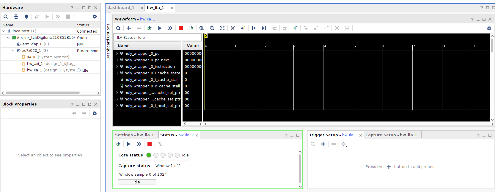

# Quickstart Guide

Hello adventurer, looks like you want to get to Holy Core running on FPGA without reading the entire 150 pages of `.md` files ?

Well, I kinda feel you. As I'm writing this, it's been a couple of month since I did not touch this codebase so I'm gonna write down all the quick things we need to do to get a simple LED to blink on our FPGA board !

> Note that I'm using a Zybo Z7-20, if you don't have this board, or any ohther supported one, you can follow along but you'll need to adapt thing in vivado for it to run synth & impl well. If you can, you can then generate a `.tcl` script for your board and make it a pull request so the next person don't have to do it again :)

## 1 : Preparation

Preparation is pretty straight forward, but its also the occasion to remind you of the prerequisites :

1. A working FPGA board (I officially support the Zybo Z7-20)

2. A working Vivado install (I use Vivado ML 2023.2)

And that's pretty much it !

## 2 : Sythesis and Implementation

To create a *ready to synth* project for the HOLY CORE, simply run the following command **from the root of the codebase** :

```bash
vivado -source fpga_edition/fpga/zybo_z720/holy_vivado_setup.tcl
```

It should create the entire project for you and you'll end up with the following SOC :


Here's what in there :

- Incomming signals
  - `cpu_reset`, assigned by default to `SW3` on the board. This is useful to stall the cpu and tell him to reset to PC = 0.
  - `axi_reset`, assigned by default to `SW2` on the board. This is upretty useless as I struggled with debugging and tried to use it in weird ways that kinda stayed in the core's code. NO WORRIES it's still used to :
    - reset the registers ? (..what was I thinking ?)
    - send an axi reset to all axi peripherals in the SoC.
  - `sys_clock`, which is the board's clock which will be converted to 50MHz clock by the clocking wizard
- The clocking wizard. (I just told you it converts clock speeds, lock in)
- `holy_wrapper` which wraps around all the RTL holy core logic to have a nice "vanilla" verilog interface which vivado enjoys more.
- `jtag_axi` which is a block we'll use to interact with our SoC directly using jtag. this is a fancy way to say that we'll nbe able to poke around and load programs using tcl scripts (very practical).
- the `ILA` debugger which allows us to set up triggers and debug the chip LIVE (this is insanely useful when you are struggling).
- Some `bram` to store the program and some data (you have `32 * 2048 / 8 ~ 8kB or 2048 words of data on the zybo Z7-20 base config`).
- And an `AXI_LITE-LED` driver IP from vivado with an AXI_LITE translator (as I'm writting this, AXI_LITE is not yet implemented but soon to be. If you find this guide to be out of date, please pull request it into updation.)

Okay ! while you were reading this, you computer was busy running implementation and place & route !

## Blinking an LED

### Flashing the board

Now that you have a bistream, you can simply flash your board.

To do so, hold all switches in the **open position, which mean you are sending a reset signal to the CPU (active low) but not to the axi peripherals (active high from the switch perspective)**

Then, in the harware manager, run "program device". You should then be on "a debugging screen" (ILA) that looks like this :



### Loading an example program

Good, now we have a working CPU held on reset ! Which is extremely useless. Maybe we should load a program don't you think ?

Good thing you won't have to deal with the terrible experience that is programming machine code for the HOLY CORE as I prepared a **tcl script** with a ready-to-go LED BLINK program.

With you board flashed, in the Vivado taskbar, go in `Tools > run tcl script` and select the scipt in `fpga_edition/fpga/test_programs/blink_leds.tcl`

Once this is done, the program is now loaded in the bram at PC=0x00000000 thans to the JTAG to AXI_MASTER IP.

Now release the CPU reset, and voila !

