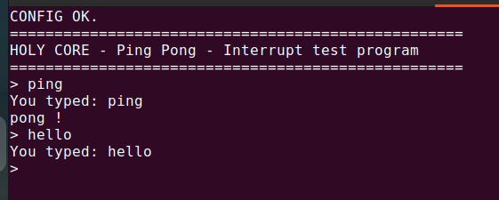

# HOLY CORE COURSE PROJECT


An open-source core **for learning purposes**. Learn to build your own 32 bits RISC-V core with detailed tutorials as a reference.

RISC-V is open source, but the digital design field is more about giving headaches than real solutions. Engineers **LOVE** making everything overcomplicated. This course aims at showing than anyone can do it, with just some will power, patience and an FPGA.

"For God is not a God of confusion but of peace."
— 1 Corinthians 14:33

> [!TIP]
> You will find a **quickstart** guide to simply use the core as a developper below.

## Features

This project is a course you can follow to build the HOLY CORE and everything that comes with it, and the final product of your work will feature :

- A single cycle RV32I Zicsr (holy) Core
- Privileged specs support (Interrupts & Exceptions)
- A customizable cache system
- Software

> You will find quickstart guides in the code case to help you out using the core without having to build it from scratch.

The course is divided in multiple blocks to learn different aspects of digital design. The table below indicates availability of these learning blocks.

| Block Name              | Status |
| ----------              | ------ |
| Single cycle edition    | FINISHED |
| FPGA edition            | FINISHED |
| SoC & Software Edition  | FINISHED |
| Performance Edition     | ON MY TODO LIST |
| OS edition              | ON MY TODO LIST |

> The code will always be **open-source**. I do give the option to donate for PDFs. You can do without, it is a way for you to support my work whilst having a better looking platform to learn from :).

Link : [support using PDF Versions](https://babinriby.gumroad.com/l/holy_core)

> Side note: please checkout the end of this document regarding the future of this situation.

## The tutorials (WHERE DO I START)

Before diving into the tutorials, it is **mandatory** to setup your environment correctly first **using the guidelines listed in the setup manual** (@ the root of the tutorials repo : `setup.md`)

Once the setup is done you can start working on the *single cycle edition* tutorial.

1. [Setup your project](./setup.md)
2. [Build a basic single core](./0_single_cycle_edition/single_cycle_edition.md)
3. [Add memory and GPIO interfacing (Cache + AXI) / Use Vivado to impl on FPGA / Run real software](./1_fpga_edition/fpga_edition.md)

Happy learning !

## Course summary

What can you learn from the different course blocks ?

### Single cycle edition

Learn to implement the full RV32I instruction set from scratch.

**Goal :** Get a RISC-V program to run ont the core through simulation. The core is 100% custom logic, from scratch.

- Build the different logic blocks and assemble them to implement your first instruction : ```lw```
- Improve the design to implement more and more instructions
- Build simple test benches to test your logic and learn a basic design/test workflow.

You will build the logic blocks yourself in **systemVerilog** and test them using **cocotb**. You can follow along the tutorial for reference but as long as the logic works, you can do you own logic and tinker around !

### FPGA Edition

Take a deep dive into memory.

**Goal :** Implement the core on FPGA and leverage systemVerilog capabilities to :

- Add interface to interact with the "outside" world
- Design a basic AXI cache
- Configure the cache using custom CSRs
- Interact with I/Os

### Software edition

Remember : a CPU is meant to run software !

**Goal :** Make software develpoment easier and run bare metal application smoothly & reliably.

- Test and debug the *HOLY CORE* complioance to actual RISC-V specs
- Enable & use C programming
- Add interrupts
- Develop basic C utilities librairies

### Other Editions

Other editions are coming soon ! Stay tuned !

## Core Resources Utilization

The core (without cache) utilize 4k LUTs and 5.5K FFs. The entire SoC utilize 20K LUTs as vivado's interconnect IPs are very large...

Last update: 22nd of june 2025 on a zybo Z7-20.

## Quickstart

### Simulation

You can run a pre-made simulation of the holy core running using the following open-source stack:

- Cocotb
- Verilator
- GtkWave for waveforms

That's it ! there is not container for tesbenches yet, you'll have to install these tools. More details in [the setup guide](./setup.md).

To run the core a a test program of you choice (in assembly) go in `./2_soc_software_edition/fpga` and run `make`. This will run a simulation running the init boot ROM on the *HOLY_CORE*.

To modify the boot ROM, go in `2_soc_software_edition/fpga/ROM/rom.S` and write your program there.

Once your proram is written, run `make` in the `ROM/` folder in order to generate a hardcoded verilog ROM of you prgram. You can the `cd` back to `./2_soc_software_edition/fpga` and run `make` again to simulate it.

> [!NOTE]
> To run the basic testbenches used during the design process as a quick reference, go in `<edition>/tb` and run `pytest test_runner.py`, this will run all the quick refence tesbenches on each module, including a simple *HOLY CORE* test harness with a simple test program.

> [!NOTE]
> To verify the core, go in `./2_soc_software_edition/riscof` where more details await. A docker container is available for quick setup.

### FPGA

The only supported way to build a bitstream is Vivado (for now). The *HOLY CORE* examples SoC & Software also rely on the Xilinx block design & IP to function on FPGA.

> The `2_soc_software_edition/fpga/holy_top` module contains all you need for the core to functions, vivado is only used to add some peripherals, e.g. UART. You are welcome to add you own SoCs in `fpga/<your_platform_of_choice>`

Here are the supported boards for now:

| **Board** | **Status**      |
| --------- | --------------- |
| Zybo Z720 | ⚠️ Needs update |
| Basys3    | ⚠️ Needs update |
| Arty S7   | ✅ All good      |

Go in `2_soc_software_edition/fpga/`, select your board folder and run (for example, with the artyS7-50 board):

```sh
vivado -source 2_soc_software_edition/fpga/arty_S7/holy_vivado_setup.tcl
```

It will create the block design start making the bitstream right aways. One it's done, flash the FPGA, press `reset` on the board (peripherals reset) and release CPU reset (which is `SW2` on the arty, refer to the constraints file for different boards).

The core will start at PC = 0x0, where the ROM will start being executed. By default, it simply blinks an LED in an infinite loop.

To load more complex program, either modify the ROM (via the same technique as in the Simulation quickstart above) or open a terminal and run:

```sh
openocd -f ./2_soc_software_edition/fpga/arty_S7/holy_core_openocd.cfg 
```

> **Note:** you need a USB-JTAG dongle to do perform this. I use the HS2 rev. A. from Digilent. If you don't have it or a different one, open an issue so we can make a cfg file toghether for your use case.

Then, you'll be able to use **gdb** to debug, allowing you to load a different program (mist link at base adress 0x80000000). You can directly load an example program to ttest it out:

```sh
riscv64-unknown-elf-gdb ./2_soc_software_edition/example_programs/ping_pong/ping_pong.elf

(gdb)target remote :3333

Remote debugging using :3333
0x800004a4 in main ()

(gdb) load

Loading section .text, size 0x72c lma 0x80000000
Loading section .rodata, size 0x10f lma 0x8000072c
Loading section .rodata.str1.4, size 0x3 lma 0x8000083c
Start address 0x80000000, load size 2110
Transfer rate: 294 KB/sec, 703 bytes/write.

(gdb) c
Continuing.
```

And voila ! your program running on the *HOLY CORE*. You can also use GDB extensively to debug your program if needed.



## OPEN SOURCE and CONTRIBUTIONS

Contributions are welcome ! (e.g. fixing typos, modifying schemes or fixing bugs).

Just know that very large PRs have low chances of being merged, keep it simple.

**Special mention** to this Veryl rewrite of the `HOLY CORE` called `VERY HOLY CORE` by @jbeaurivage : [Link to VERY HOLY CORE repo](https://github.com/jbeaurivage/very-holy-core).

## A word on the course (AKA me being a grumpy dude, as always)

Please don't steal content to train some AI or to rebrand it to make a linkedin post.