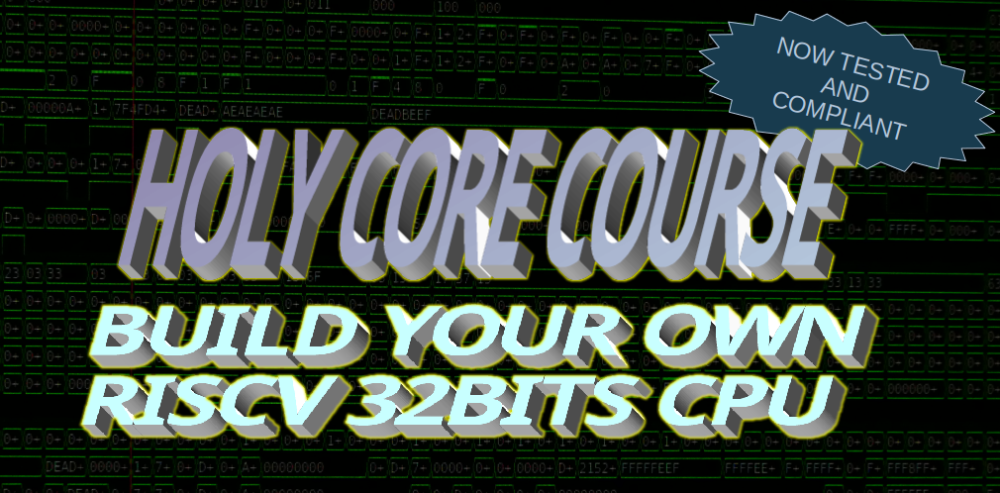

# HOLY CORE COURSE PROJECT



An open-source core **for learning purposes**. Learn to build your own 32 bits RISC-V core with detailled tutorials as a reference.

The course is divided in multiple blocks to learn different aspects of digital design. The table below indicates availability of these learning blocks.

| Block Name            | Status            |
| ----------            | ------            |
| Single cycle edition  | FINISHED   |
| FPGA edition          | FINISHED   |
| Pipelined edition     | ON MY TODO LIST      |

> The code will always be **open-source**. I do give the option to donate for PDFs. You can do without, it is a way for you to support my work whilst having a better looking platform to learn from :).

Link : [*todo : add link*](https://0bab1.github.io/BRH/)

## Prerequestites

To start this course you need to have these basics down :

- Python programming.
- RISC-V assembly.
- SystemVerilog / HDL knowledge.
- Have a linux distro (you can do it on windows, glhf)

**Please check out the setup mnual before starting the course !**

Use it to setup you environement properly before working on the tu

## The tutorials (WHERE DO I START)

Before diving into the tutorials, it is **mandatory** to setup your environement correctly first **using the guidelines listed in the setup manual** (@ the root of the tutorials repo : `setup.md`)

Once the setup is done you can start working on the *single cycle edition* tutorial.

Happy learning !

## Course summary

What can you learn from the differents course blocks ?

### Single cycle edition

Learn to implement the full RV32I instruction set from scratch.

**Goal :** Get a RISC-V program to run ont the core through simulation. The core is 100% custom logic, from scratch.

- Build the different logic blocks and assemble them to implement your first instruction : ```lw```
- Improve the design to implement more and more instructions
- Build simple test benches to test your logic and learn a basic design/test workflow.

You will build the logic blocks yourself in **systemVerilog** and test them using **cocotb**. You can follow along the tutorial for reference but as long as the logic works, you can do you own logic and tinker around !

### FPGA Edition

Take a deep dive into memory.

**Goal :** Implement the core on FPGA and leverage systemVerilog capabilities to :

- Add interfaxce to interact with the "outside" world
- Improve our design by using cache and querying external data using AXI.
- Interact with I/Os

### Pipelined edition

> The pipelined edition is on my todo list but I need to move on to other projects and freelancing stuff for now.

Make the core more performant by adding a pipeline (On my todo list).

**Goal :** Increase the core perfs by pipelining it and hadling all the hazards that comes with it.

## A word on the course

The HOLY CORE is a project I started for my own learning journey and I documented by explaining what I do to... :

- ...Make my own understading clearer
- ...Make the whole thing availible once I'm done

So yes, it was made **by** a "begginer" **for** "begginers". If you decide something is "wrong" in the way I decided to conduct my (holy) operations, I suggest you re-consider the fact of complaining for better activities like : *touching grass* or *going for a walk outside* for example.

Nevertheless, I am still very open to meaningful and constructive criticism, in which case I will be more than happy to consider your opinion.
