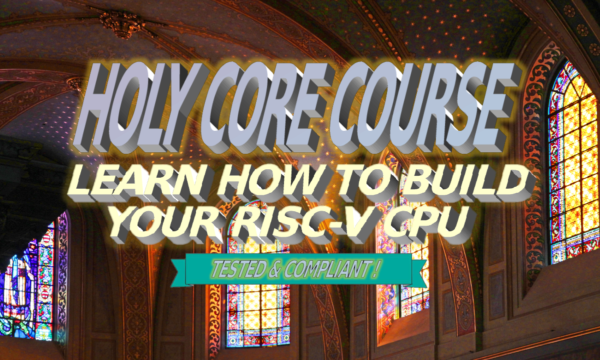

# HOLY CORE PROJECT

**Build your own 32-bit RISC-V CPU from scratch.** An open-source core with detailed tutorials — because learning hardware shouldn't feel like black magic.

<!-- "For God is not a God of confusion but of peace."
— 1 Corinthians 14:33 -->
<!-- Aftersome reflexion, I'm commenting this citation out of respect to the teachinf of the holy catholic church. This project is filled with references but is not a substitute to the church's preaching... -->

> [!NOTE]
> And yes, the HOLY CORE runs [**DOOM**](https://github.com/0BAB1/HOLY_CORE_DOOM) ;)

## 🧙‍♂️ Choose Your Path

<table>
<tr>
<td width="50%" valign="top">

### 📚 I want to **LEARN**
*Follow the tutorials step-by-step*

Perfect if you want to understand how CPUs work by building the HOLY CORE yourself.

**Start here →** [Setup Guide](./setup.md)

Then follow the course:
1. [Single Cycle Edition](./0_single_cycle_edition/single_cycle_edition.md)
2. [FPGA Edition](./1_fpga_edition/fpga_edition.md)
3. [SoC & Software Edition](https://babinriby.gumroad.com/l/holy_core) *(PDF)*

</td>
<td width="50%" valign="top">

### 🚀 I want to **USE**
*Get the core running quickly*

Perfect if you already know what you're doing and just want to test/extend the core.

**Start here →** [Quickstart](https://0bab1.github.io/HOLY_CORE_COURSE/#quickstart)

Full reference docs:
- [📖 Documentation](https://0bab1.github.io/HOLY_CORE_COURSE/)

</td>
</tr>
</table>

## 🎓 What You'll Build

By the end of this course, you'll have:

| Feature | Description |
|---------|-------------|
| 🧠 **RV32I Zicsr Core** | Full integer instruction set + CSR support |
| ⚡ **Interrupts & Exceptions** | Privileged spec compliant |
| 💾 **Cache System** | Learn advanced statemachine and AXI protocols by build configurable instruction & data caches |
| 🔌 **Complete SoC** | UART, GPIO, etc Running on your FPGA |
| 🎮 **Real Software** | C programs, bare-metal, etc |

## 📖 Course Overview

### 🟢 Single Cycle Edition
> [!TIP]
> *Learn the fundamentals*

Build the full RV32I instruction set from scratch in SystemVerilog. Test everything with cocotb.

**You'll learn:** ALU design, register files, control logic, instruction decoding, basic verification.

### 🟢 FPGA Edition  
> [!TIP]
> *Meet the real world*

Add memory interfaces (AXI), design a cache system, and deploy on actual FPGA hardware.

**You'll learn:** Memory hierarchies, bus protocols, hardware/software co-design.

### 🟡 SoC & Software Edition *(Contributors Only)*
> [!TIP]
> *Make it useful*

Pass RISC-V compliance tests, add interrupts, write C code, build driver libraries.

Note that for now, it's only available here for the early supporters of the project or advanced people looking to take it a step further verification wise. See `## Support the Project` section.

**You'll learn:** Core verification, privileged architecture, interrupt handling, embedded C development, debug support.

### 🟡 Performance Edition *(Coming Soon)*
> [!TIP]
> *Maximise DOOM fps and overall perfs*

This edition is not over yet but the early work is available for contributors. See `## Support the Project` section.

### 🔴 OS Edition *(Coming Soon)*
> *Run a real operating system*

### 🔴 Tapeout Edition *(Coming Soon + I'm too broke)*
> *Tapeout the HOLYCORE, one day maybe...*

## 📊 Status

| Edition | Status |
|---------|--------|
| Single Cycle | ✅ Complete |
| FPGA | ✅ Complete |
| SoC & Software | ✅ Complete |
| Performance | 🔜 DOING |
| OS | 🔴 Idk |

## Support the Project

The code is **100% open-source** and always will be.

If you want to support the project and get nicely formatted PDF versions of the tutorials:

**→ [Get the PDF Course](https://babinriby.gumroad.com/l/holy_core)**

## 🤝 Contributing

Contributions are welcome! Typo fixes, documentation improvements, bug reports are all appreciated.

> [!WARNING]
>  Large architectural PRs have low chances of being merged. Open an issue first to discuss.

**Community Spotlight:** Check out [VERY HOLY CORE](https://github.com/jbeaurivage/very-holy-core) by @jbeaurivage: a Veryl rewrite of the HOLY_CORE! *Impressive, Very nice.*

## 📜 A Note on AI & Content

Please don't scrape this content to train AI models or rebrand it for LinkedIn clout. Thanks. 🙏

  <i>Happy learning! 🎓</i>

