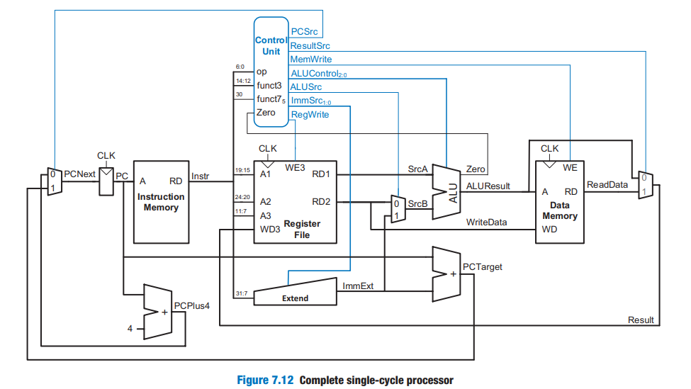
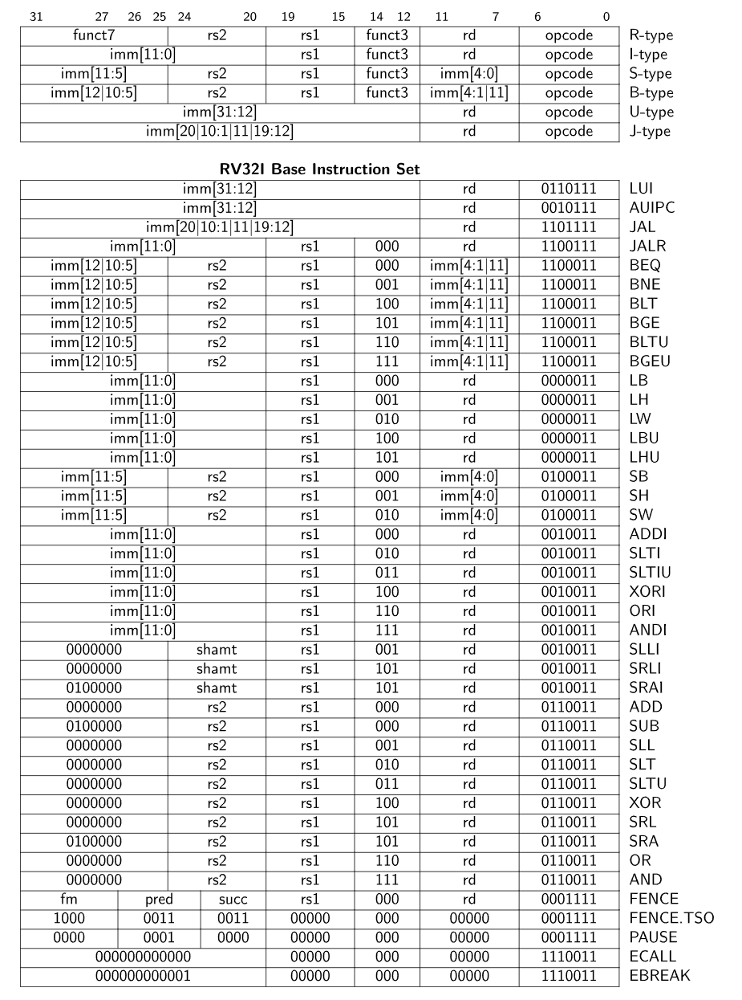

# Tutorial / Writeup

Tutorial heavily based on [DDCA lectures, chapter 7](https://www.youtube.com/watch?v=lrN-uBKooRY&list=PLh8QClfSUTcbfTnKUz_uPOn-ghB4iqAhs). PS :  the intro is legendary.

It is also based on the *Digital Design and
Computer Architecture, RISC-V Edition* Book from Sarah & David Harris (The persons that teaches the youtube lectures mentionned above). I'll let you do your own research to get your hands on the PDF ;)

Here is what we'll aim to build in this tutorial :



Which aims at implementing all of the RV32 base instruction set :



That looks like a lot, but by implementing each type 1 by 1 (e.g. I,S,R,B,...) it can be done !

You can also find some tables for instructions [here](https://five-embeddev.com/riscv-user-isa-manual/Priv-v1.12/instr-table.html).

In order to achieve this, we'll (more or less) follow the [DDCA lectures, chapter 7](https://www.youtube.com/watch?v=lrN-uBKooRY&list=PLh8QClfSUTcbfTnKUz_uPOn-ghB4iqAhs) lectures (availible for free on youtube).

The plan consist in thinking about each type of instruction we can encounter and implement the necessary building block whilst thinking about the datapath for a specific instruction example.

Of course, the first instruction will necessitate the most as we'll start from 0. But once we implement a couple of them, the others will be way easier to implement ! So let's get started !

## 1 : Implementing the "load word" ```lw``` instruction (basic I-Type)

[Lecture](https://www.youtube.com/watch?v=AoBkibslRBM)

Below is a I-type instruction example (I standing for "Immediate") that loads data into reg x6, from the pointer in x9 with an offset of -4 on the address :

```asm
lw x6, -4(x9)
```

We would translate it like this in binary and in hex, as an I-type instruction :

```txt
111111111100 01001 010 00110 0000011
0xFFC4A303
```

here is a quick breakdown :

|        | IMM [11:0]   | rs1          | f3     | rd           | op      |
| ------ | ------------ | ------------ | ------ | ------------ | ------- |
| binary | 111111111100 | 01001        | 010    | 00110        | 0000011 |
| Value  | -4           | 9 (as in x9) | 2 (lw) | 6 (as in x6) | I-type  |

## 1.1 : What do we need to implement ```lw``` ?

Before doing any actual hardware digital interpretation of this instruction, the lecture tells us what we first need some basic logic blocks :

- A register file
- An instruction memory
- Some data memory too
- A sign extender
- A basic ALU we'll improve as time goes on
- And a decoder/control unit we will improve as time goes on

Gotta build it then ! We'll start by crezting basic versions of the different building blocks, test them seperatly and assemble them.

## 1.1.a : Implementing memory

### HDL Code

Memory is memory, on FPGA for example, we would just take everything from a DDR IP of some sort. Here we'll implement some basic piece of memory that can store X amount of words and it will respond in 1 clock cycle (which is way too good to be true, but memory is a pain so we'll *conviniently* ignore that for now...).

So, let's get to work shall we ? We create a memeory.sv file in which we'll write some [code](./src/memory.sv) :

```sv
module memory #(
    parameter WORDS = 64
) (
    input logic clk,
    input logic [31:0] address,
    input logic [31:0] write_data,
    input logic write_enable,
    input logic rst_n,

    output logic [31:0] read_data
);

/*
* This memory is byte addressed
* But have no support for mis-aligned write nor reads.
*/

reg [31:0] mem [0:WORDS-1];  // Memory array of words (32-bits)

always @(posedge clk) begin
    // reset logic
    if (rst_n == 1'b0) begin
        for (int i = 0; i < WORDS; i++) begin
            mem[i] <= 32'b0;  
        end
    end
    else if (write_enable) begin
        // Ensure the address is aligned to a word boundary
        // If not, we ignore the write
        if (address[1:0] == 2'b00) begin 
            //here, address[31:2] is the word index
            mem[address[31:2]] <= write_data;
        end
    end
end

// Read logic
always_comb begin
    //here, address[31:2] is the word index
    read_data = mem[address[31:2]]; 
end

endmodule
```

Note the trick here, we use a [byte adressed momory](https://youtu.be/P2oFPtdDgTg?feature=shared&t=233) (watch the video if you don't know the difference with word addressed memory). However, the memory stays fairly simple as we do not add support for non-aligned read and writes. It just add statements like ``mem[address[31:2]] <= write_data;`` which can be tricky to get your head around at first as a begginer, but do some research, take your time to understand if you don't. If you do, let's move on shall we ?

(If you know your way around HDL, this should be farly easy for you)

Each and everytime we implement something, we also test it, as stated in the main [readme file](./readme.md), we will use cocotb and verilator to verify our HDL.

### Verification

When it comes to verifying memory, we'll simply do some writes while tinkering with the ``write_enable`` flag. Since I don't like writing tests and this is a simple case, I can ask my favorite LLM to generate some tests for me and after manual review (turns out LLM are EXTREMELY bad at cocotb and hadware stuff in general), here is the testbench :

```python
import cocotb
from cocotb.clock import Clock
from cocotb.triggers import RisingEdge, Timer


@cocotb.test()
async def memory_data_test(dut):
    # Start a 10 ns clock
    cocotb.start_soon(Clock(dut.clk, 1, units="ns").start())
    await RisingEdge(dut.clk)

    # Init and reset
    dut.rst_n.value = 0
    dut.write_enable.value = 0
    dut.address.value = 0
    dut.write_data.value = 0      # De-assert reset

    await RisingEdge(dut.clk)     # Wait for a clock edge after reset
    dut.rst_n.value = 1           # De-assert reset
    await RisingEdge(dut.clk)     # Wait for a clock edge after reset

    # Assert all is 0 after reset
    for address in range(dut.WORDS.value):
        dut.address.value = address
        await Timer(1, units="ns")
        # just 32 zeroes, you can also use int()
        assert dut.read_data.value == "00000000000000000000000000000000"
      
    # Test: Write and read back data
    test_data = [
        (0, 0xDEADBEEF),
        (4, 0xCAFEBABE),
        (8, 0x12345678),
        (12, 0xA5A5A5A5)
    ]

    for address, data in test_data:
        # Write data to memory
        dut.address.value = address
        dut.write_data.value = data
        dut.write_enable.value = 1
        await RisingEdge(dut.clk)

        # Disable write after one cycle
        dut.write_enable.value = 0
        await RisingEdge(dut.clk)

        # Verify the write by reading back
        dut.address.value = address
        await RisingEdge(dut.clk)
        assert dut.read_data.value == data, f"Readback error at address {address}: expected {hex(data)}, got {hex(dut.read_data.value)}"

    # Test: Write to multiple addresses, then read back
    for i in range(40,4):
        dut.address.value = i
        dut.write_data.value = i + 100
        dut.write_enable.value = 1
        await RisingEdge(dut.clk)

    # Disable write, then read back values to check
    dut.write_enable.value = 0
    for i in range(40,4):
        dut.address.value = i
        await RisingEdge(dut.clk)
        expected_value = i + 100
        assert dut.read_data.value == expected_value, f"Expected {expected_value}, got {dut.read_data.value} at address {i}"
```

Once agin, we increment memory by 4 beacause it is byte addressed.

To run this, I create a ``Makefile`` according to the [cocotb docs](https://docs.cocotb.org/en/stable/quickstart.html#creating-a-makefile) and, still in the memory tesbench subdir, I use ``gtkwave ./sim_build/memory.fst`` to visualize the waveforms. It's all open-source ! *But once again, without linux, you will have some troubles.*

After it's done, I can go back to the root dir and run ``make clean`` to clean out the simulation results.

## 1.1.b : Implementing the regfile

### HDL Code

For the reg file, it's just 32x32bits registers. we'll implement it like memory execpt the size is fixes the 32 bits with 5bits addressing.

The I/Os are a bit different though as we have to accomodate all the instrction types : in R-Types (which operates ONLY on registers) we can write to a register whilst getting data from 2 of them at the same time.

```sv
module regfile (
    // basic signals
    input logic clk,
    input logic rst_n,

    // Reads
    input logic [4:0] address1,
    input logic [4:0] address2,
    output logic [31:0] read_data1,
    output logic [31:0] read_data2,

    // Writes
    input logic write_enable,
    input logic [31:0] write_data,
    input logic [4:0] address3
);

// 32bits register. 32 of them (addressed with 5 bits)
reg [31:0] registers [0:31]; 

// Write logic
always @(posedge clk) begin
    // reset support, init to 0
    if(rst_n == 1'b0) begin
        for(int i = 0; i<32; i++) begin
            registers[i] <= 32'b0;
        end
    end 
    // Write, except on 0, reserved for a zero constant according to RISC-V specs
    else if(write_enable == 1'b1 && address3 != 0) begin
        registers[address3] <= write_data;
    end
end

// Read logic, async
always_comb begin : readLogic
    read_data1 = registers[address1];
    read_data2 = registers[address2];
end
  
endmodule
```

### Verification

Now to verify this HDL, we'll simply use random write on A3, and read after each write on both address. We then compare to a therorical golden state update in software in the testbench.

We also add small tests at the end to test the 0 constant, It's simple but helps us getting used to cocotb.

Note that we use small timer delay to test out the async properties of our design.

```python
import cocotb
from cocotb.clock import Clock
from cocotb.triggers import RisingEdge, Timer
import random
import numpy as np

@cocotb.test()
async def random_write_read_test(dut):
    # Start a 10 ns clock
    cocotb.start_soon(Clock(dut.clk, 10, units="ns").start())
    await RisingEdge(dut.clk)

    # Init and reset
    dut.rst_n.value = 0
    dut.write_enable.value = 0
    dut.address1.value = 0
    dut.address2.value = 0
    dut.address3.value = 0
    dut.write_data.value = 0  

    await RisingEdge(dut.clk)   
    dut.rst_n.value = 1  # realease reset_n   
    await RisingEdge(dut.clk)  

    # fill a heorical state of the regs, all 0s for starters
    theorical_regs = [0 for _ in range(32)]

    # Loop to write and read random values, 1000 test shall be enough
    for _ in range(1000): 
        # Generate a random register address (1 to 31, skip 0)
        address1 = random.randint(1, 31)
        address2 = random.randint(1, 31)
        address3 = random.randint(1, 31)
        write_value = random.randint(0, 0xFFFFFFFF)

        # perform reads
        await Timer(1, units="ns") # wait a ns to test async read
        dut.address1.value = address1
        dut.address2.value = address2
        await Timer(1, units="ns")
        assert dut.read_data1.value == theorical_regs[address1]
        assert dut.read_data2.value == theorical_regs[address2]

        # perform a random write
        dut.address3.value = address3
        dut.write_enable.value = 1
        dut.write_data = write_value
        await RisingEdge(dut.clk)
        dut.write_enable.value = 0
        theorical_regs[address3] = write_value
        await Timer(1, units="ns")

    # try to write at 0 and check if it's still 0
    await Timer(1, units="ns")
    dut.address3.value = 0
    dut.write_enable.value = 1
    dut.write_data = 0xAEAEAEAE
    await RisingEdge(dut.clk)
    dut.write_enable.value = 0
    theorical_regs[address3] = 0

    await Timer(1, units="ns") # wait a ns to test async read
    dut.address1.value = 0
    await Timer(1, units="ns")
    print(dut.read_data1.value)
    assert int(dut.read_data1.value) == 0

    print("Random write/read test completed successfully.")
```

## 1.1.c Implementing the ALU

### HDL Code

For the Load Word datapath, we only need to add :

- The content of a source register, containing an alged adress
- A 12bits immediate / offset

Here is a very basic implementation, **note that this design will evolve heavily !**.

```sv
module alu (
    // IN
    input logic [2:0] alu_control,
    input logic [31:0] src1,
    input logic [31:0] src2,
    // OUT
    output logic [31:0] alu_result,
    output logic zero
);

always_comb begin
    case (alu_control)
        3'b000 : alu_result = src1 + src2;
        default: alu_result = 32'b0;
    endcase
end

assign zero = alu_result == 32'b0;
    
endmodule
```

We also add a ```alu_control``` option, to later select other arithmetic operation. We default the result to 0 if the requested arithmetic isn't iplemented and we add a "zero" flag that we'll use in later designs.

### Verification

Simple design, simple tesbench, but this time, the alu being pur combinational logic, we do not use a clock :

```python
import cocotb
from cocotb.triggers import Timer
import random


@cocotb.test()
async def add_test(dut):
    await Timer(1, units="ns")
    dut.alu_control.value = 0b000
    for _ in range(1000):
        src1 = random.randint(0,0xFFFFFFFF)
        src2 = random.randint(0,0xFFFFFFFF)
        dut.src1.value = src1
        dut.src2.value = src2
        # We mask expected to not take account of overflows
        expected = (src1 + src2) & 0xFFFFFFFF
        # Await 1 ns for the infos to propagate
        await Timer(1, units="ns")
        assert int(dut.alu_result.value) == expected

@cocotb.test()
async def default_test(dut):
    await Timer(1, units="ns")
    dut.alu_control.value = 0b111
    src1 = random.randint(0,0xFFFFFFFF)
    src2 = random.randint(0,0xFFFFFFFF)
    dut.src1.value = src1
    dut.src2.value = src2
    expected = 0
    # Await 1 ns for the infos to propagate
    await Timer(1, units="ns")
    assert int(dut.alu_result.value) == expected

@cocotb.test()
async def zero_test(dut):
    await Timer(1, units="ns")
    dut.alu_control.value = 0b000
    dut.src1.value = 123
    dut.src2.value = -123
    await Timer(1, units="ns")
    print(int(dut.alu_result.value))
    assert int(dut.zero.value) == 1
    assert int(dut.alu_result.value) == 0
```

New ! we declare multiple tests, it's exactly the same as making a single block but it improve readability so why not.

## 1.1.d Implementing the sign extender

In odrer to manipulte the immediate in other computation block, we need to make it 32bit wide. Also, Immediates can be "scatered" around in the instruction in RISC-V (e.g. Sotre Word ```sw```). This means that we'll need to :

- 1 Gather the immediate in the instruction, depending on the op code (ie, include some control inputs)
- 2 Extend the gathered immediate sign to 32bits. Here is a basic implemention for our basic lw only with some preparations for the future :

```sv
module signext (
    // IN
    input logic [24:0] raw_src,
    input logic [1:0] imm_source,

    // OUT (immediate)
    output logic [31:0] immediate
);

logic [11:0] gathered_imm;

always_comb begin
    case (imm_source)
        1'b00 : gathered_imm = raw_src[24:13];
        default: gathered_imm = 12'b0;
    endcase
end

assign immediate = {{20{gathered_imm[11]}}, gathered_imm};
    
endmodule
```

Simple enough right ? no magic here, simply an raw application of the DDCA lecture. Now we test this design !

### Verification

Here is the test benchench, if you are not used to bitwise operations, take a minute to get your head around these :

```python
import cocotb
from cocotb.clock import Clock
from cocotb.triggers import RisingEdge, Timer
import random
import numpy as np

@cocotb.test()
async def random_write_read_test(dut):
    # TEST POSITIVE IMM = 123 WITH SOURCE = 0
    imm = 0b000001111011 #123
    imm <<= 13 # leave "room" for ramdom junk
    source = 0b00
    # 25 bits sent to sign extend contains data before that will be ignred (rd, f3,..)
    # masked to leave room for imm "test payload"
    random_junk = 0b000000000000_1010101010101 
    raw_data = random_junk | imm
    await Timer(1, units="ns")
    dut.raw_src.value = raw_data
    dut.imm_source = source
    await Timer(1, units="ns") # let it propagate ...
    assert dut.immediate.value == "00000000000000000000000001111011", f"expected 00000000000000000000000001111011, got {dut.immediate.value}"
    assert int(dut.immediate.value) == 123

    # TEST Negative IMM = -42 WITH SOURCE = 0
    imm = 0b111111010110 #-42
    imm <<= 13 # leave "room" for ramdom junk
    source = 0b00
    # 25 bits sent to sign extend contains data before that will be ignred (rd, f3,..)
    # masked to leave room for imm "test payload"
    random_junk = 0b000000000000_1010101010101 
    raw_data = random_junk | imm
    await Timer(1, units="ns")
    dut.raw_src.value = raw_data
    dut.imm_source = source
    await Timer(1, units="ns") # let it propagate ...
    assert dut.immediate.value == "11111111111111111111111111010110", f"expected 11111111111111111111111111010110, got {dut.immediate.value}"
    # Python interprets int as uint. we sub 1<<32 as int to get corresponding negative value
    assert int(dut.immediate.value) - (1 << 32)  == -42
```

Once again, we'll add oher feature to this a bit later ;)

## 1.1.e Implementing basic control

Below is an image of what we need to do implement for the control unit. Note that the following image contains the logic for the **FULL** controller, for now, we'll focus on implementing the ```lw``` logic.

First we lay down the only I/Os we need so far for ```lw```:

```sv
module control (
    // IN
    input logic [6:0] op,
    input logic [2:0] func3,
    input logic [6:0] func7,
    input logic alu_zero,

    // OUT
    output logic [2:0] alu_control,
    output logic [1:0] imm_source,
    output logic mem_write,
    output logic reg_write
);

// lorem ipsum...

endmodule
```

This will help us focus on the important stuff to get a first ```lw``` example working.


As you can see, there is aan ALU control as well. This is because a single instruction type require different kinds of arithmetics (e.g. R-Types that can be ```add```, ```sub```, ```mul```, ...).

So, the plan is to deduce a general ```alu_op``` and then add an ```alu_decoder``` unit will deduce the qrithmetic from indicators like ```func3``` (That i'll also call f3) and ```func7``` (That i'll also call f7). This will finally raise some ```alu_control``` control signals to tell the ALU what to do, here is another truth table to use that :


This process may seem weird as everything is in the same block at the end of the day but this makes the comb logics way easier to write and readable :

```sv
module control (
    // IN
    input logic [6:0] op,
    input logic [2:0] func3,
    input logic [6:0] func7,
    input logic alu_zero,

    // OUT
    output logic [2:0] alu_control,
    output logic [1:0] imm_source,
    output logic mem_write,
    output logic reg_write
);

/**
* MAIN DECODER
*/

logic [1:0] alu_op;
always_comb begin
    case (op)
        // LW
        7'b0000011 : begin
            reg_write = 1'b1;
            imm_source = 2'b00;
            mem_write = 1'b0;
            alu_op = 2'b00;
        end
        // EVERYTHING ELSE
        default: begin
            reg_write = 1'b0;
            imm_source = 2'b00;
            mem_write = 1'b0;
            alu_op = 2'b00;
        end
    endcase
end

/**
* ALU DECODER
*/

always_comb begin
    case (alu_op)
        // LW, SW
        1'b00 : alu_control = 3'b000;
        // EVERYTHING ELSE
        default: alu_control = 3'b111;
    endcase
end
    
endmodule
```

And everything is ready for the future instruction to be added in control !

### Verification

The tesbench is veristraight forward, we emulate ONLY the important signals described in the truth tables for a given instruction (we don't care about the other one being ```X``` or ```Z``` in simulation). And we assert the outputs states :

```python
import cocotb
from cocotb.triggers import Timer

@cocotb.test()
async def control_test(dut):
    # TEST CONTROL SIGNALS FOR LW
    await Timer(1, units="ns")
    dut.op.value = 0b0000011 #lw
    await Timer(1, units="ns")
    assert dut.alu_control.value == "000"
    assert dut.imm_source.value == "00"
    assert dut.mem_write.value == "0"
    assert dut.reg_write.value == "1"
```

For the curious who may ask "so what is the f3 for in the ```lw``` instruction then ?". Great question. We can use F3 to implement different flavors of the ```load``` instruction

> "The LW instruction loads a 32-bit value from memory into rd. LH loads a 16-bit value from memory,
then sign-extends to 32-bits before storing in rd. LHU loads a 16-bit value from memory but then
zero extends to 32-bits before storing in rd. LB and LBU are defined analogously for 8-bit values."

(from the [RISC-V Vol1 User-level ISA](https://riscv.org/wp-content/uploads/2017/05/riscv-spec-v2.2.pdf), Page 19)

Use the [tables](https://five-embeddev.com/riscv-user-isa-manual/Priv-v1.12/instr-table.html) to check out different f3 values for ```loads```.

## 1.2 : Laying down the ```lw``` datapath (finally)

We can now start to edit ```cpu.sv``` and add the pieces toggether ! From tehere (a working lw datapath), we'll be able to add functionalities and build more advanced features !

### HDL Code

Here is the complete ```lw``` specific datapth :


So we implement it !

```sv
module cpu (
    input logic clk,
    input logic rst_n
);

/**
* PROGRAM COUNTER
*/

reg [31:0] pc;
logic [31:0] pc_next;

always_comb begin : pcSelect
    pc_next = pc + 4;
end

always @(posedge clk) begin
    if(rst_n == 0) begin
        pc <= 32'b0;
    end else begin
        pc <= pc_next;
    end
end

/**
* INSTRUCTION MEMORY
*/

// Acts as a ROM.
wire [31:0] instruction;

memory #(
    .mem_init("./test_imemory.hex")
) instruction_memory (
    // Memory inputs
    .clk(clk),
    .address(pc),
    .write_data(32'b0),
    .write_enable(1'b0),
    .rst_n(1'b1),

    // Memory outputs
    .read_data(instruction)
);

/**
* CONTROL
*/

// Intercepts instructions data, generate control signals accordignly
// in control unit
logic [6:0] op;
assign op = instruction[6:0];
logic [2:0] f3;
assign f3 = instruction[14:12];
wire alu_zero;
// out of control unit
wire [2:0] alu_control;
wire [1:0] imm_source;
wire mem_write;
wire reg_write;

control control_unit(
    .op(op),
    .func3(f3),
    .func7(7'b0),
    .alu_zero(alu_zero),

    // OUT
    .alu_control(alu_control),
    .imm_source(imm_source),
    .mem_write(mem_write),
    .reg_write(reg_write)
);

/**
* REGFILE
*/

logic [4:0] source_reg1;
assign source_reg1 = instruction[19:15];
logic [4:0] source_reg2;
assign source_reg2 = instruction[24:20];
logic [4:0] dest_reg;
assign dest_reg = instruction[11:7];
wire [31:0] read_reg1;
wire [31:0] read_reg2;

logic [31:0] write_back_data;
always_comb begin : wbSelect
    write_back_data = mem_read;
end


regfile regfile(
    // basic signals
    .clk(clk),
    .rst_n(rst_n),

    // Read In
    .address1(source_reg1),
    .address2(source_reg2),
    // Read out
    .read_data1(read_reg1),
    .read_data2(read_reg2),

    // Write In
    .write_enable(reg_write),
    .write_data(write_back_data),
    .address3(dest_reg)
);

/**
* SIGN EXTEND
*/
logic [24:0] raw_imm;
assign raw_imm = instruction[31:7];
wire [31:0] immediate;

signext sign_extender(
    .raw_src(raw_imm),
    .imm_source(imm_source),
    .immediate(immediate)
);

/**
* ALU
*/
wire [31:0] alu_result;
logic [31:0] alu_src2;

always_comb begin : srcBSelect
    alu_src2 = immediate;
end

alu alu_inst(
    .alu_control(alu_control),
    .src1(read_reg1),
    .src2(alu_src2),
    .alu_result(alu_result),
    .zero(alu_zero)
);

/**
* DATA MEMORY
*/
wire [31:0] mem_read;

memory #(
    .mem_init("./test_dmemory.hex")
) data_memory (
    // Memory inputs
    .clk(clk),
    .address(alu_result),
    .write_data(32'b0),
    .write_enable(1'b0),
    .rst_n(1'b1),

    // Memory outputs
    .read_data(mem_read)
);
    
endmodule
```

This one is large but failry simple, no fancy logic here as we pretty much just assemble legos according to the plan with a bunch of additional wires. Note the "always comb" muxes we add in preparetion for further improvements, even though they are pretty useless right now.

> Tip : to navigate such HDL files, use the "find" feature of your text editor **extensively** ! It will be you best friend when it comes to finding out *what* goes *where* !

Note that I added some ```.mem_init("blablabla")``` parameters to the memory. This has to do with verification afterward. Here is the updated memory's verilog to acoomodate this change :

```sv
module memory #(
    parameter WORDS = 64,
    parameter mem_init = ""
) (
    // same I/Os ...
);

reg [31:0] mem [0:WORDS-1];  // Memory array of words (32-bits)

initial begin
    $readmemh(mem_init, mem);  // Load memory for simulation
end

// same logic as before ....

endmodule
```

see below verification for explainations...

### Verification

To test this, we need to instanciate instruction and data memory with some known data. We then check the regfile's states and check if the said states are the one we expected when writting the instructions.

So here is our todo list to lay down the tests :

- Write some basic memories file to init the memory for testing
- Loads these files for simulation
- Write the testbench

Sounds simple enough, but our current project testing setup has some limitations that have to be carefully taken into account. These limitation leads to :

- We will only have 1 memory file for each memory in the system. Wich will prove to be annoying when we'll have to test dozens of differents instructions. (it is what it is).
- We have to load the initial "ROMs" memory hexfiles directly via hardcoded verilog. Thus the modifications and limitations described above. (thanksfully, verilog will ignre comments, allowing us to explain what instruction does what and why)
- The cocotb framework is great but when test benches and data get more complex, we have to use a bunch of tricks, that I'll do my best to explain here.

Whith all of these facts in mind, let's write some test ROMs for our lw datapath !

for the instrcution memory to test our data path, we'll use a simple

```asm
lw x18 8(x0) // loads daata from addr 0x00000008 in reg x18 (s2)
```

Which translates as this in HEX format (comments like ```//blablabla``` are ignored by ```$readmemh("rom.hex")```):

```asm
00802903  //LW TEST START : lw x18 8(x0)
00000013  //NOP
00000013  //NOP
//(...) 
```

And here is the data we'll try to load :

```asm
AEAEAEAE  // @ 0x00000000 Useless data
00000000  // @ 0x00000004 Useless data
DEADBEEF  // @ 0x00000008 What we'll try to get in x18
00000000
00000000
//(...)
```

Great ! Here is how we are going to organize ou cpu tb folder (we put ```*.hex``` file in there as th HDL file are called from here so ```$readmemh("myrom.hex")``` will gets the ```.hex``` files from there) :

```txt
tb
├── cpu
│   ├── Makefile
│   ├── test_cpu.py
│   ├── test_dmemory.hex
│   └── test_imemory.hex
```

And now we can design a test bench ! First, we design some halper functions that will convert str data from ```HEX``` to ```BIN``` as needed (python tricks to deal with multiple data types expressed as ```str``` in cocotb), we also declare a ```cocotb.coroutine``` that will handle cpu resets :

```python
# test_cpu.py

import cocotb
from cocotb.clock import Clock
from cocotb.triggers import RisingEdge

def binary_to_hex(bin_str):
    # Convert binary string to hexadecimal
    hex_str = hex(int(str(bin_str), 2))[2:]
    hex_str = hex_str.zfill(8)
    return hex_str.upper()

def hex_to_bin(hex_str):
    # Convert hex str to bin
    bin_str = bin(int(str(hex_str), 16))[2:]
    bin_str = bin_str.zfill(32)
    return bin_str.upper()

@cocotb.coroutine
async def cpu_reset(dut):
    # Init and reset
    dut.rst_n.value = 0
    await RisingEdge(dut.clk)     # Wait for a clock edge after reset
    dut.rst_n.value = 1           # De-assert reset
    await RisingEdge(dut.clk)     # Wait for a clock edge after reset

```

Great ! Now I added a small test to see if memory reads worked on my side, and we also write a test to check if out ```lw``` instruction worked as expected :

```python
# test_cpu.py

import cocotb
from cocotb.clock import Clock
from cocotb.triggers import RisingEdge

def binary_to_hex(bin_str):
    ...

def hex_to_bin(hex_str):
    ...

@cocotb.coroutine
async def cpu_reset(dut):
    ...

@cocotb.test()
async def cpu_init_test(dut):
    """Reset the cpu and check for a good imem read"""
    cocotb.start_soon(Clock(dut.clk, 1, units="ns").start())
    await RisingEdge(dut.clk)

    await cpu_reset(dut)
    assert binary_to_hex(dut.pc.value) == "00000000"

    # Load the expected instruction memory as binary
    # Note that this is loaded in sim directly via the verilog code
    # This load is only for expected
    imem = []
    with open("test_imemory.hex", "r") as file:
        for line in file:
            # Ignore comments
            line_content = line.split("//")[0].strip()
            if line_content:
                imem.append(hex_to_bin(line_content))

    # We limit this inital test to the first couple of instructions as we'll later implement branches
    for counter in range(5):
        expected_instruction = imem[counter]
        assert dut.instruction.value == expected_instruction, f"expected {binary_to_hex(expected_instruction)} but got {binary_to_hex(dut.instruction.value)} @ pc {binary_to_hex(dut.pc.value)}"
        await RisingEdge(dut.clk)

@cocotb.test()
async def cpu_insrt_test(dut):
    """Runs a lw datapath test"""
    cocotb.start_soon(Clock(dut.clk, 1, units="ns").start())
    await RisingEdge(dut.clk)

    await cpu_reset(dut)

    # The first instruction for the test in imem.hex load the data from
    # dmem @ adress 0x00000008 that happens to be 0xDEADBEEF into register x18

    # Wait a clock cycle for the instruction to execute
    await RisingEdge(dut.clk)

    print(binary_to_hex(dut.regfile.registers[18].value))

    # Check the value of reg x18
    assert binary_to_hex(dut.regfile.registers[18].value) == "DEADBEEF", f"expected DEADBEEF but got {binary_to_hex(dut.regfile.registers[18].value)} @ pc {binary_to_hex(dut.pc.value)}"
```

As you can see, the helper functions does help a lot indeed ! Using them, we can easily compare our expected values by switching between data representations as needed.

## 2 : Implementing the "store word" ```sw``` instruction (basic S-Type)

[Lecture](https://www.youtube.com/watch?v=sVZmqLRkbVk)

Here is what enhancements we need to make to add basic ```sw (S-type)``` support in our CPU :


Below is a S-type instruction example (S standing for "Store") that loads data from reg x18 (s1), to the address pointer in x5 (t0) with an offset of C on the address :

```asm
sw x18, 0xC(x0)
```

We would translate it like this in binary and in hex, as an S-type instruction :

```txt
0000000 10010 00000 010 01100 0100011
0x01202623
```

here is a quick breakdown :

|        | IMM [11:5]   | rs2          | rs1        | f3     | IMM [4:0]    | op      |
| ------ | ------------ | ------------ | ------     | ------ | ------------ | ------- |
| binary | 0000000      | 10010        | 00000     | 010    | 01100        | 0100011 |
| Value  |  0           | x18 (s1)      | x0 (0)   | 2 (sw) | 0xC          | S-type  |

## 2.1 : What do we need to implement ```sw``` ?

Here is a todo list to implement these new changes :

- The immediate is now "scatered" around the instruction, we'll need to:
  - Tell the control to select anthother source for the IMM
  - Tell the sign extender unit how to interpret that
- We'll also need to update the control unit to :
  - Not enable write for the regs
  - Enable write for the memory

## 2.1.a : Updating the signextender

### HDL Code

So let's get to work shall we ? We'll statrt by updating the sign extender to take into account our new source type

```sv
module signext (
    // IN
    input logic [24:0] raw_src,
    input logic [1:0] imm_source,

    // OUT (immediate)
    output logic [31:0] immediate
);

logic [11:0] gathered_imm;

always_comb begin
    case (imm_source)
        // For I-Types
        2'b00 : gathered_imm = raw_src[24:13];
        // For S-types
        2'b01 : gathered_imm = {raw_src[24:18],raw_src[4:0]};
        default: gathered_imm = 12'b0;
    endcase
end

assign immediate = {{20{gathered_imm[11]}}, gathered_imm};
    
endmodule
```
As you can see, just a simple application of the S-Type instruction Imm format.

### Verification

Now to verify that, we update the ```test_signext.py``` testbench file by adding another, improved test :

```python
# test_signext.py

import cocotb
from cocotb.triggers import Timer
import random
import numpy as np

@cocotb.test()
async def signext_i_type_test(dut):
    # Old fully manual test for I_Types instrs
    # ...

@cocotb.test()
async def signext_s_type_test(dut):
    # 100 randomized tests
    for _ in range(100):
        # TEST POSITIVE IMM
        await Timer(100, units="ns")
        imm = random.randint(0,0b01111111111) 
        imm_11_5 = imm >> 5
        imm_4_0 = imm & 0b000000011111
        raw_data = (imm_11_5 << 18) | (imm_4_0) # the 25 bits of data
        source = 0b01
        dut.raw_src.value = raw_data
        dut.imm_source = source
        await Timer(1, units="ns") # let it propagate ...
        assert int(dut.immediate.value) == imm

        # TEST Negative IMM
        # Get a random 12 bits UINT and gets its base 10 neg value by - (1 << 12)
        imm = random.randint(0b100000000000,0b111111111111) - (1 << 12)
        imm_11_5 = imm >> 5
        imm_4_0 = imm & 0b000000011111
        raw_data = (imm_11_5 << 18) | (imm_4_0) # the 25 bits of data
        source = 0b01
        await Timer(1, units="ns")
        dut.raw_src.value = raw_data
        dut.imm_source = source
        await Timer(1, units="ns") # let it propagate ...
        # print(bin(imm),dut.raw_src.value)
        # print(int(dut.immediate.value), imm)
        assert int(dut.immediate.value) - (1 << 32) == imm
```

As we can see, we randomized the testes and used more bitwise manipulation for assertions to make the whole testing more robust.

> (This also serves as a great biwise operations exercise !)

## 2.1.b : Updating the control signals

As you can see in the lecture and as stated before, we need to update the ```reg_write_enable``` and ```mem_write_enable``` signals.

### HDL Code

Here is the updated main decode, nothing else changes :

```sv
// control.sv

//...

/**
* MAIN DECODER
*/

logic [1:0] alu_op;
always_comb begin
    case (op)
        // I-type (lw)
        7'b0000011 : begin
            reg_write = 1'b1;
            imm_source = 2'b00;
            mem_write = 1'b0;
            alu_op = 2'b00;
        end
        // S-Type (sw)
        7'b0100011 : begin
            reg_write = 1'b0;
            imm_source = 2'b01;
            mem_write = 1'b1;
            alu_op = 2'b00;
        end
        // EVERYTHING ELSE
        default: begin
            reg_write = 1'b0;
            imm_source = 2'b00;
            mem_write = 1'b0;
            alu_op = 2'b00;
        end
    endcase
end

//...
```

As you can see it is simple a matter of adding a decoding case.

### Verification

For the verification, it is also pretty somple :

```python
#test_control.py

import cocotb
from cocotb.triggers import Timer

@cocotb.test()
async def lw_control_test(dut):
    # ...

@cocotb.test()
async def sw_control_test(dut):
    # TEST CONTROL SIGNALS FOR SW
    await Timer(10, units="ns")
    dut.op.value = 0b0100011 #sw
    await Timer(1, units="ns")
    assert dut.alu_control.value == "000"
    assert dut.imm_source.value == "01"
    assert dut.mem_write.value == "1"
    assert dut.reg_write.value == "0"
```

> Note that these tests will change, we will later add "flavors" to these I and S types : ```lb```, ```sb```, ... which will have another f3, which will require a bit more decoding and logic, but for now, this will do just fine !

## 2.2 : Actually mplementing the ```sw``` datapath

Globally in the datapath, nothing much changes, we just link the signals we previously kept on 0 for the memory write inputs :

```sv 
// cpu.sv

// non changed logic ...

/**
* DATA MEMORY
*/
wire [31:0] mem_read;

logic [31:0] write_data;
always_comb begin : mem_write_data_source_selection
    mem_write_data = read_reg2;
end

memory #(
    .mem_init("./test_dmemory.hex")
) data_memory (
    // Memory inputs
    .clk(clk),
    .address(alu_result),
    .write_data(mem_write_data),
    .write_enable(mem_write),
    .rst_n(1'b1),

    // Memory outputs
    .read_data(mem_read)
);

// non changed logic ...
```

### Verification

To verify, once again, we set up the memory files on a scenario that will be easily predictible in testing so we can verify the CPU behavior, whilst keeping of course the previos ```lw``` tests in our memory files :

```asm
//test_imemory.hex

00802903  //LW TEST START : lw x18 0x8(x0)
01202623  //SW TEST START : sw x18 0xC(x0)
00000013  //NOP
00000013  //NOP
00000013  //NOP
//...
```

As you can see, we add a new instruction that will take the value we loaded in x18 and store it @ addr 0x0000000C in memory.

Speaking of memory, the file did not really change, except I changed the 0xC value to ```0xF2F2F2F2``` to avoir asserting 00000000 as it is too common of a value :

```asm
//test_dmemory.hex

AEAEAEAE
00000000
DEADBEEF
F2F2F2F2
00000000
00000000
//...
```

And for the testbench, I simple did some assertion based on how the CPU should react to these instructions. We also get rit of the "init" test that test for init memory state as it executed the instruction to verify PC & memory behavior, which messed up all of the memory state for assertions. Here is the final result :

```python
# test_cpu.py

import cocotb
from cocotb.clock import Clock
from cocotb.triggers import RisingEdge

def binary_to_hex(bin_str):
    # ...

def hex_to_bin(hex_str):
    # ...

@cocotb.coroutine
async def cpu_reset(dut):
    # ...

@cocotb.test()
async def cpu_insrt_test(dut):
    """Runs a lw datapath test"""
    cocotb.start_soon(Clock(dut.clk, 1, units="ns").start())
    await RisingEdge(dut.clk)
    await cpu_reset(dut)

    ##################
    # LOAD WORD TEST 
    # lw x18 0x8(x0)
    ##################
    print("\n\nTESTING LW\n\n")

    # The first instruction for the test in imem.hex load the data from
    # dmem @ adress 0x00000008 that happens to be 0xDEADBEEF into register x18

    # Wait a clock cycle for the instruction to execute
    await RisingEdge(dut.clk)

    # Check the value of reg x18
    assert binary_to_hex(dut.regfile.registers[18].value) == "DEADBEEF", f"expected DEADBEEF but got {binary_to_hex(dut.regfile.registers[18].value)} @ pc {binary_to_hex(dut.pc.value)}"

    ##################
    # STORE WORD TEST 
    # lw x18 0xC(x0)
    ##################
    print("\n\nTESTING SW\n\n")
    test_address = int(0xC / 4) #mem is byte adressed but is made out of words in the eyes of the software
    # The second instruction for the test in imem.hex stores the data from
    # x18 (that happens to be 0xDEADBEEF from the previous LW test) @ adress 0x0000000C 

    # First, let's check the inital value
    assert binary_to_hex(dut.data_memory.mem[test_address].value) == "F2F2F2F2", f"expected F2F2F2F2 but got {binary_to_hex(dut.data_memory.mem[test_address].value)} @ pc {binary_to_hex(dut.pc.value)}"

    # Wait a clock cycle for the instruction to execute
    await RisingEdge(dut.clk)
    # Check the value of mem[0xC]
    assert binary_to_hex(dut.data_memory.mem[test_address].value) == "DEADBEEF", f"expected DEADBEEF but got {binary_to_hex(dut.data_memory.mem[test_address].value)} @ pc {binary_to_hex(dut.pc.value)}"
```
