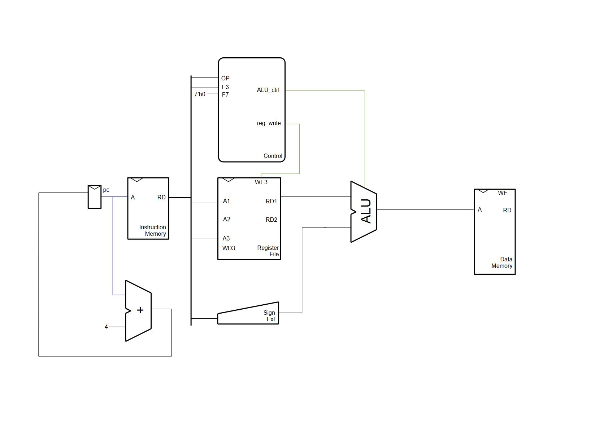
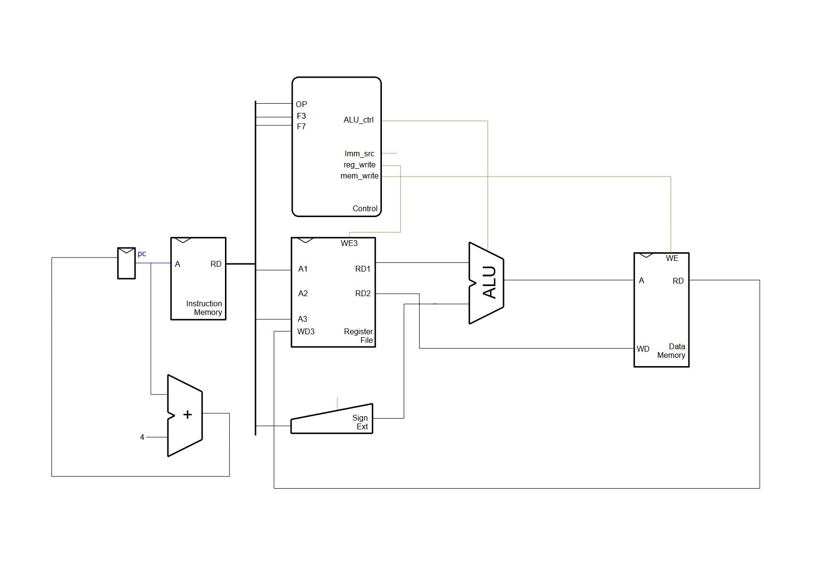

# The HOLY CORE project : A full RISC-V Tutorial, for everyone

This tutorial will teach you how to build and test a RISC-V Single cycle core at the RTL Level.

We'll use a set of open-source tools to allow everyone to complete this project at home using little to no specific resources. If you need more info on the tools or the setup process, check out the [project setup](./setup.md) file. **The setup file also contains important informations on what you need to know, have and learn before starting this tutorial**.

This tutorial heavily based on [DDCA lectures, chapter 7](https://www.youtube.com/watch?v=lrN-uBKooRY&list=PLh8QClfSUTcbfTnKUz_uPOn-ghB4iqAhs) and on the *Digital Design and Computer Architecture, RISC-V Edition* Book from Sarah & David Harris. (*I'll let you do your own research to get your hands on the PDF*).

> Why **Holy** core ? Because I like this name and wanted to a little credit to god. It is also a reference to Terry A. Davis. But the naming does not really impact this project, *at all*.

In this tutorial, we will build the following core :


Which aims at implementing all of the RV32I base instruction set. You can find a table [here](https://five-embeddev.com/riscv-user-isa-manual/Priv-v1.12/instr-table.html) describing each intruction we'll implement (only **RV32I** here).

We will implement these using SystemVerilog at the Register-Transfer Level (RTL), meaning we will focus on the underlying logic of the CPU rather than basics (e.g. full aders and gate-level design).

You can also find some tables for instructions [here](https://five-embeddev.com/riscv-user-isa-manual/Priv-v1.12/instr-table.html).

## 0 : Where do we start

In order to build this core, we'll start by following the [DDCA lectures, chapter 7](https://www.youtube.com/watch?v=lrN-uBKooRY&list=PLh8QClfSUTcbfTnKUz_uPOn-ghB4iqAhs) lectures (availible for free on youtube). You can also use their book cited in the intro. This will allow you to have another reference to start this project, which can be extremely useful if there is something you struggle to understand.

The plan now consists in thinking about each type of instruction we can encounter and create the logic blocks necessary to make them happen. As stated in the [project setup](./setup.md) We'll test these block individually to make sure each feature works, and we'll them put them togheter to form our core that we'll test using one big test program.

> Note that the testbenches and verification technique can be improved and people smarter than me may comment on "how unefficient" this is. **But** I simply do not care and invite them to go outside and enjoy the sun a little bit.

Of course, the first couple of instructions we'll implement will require the most amount of work as we'll start from 0. But once we implement a few, **the others will be way easier to implement** ! So keep in mind that the first few instructions are the hardest, and once this is done, it only gets more practical.

Let's get started !

## 1 : Implementing the "load word" ```lw``` instruction (basic I-Type)

[Lecture](https://www.youtube.com/watch?v=AoBkibslRBM)

Below is a I-type instruction example (I standing for "Immediate") that loads data into reg x6, from the pointer in x9 with an offset of -4 on the address :

```asm
lw x6, -4(x9)
```

We would translate it like this in binary and in hex, as an I-type instruction :

```txt
111111111100 01001 010 00110 0000011
0xFFC4A303
```

here is a quick breakdown :

|        | IMM [11:0]   | rs1          | f3     | rd           | op      |
| ------ | ------------ | ------------ | ------ | ------------ | ------- |
| binary | 111111111100 | 01001        | 010    | 00110        | 0000011 |
| Value  | -4           | 9 (as in x9) | 2 (lw) | 6 (as in x6) | I-type  |

## 1.1 : What do we need to implement ```lw``` ?

Here is an overview of what we'll try to do :



As you can see, before doing any actual hardware digital interpretation of this instruction, we first need to build some basic logic blocks :

- A register file
- An instruction memory
- Some data memory too
- A sign extender
- A basic ALU
- And a decoder/control unit we will improve as time goes on

We'll start by ceazting basic versions of the different building blocks and test their bahavior seperatly.

We'll then assemble them to form our first version of our datapath.

## 1.1.a : Implementing memory

### 1.1.a : HDL Code

We'll implement some basic piece of memory that can store X amount of words and it will respond in 1 clock cycle (which is way too good to be true, but memory is a pain so we'll *conviniently* ignore that for now...).

So, let's get to work shall we ? We create a memeory.sv file in which we'll write some RTL logic :

```sv
// memory.sv

module memory #(
    parameter WORDS = 64
) (
    input logic clk,
    input logic [31:0] address,
    input logic [31:0] write_data,
    input logic write_enable,
    input logic rst_n,

    output logic [31:0] read_data
);

/*
* This memory is byte addressed
* But have no support for mis-aligned write nor reads.
*/

reg [31:0] mem [0:WORDS-1];  // Memory array of words (32-bits)

always @(posedge clk) begin
    // reset logic
    if (rst_n == 1'b0) begin
        for (int i = 0; i < WORDS; i++) begin
            mem[i] <= 32'b0;  
        end
    end
    else if (write_enable) begin
        // Ensure the address is aligned to a word boundary
        // If not, we ignore the write
        if (address[1:0] == 2'b00) begin 
            //here, address[31:2] is the word index
            mem[address[31:2]] <= write_data;
        end
    end
end

// Read logic
always_comb begin
    //here, address[31:2] is the word index
    read_data = mem[address[31:2]]; 
end

endmodule
```

Note the trick here, we use a [byte adressed momory](https://youtu.be/P2oFPtdDgTg?feature=shared&t=233) (watch the video if you don't know the difference with word addressed memory). However, the memory stays fairly simple as we do not add support for non-aligned read and writes (we'll add byte and halfword R/W towards then end of the tutorial).

If you are not fully used to verilog/systemVerilog syntax yet, take your time to get your head around it but you can learn along the way. I will also leave "blanks" in this tutorial sometimes, where you will have some room for creativity which should allow you to learn.

Each and everytime we implement something, we also test it, as stated in the [setup file](./setup.md), we will use cocotb and verilator to verify our HDL.

### 1.1.a : Verification

When it comes to verifying memory, we'll simply do some writes while tinkering with the ``write_enable`` flag.

> It turns out LLMs are bad at digital design and I don't recommend using it for this course, especially for test benches so please try to write them yourself (written in late 2024).

Here is the testbench :

```python
# test_memory.py

import cocotb
from cocotb.clock import Clock
from cocotb.triggers import RisingEdge, Timer


@cocotb.test()
async def memory_data_test(dut):
    # Start a 10 ns clock
    cocotb.start_soon(Clock(dut.clk, 1, units="ns").start())
    await RisingEdge(dut.clk)

    # Reset
    dut.rst_n.value = 0
    dut.write_enable.value = 0
    dut.address.value = 0
    dut.write_data.value = 0  

    await RisingEdge(dut.clk)    
    dut.rst_n.value = 1 
    await RisingEdge(dut.clk)  

    # All is 0 after reset
    for address in range(dut.WORDS.value):
        dut.address.value = address
        await Timer(1, units="ns")
        assert dut.read_data.value == "00000000000000000000000000000000"
      
    # Test: Write and read back data
    test_data = [
        (0, 0xDEADBEEF),
        (4, 0xCAFEBABE),
        (8, 0x12345678),
        (12, 0xA5A5A5A5)
    ]

    for address, data in test_data:
        # Write data to memory
        dut.address.value = address
        dut.write_data.value = data
        dut.write_enable.value = 1
        await RisingEdge(dut.clk)

        # Disable write after one cycle
        dut.write_enable.value = 0
        await RisingEdge(dut.clk)

        # Verify the write by reading back
        dut.address.value = address
        await RisingEdge(dut.clk)
        assert dut.read_data.value == data

    # Test: Write to multiple addresses, then read back
    for i in range(40,4):
        dut.address.value = i
        dut.write_data.value = i + 100
        dut.write_enable.value = 1
        await RisingEdge(dut.clk)

    # Disable write, then read back values to check
    dut.write_enable.value = 0
    for i in range(40,4):
        dut.address.value = i
        await RisingEdge(dut.clk)
        expected_value = i + 100
        assert dut.read_data.value == expected_value
```

Once again, we increment memory by 4 because it is byte addressed.

To run this, check out the [setup file](./setup.md).

## 1.1.b : Implementing the Register File

### 1.1.b : HDL Code

For the reg file, it's just 32x32bits registers. we'll implement it like memory execpt the size is fixed to 32 bits with 5bits addressing.

The I/Os are a bit different though as we have to accomodate all the instruction types. E.g. in R-Types (which operates ONLY on registers) we can write to a register whilst getting data from 2 of them at the same time.

```sv
// regfile.sv

module regfile (
    // basic signals
    input logic clk,
    input logic rst_n,

    // Reads
    input logic [4:0] address1,
    input logic [4:0] address2,
    output logic [31:0] read_data1,
    output logic [31:0] read_data2,

    // Writes
    input logic write_enable,
    input logic [31:0] write_data,
    input logic [4:0] address3
);

// 32bits register. 32 of them (addressed with 5 bits)
reg [31:0] registers [0:31]; 

// Write logic
always @(posedge clk) begin
    // reset support, init to 0
    if(rst_n == 1'b0) begin
        for(int i = 0; i<32; i++) begin
            registers[i] <= 32'b0;
        end
    end 
    // Write, except on 0, reserved for a zero constant according to RISC-V specs
    else if(write_enable == 1'b1 && address3 != 0) begin
        registers[address3] <= write_data;
    end
end

// Read logic, async
always_comb begin : readLogic
    read_data1 = registers[address1];
    read_data2 = registers[address2];
end
  
endmodule
```

### 1.1.b : Verification

Now to verify this HDL, we'll simply use random write on A3, and read after each write on both addresses. We then compare to a therorical golden state update in software in the testbench.

We also add small tests at the end to test the 0 constant.

Note that we use small timer delay to test out the async properties of our design.

```python
import cocotb
from cocotb.clock import Clock
from cocotb.triggers import RisingEdge, Timer
import random
import numpy as np

@cocotb.test()
async def random_write_read_test(dut):
    # Start a 10 ns clock
    cocotb.start_soon(Clock(dut.clk, 10, units="ns").start())
    await RisingEdge(dut.clk)

    # Init and reset
    dut.rst_n.value = 0
    dut.write_enable.value = 0
    dut.address1.value = 0
    dut.address2.value = 0
    dut.address3.value = 0
    dut.write_data.value = 0  

    await RisingEdge(dut.clk)   
    dut.rst_n.value = 1  # realease reset_n   
    await RisingEdge(dut.clk)  

    # fill a heorical state of the regs, all 0s for starters
    theorical_regs = [0 for _ in range(32)]

    # Loop to write and read random values, 1000 test shall be enough
    for _ in range(1000): 
        # Generate a random register address (1 to 31, skip 0)
        address1 = random.randint(1, 31)
        address2 = random.randint(1, 31)
        address3 = random.randint(1, 31)
        write_value = random.randint(0, 0xFFFFFFFF)

        # perform reads
        await Timer(1, units="ns") # wait a ns to test async read
        dut.address1.value = address1
        dut.address2.value = address2
        await Timer(1, units="ns")
        assert dut.read_data1.value == theorical_regs[address1]
        assert dut.read_data2.value == theorical_regs[address2]

        # perform a random write
        dut.address3.value = address3
        dut.write_enable.value = 1
        dut.write_data = write_value
        await RisingEdge(dut.clk)
        dut.write_enable.value = 0
        theorical_regs[address3] = write_value
        await Timer(1, units="ns")

    # try to write at 0 and check if it's still 0
    await Timer(1, units="ns")
    dut.address3.value = 0
    dut.write_enable.value = 1
    dut.write_data = 0xAEAEAEAE
    await RisingEdge(dut.clk)
    dut.write_enable.value = 0
    theorical_regs[address3] = 0

    await Timer(1, units="ns") # wait a ns to test async read
    dut.address1.value = 0
    await Timer(1, units="ns")
    print(dut.read_data1.value)
    assert int(dut.read_data1.value) == 0

    print("Random write/read test completed successfully.")
```

## 1.1.c : Implementing the ALU

### 1.1.c : HDL Code

For the Load Word datapath, we only need to add :

- The content of a source register, containing a target address
- A 12bits immediate / offset

Here is a very basic implementation, **note that this design will evolve heavily !**.

```sv
module alu (
    // IN
    input logic [2:0] alu_control,
    input logic [31:0] src1,
    input logic [31:0] src2,
    // OUT
    output logic [31:0] alu_result,
    output logic zero
);

always_comb begin
    case (alu_control)
        3'b000 : alu_result = src1 + src2;
        default: alu_result = 32'b0;
    endcase
end

assign zero = alu_result == 32'b0;
    
endmodule
```

We also add a ```alu_control``` option, to later select other arithmetic operation. We default the result to 0 if the requested arithmetic isn't iplemented and we add a "zero" flag that we'll use in later designs.

### 1.1.c : Verification

Simple design, simple tesbench, but this time, the alu being pur combinational logic, we do not use a clock :

```python
import cocotb
from cocotb.triggers import Timer
import random


@cocotb.test()
async def add_test(dut):
    await Timer(1, units="ns")
    dut.alu_control.value = 0b000
    for _ in range(1000):
        src1 = random.randint(0,0xFFFFFFFF)
        src2 = random.randint(0,0xFFFFFFFF)
        dut.src1.value = src1
        dut.src2.value = src2
        # We mask expected to not take account of overflows
        expected = (src1 + src2) & 0xFFFFFFFF
        # Await 1 ns for the infos to propagate
        await Timer(1, units="ns")
        assert int(dut.alu_result.value) == expected

@cocotb.test()
async def default_test(dut):
    await Timer(1, units="ns")
    dut.alu_control.value = 0b111
    src1 = random.randint(0,0xFFFFFFFF)
    src2 = random.randint(0,0xFFFFFFFF)
    dut.src1.value = src1
    dut.src2.value = src2
    expected = 0
    # Await 1 ns for the infos to propagate
    await Timer(1, units="ns")
    assert int(dut.alu_result.value) == expected

@cocotb.test()
async def zero_test(dut):
    await Timer(1, units="ns")
    dut.alu_control.value = 0b000
    dut.src1.value = 123
    dut.src2.value = -123
    await Timer(1, units="ns")
    print(int(dut.alu_result.value))
    assert int(dut.zero.value) == 1
    assert int(dut.alu_result.value) == 0
```

Here we declare multiple tests, it's exactly the same as making a single block but it improves readability so why not.

## 1.1.d : Implementing the sign extender

In odrer to manipulte the immediate in other computation block, we need to make it 32bit wide. Also, Immediates can be "scatered" around in the instruction in RISC-V (e.g. Sotre Word ```sw```). This means that we'll need to :

1. Gather the immediate in the instruction, depending on the op code (ie, include some control inputs)
2. Extend the gathered immediate sign to 32bits. Here is a basic implemention for our basic lw only with some preparations for the future :

```sv
// signext.sv

module signext (
    // IN
    input logic [24:0] raw_src,
    input logic [1:0] imm_source,

    // OUT (immediate)
    output logic [31:0] immediate
);

logic [11:0] gathered_imm;

always_comb begin
    case (imm_source)
        1'b00 : gathered_imm = raw_src[24:13];
        default: gathered_imm = 12'b0;
    endcase
end

assign immediate = {{20{gathered_imm[11]}}, gathered_imm};
    
endmodule
```

Simple enough right ? no magic here, simply an raw application of the DDCA lecture. Now we test this design !

### 1.1.d : Verification

Here is the test benchench, if you are not used to bitwise operations, take a minute to get your head around these :

```python
import cocotb
from cocotb.clock import Clock
from cocotb.triggers import RisingEdge, Timer
import random
import numpy as np

@cocotb.test()
async def random_write_read_test(dut):
    # TEST POSITIVE IMM = 123 WITH SOURCE = 0
    imm = 0b000001111011 #123
    imm <<= 13 # leave "room" for ramdom junk
    source = 0b00
    # 25 bits sent to sign extend contains data before that will be ignred (rd, f3,..)
    # masked to leave room for imm "test payload"
    random_junk = 0b000000000000_1010101010101 
    raw_data = random_junk | imm
    await Timer(1, units="ns")
    dut.raw_src.value = raw_data
    dut.imm_source = source
    await Timer(1, units="ns") # let it propagate ...
    assert dut.immediate.value == "00000000000000000000000001111011", f"expected 00000000000000000000000001111011, got {dut.immediate.value}"
    assert int(dut.immediate.value) == 123

    # TEST Negative IMM = -42 WITH SOURCE = 0
    imm = 0b111111010110 #-42
    imm <<= 13 # leave "room" for ramdom junk
    source = 0b00
    # 25 bits sent to sign extend contains data before that will be ignred (rd, f3,..)
    # masked to leave room for imm "test payload"
    random_junk = 0b000000000000_1010101010101 
    raw_data = random_junk | imm
    await Timer(1, units="ns")
    dut.raw_src.value = raw_data
    dut.imm_source = source
    await Timer(1, units="ns") # let it propagate ...
    assert dut.immediate.value == "11111111111111111111111111010110", f"expected 11111111111111111111111111010110, got {dut.immediate.value}"
    # Python interprets int as uint. we sub 1<<32 as int to get corresponding negative value
    assert int(dut.immediate.value) - (1 << 32)  == -42
```

Once again, we'll add other features to this a bit later ;)

## 1.1.e : Implementing basic control

Below is an image of what we need to do implement for the control unit. Note that the following image contains the logic for the **FULL** controller, for now, we'll focus on implementing the ```lw``` logic.


> You can find the definitives tables for the HOLY CORE in this [spreadsheet](https://docs.google.com/spreadsheets/d/1qkPa6muBsE1olzJDY9MTXeHVy1XvEswYHMTnvV1bRlU/edit?usp=sharing) for reference.

### 1.1.e : HDL Code

First we lay down the only I/Os we need so far for ```lw```:

```sv
module control (
    // IN
    input logic [6:0] op,
    input logic [2:0] func3,
    input logic [6:0] func7,
    input logic alu_zero,

    // OUT
    output logic [2:0] alu_control,
    output logic [1:0] imm_source,
    output logic mem_write,
    output logic reg_write
);

// lorem ipsum...

endmodule
```

This will help us focus on the important stuff to get a first ```lw``` example working.

As you can see, there is an ALU control as well. This is because a single instruction type can require different kinds of arithmetics (e.g. R-Types that can be ```add```, ```sub```, ```mul```, ...). So we put it here now because it is one of the main purpose of the control unit to assert what arithmetic to use using this signal.

**To know what ```alu_control```to use**, the plan is to deduce a general ```alu_op``` depending on the instruction type and then add an ```alu_decoder``` unit will deduce the arithmetic from indicators like ```func3``` and ```func7``` (Also called simply *f3* & *f7*). This will finally assert some ```alu_control``` control signals to tell the ALU what to do, here is another truth table to use that :


> You can find the full table for the entire course at [this google calc link](https://docs.google.com/spreadsheets/d/1qkPa6muBsE1olzJDY9MTXeHVy1XvEswYHMTnvV1bRlU/edit?usp=sharing).

This process of seperating ```alu_op``` and ```alu_control``` may seem weird but trust me, it is for the better as we add mulptiple arithmetic option for each type of instruction :

```sv
module control (
    // IN
    input logic [6:0] op,
    input logic [2:0] func3,
    input logic [6:0] func7,
    input logic alu_zero,

    // OUT
    output logic [2:0] alu_control,
    output logic [1:0] imm_source,
    output logic mem_write,
    output logic reg_write
);

/**
* MAIN DECODER
*/

logic [1:0] alu_op;
always_comb begin
    case (op)
        // LW
        7'b0000011 : begin
            reg_write = 1'b1;
            imm_source = 2'b00;
            mem_write = 1'b0;
            alu_op = 2'b00;
        end
        // EVERYTHING ELSE
        default: begin
            reg_write = 1'b0;
            imm_source = 2'b00;
            mem_write = 1'b0;
            alu_op = 2'b00;
        end
    endcase
end

/**
* ALU DECODER
*/

always_comb begin
    case (alu_op)
        // LW, SW
        1'b00 : alu_control = 3'b000;
        // EVERYTHING ELSE
        default: alu_control = 3'b111;
    endcase
end
    
endmodule
```

And everything is ready for the future instruction to be added in control !

### 1.1.e : Verification

The tesbench is veristraight forward, we emulate ONLY the important signals described in the truth tables for a given instruction (we don't care about the other one being ```X``` or ```Z``` in simulation). And we assert the outputs states :

```python
import cocotb
from cocotb.triggers import Timer
import random
from cocotb.binary import BinaryValue

@cocotb.coroutine
async def set_unknown(dut):
    # we'll see what this is in a minute ...

@cocotb.test()
async def control_test(dut):
    await set_unknown(dut)
    # TEST CONTROL SIGNALS FOR LW
    await Timer(1, units="ns")
    dut.op.value = 0b0000011 #lw
    await Timer(1, units="ns")
    assert dut.alu_control.value == "000"
    assert dut.imm_source.value == "00"
    assert dut.mem_write.value == "0"
    assert dut.reg_write.value == "1"
```

> ```await set_unknown(dut)``` is here to set the signals to default ```X``` values. You can check the section on tests setup or the source code for more info. If you don't use it, you may having passing test whereas you are checking on other tests states. It will be up to you to update it (**by uncommenting the assignements**) as we add input to the *control* unit. Don't, worry, it will come to mind naturally.

Here is what the ```set_unknown``` function looks like :

```python
@cocotb.coroutine
async def set_unknown(dut):
    # Set all input to unknown before each test
    await Timer(1, units="ns")
    dut.op.value = BinaryValue("XXXXXXX")
    #
    # Uncomment the following throughout the course whan needed
    #
    # dut.func3.value = BinaryValue("XXX")
    # dut.func7.value = BinaryValue("XXXXXXX")
    # dut.alu_zero.value = BinaryValue("X")
    # dut.alu_last_bit.value = BinaryValue("X")
    await Timer(1, units="ns")
```

For the curious who may ask "so what is the f3 for in the ```lw``` instruction then ?". Great question. We can use F3 to implement different flavors of the ```load``` instruction

> "The LW instruction loads a 32-bit value from memory into rd. LH loads a 16-bit value from memory,
then sign-extends to 32-bits before storing in rd. LHU loads a 16-bit value from memory but then
zero extends to 32-bits before storing in rd. LB and LBU are defined analogously for 8-bit values."

(from the [RISC-V Vol1 User-level ISA](https://riscv.org/wp-content/uploads/2017/05/riscv-spec-v2.2.pdf), Page 19)

Use the [tables](https://five-embeddev.com/riscv-user-isa-manual/Priv-v1.12/instr-table.html) to check out different f3 values for ```loads```.

## 1.2 : Laying down the ```lw``` datapath (finally)

We can now start to edit ```cpu.sv``` and add the pieces toggether ! From tehere (a working lw datapath), we'll be able to add functionalities and build more advanced features !

### 1.2 : HDL Code

Here is the complete ```lw``` specific datapth :


So we implement it !

```sv
module cpu (
    input logic clk,
    input logic rst_n
);

/**
* PROGRAM COUNTER
*/

reg [31:0] pc;
logic [31:0] pc_next;

always_comb begin : pcSelect
    pc_next = pc + 4;
end

always @(posedge clk) begin
    if(rst_n == 0) begin
        pc <= 32'b0;
    end else begin
        pc <= pc_next;
    end
end

/**
* INSTRUCTION MEMORY
*/

// Acts as a ROM.
wire [31:0] instruction;

memory #(
    .mem_init("./test_imemory.hex")
) instruction_memory (
    // Memory inputs
    .clk(clk),
    .address(pc),
    .write_data(32'b0),
    .write_enable(1'b0),
    .rst_n(1'b1),

    // Memory outputs
    .read_data(instruction)
);

/**
* CONTROL
*/

// Intercepts instructions data, generate control signals accordignly
// in control unit
logic [6:0] op;
assign op = instruction[6:0];
logic [2:0] f3;
assign f3 = instruction[14:12];
wire alu_zero;
// out of control unit
wire [2:0] alu_control;
wire [1:0] imm_source;
wire mem_write;
wire reg_write;

control control_unit(
    .op(op),
    .func3(f3),
    .func7(7'b0),
    .alu_zero(alu_zero),

    // OUT
    .alu_control(alu_control),
    .imm_source(imm_source),
    .mem_write(mem_write),
    .reg_write(reg_write)
);

/**
* REGFILE
*/

logic [4:0] source_reg1;
assign source_reg1 = instruction[19:15];
logic [4:0] source_reg2;
assign source_reg2 = instruction[24:20];
logic [4:0] dest_reg;
assign dest_reg = instruction[11:7];
wire [31:0] read_reg1;
wire [31:0] read_reg2;

logic [31:0] write_back_data;
always_comb begin : wbSelect
    write_back_data = mem_read;
end


regfile regfile(
    // basic signals
    .clk(clk),
    .rst_n(rst_n),

    // Read In
    .address1(source_reg1),
    .address2(source_reg2),
    // Read out
    .read_data1(read_reg1),
    .read_data2(read_reg2),

    // Write In
    .write_enable(reg_write),
    .write_data(write_back_data),
    .address3(dest_reg)
);

/**
* SIGN EXTEND
*/
logic [24:0] raw_imm;
assign raw_imm = instruction[31:7];
wire [31:0] immediate;

signext sign_extender(
    .raw_src(raw_imm),
    .imm_source(imm_source),
    .immediate(immediate)
);

/**
* ALU
*/
wire [31:0] alu_result;
logic [31:0] alu_src2;

always_comb begin : srcBSelect
    alu_src2 = immediate;
end

alu alu_inst(
    .alu_control(alu_control),
    .src1(read_reg1),
    .src2(alu_src2),
    .alu_result(alu_result),
    .zero(alu_zero)
);

/**
* DATA MEMORY
*/
wire [31:0] mem_read;

memory #(
    .mem_init("./test_dmemory.hex")
) data_memory (
    // Memory inputs
    .clk(clk),
    .address(alu_result),
    .write_data(32'b0),
    .write_enable(1'b0),
    .rst_n(1'b1),

    // Memory outputs
    .read_data(mem_read)
);
    
endmodule
```

This one is large but failry simple, no fancy logic here as we pretty much just assemble legos according to the plan with a bunch of additional wires. Note the "always comb" muxes we add in preparetion for further improvements, even though they are pretty useless right now.

> Tip : to navigate such HDL files, use the "find" feature of your text editor **extensively** ! It will be you best friend when it comes to finding out *what* goes *where* when these files gets big.

Note that I added some ```.mem_init("blablabla")``` parameters to the memory. This has to do with verification afterward. Here is the updated memory's verilog to acoomodate this change :

```sv
module memory #(
    parameter WORDS = 64,
    parameter mem_init = ""
) (
    // same I/Os ...
);

reg [31:0] mem [0:WORDS-1];  // Memory array of words (32-bits)

initial begin
    $readmemh(mem_init, mem);  // Load memory for simulation
end

// same logic as before ....

endmodule
```

see below verification for explainations...

### 1.2 : Verification

To test this, we need to instanciate instruction and data memory with some known data. We then check the regfile's states and check if the said states are the one we expected when writting the instructions.

So here is our todo list to lay down the tests :

- Write some basic memories file to init the memory for testing
- Loads these files for simulation
- Write the testbench

Sounds simple enough, but our current project testing setup has some limitations that have to be carefully taken into account. These limitation leads to :

- We will only have 1 memory (*it is what it is*).
- We have to load the initial "ROMs" memory hexfiles directly via hardcoded verilog. Thus the modifications and limitations described above.
- The cocotb framework is great **but** when test benches and data get more complex, we have to use these kinds of tricks.

With all of these facts in mind, let's write some test ROMs for our lw datapath !

For the instrcution memory to test our data path, we'll use a simple lw test  :

```asm
lw x18 8(x0) // loads daata from addr 0x00000008 in reg x18 (s2)
```

Which translates as this in HEX format (comments like ```//blablabla``` are ignored by ```$readmemh("rom.hex")```):

```txt
00802903  //LW TEST START : lw x18 8(x0)
00000013  //NOP
00000013  //NOP
//(Filled the rest with NOPs...) 
```

> To translate ASM to HEX, you can use [this website](https://luplab.gitlab.io/rvcodecjs/) (better than doing it on paper like I did haha).

And here is the data we'll try to load :

```txt
AEAEAEAE  // @ 0x00000000 Useless data
00000000  // @ 0x00000004 Useless data
DEADBEEF  // @ 0x00000008 What we'll try to get in x18
00000000
00000000
//(...)
```

Great ! Here is how we are going to organize ou cpu tb folder (we put the ```.hex``` file in there as the HDL file are called from here so ```$readmemh("myrom.hex")``` will gets the ```.hex``` files from there) :

```txt
tb
├── cpu
│   ├── Makefile
│   ├── test_cpu.py
│   ├── test_dmemory.hex
│   └── test_imemory.hex
```

And now we can design a test bench ! First, we design some helper functions that will convert str data from ```HEX``` to ```BIN``` as needed (python tricks to deal with multiple data types expressed as ```str``` in cocotb), we also declare a ```cocotb.coroutine``` that will handle cpu resets :

```python
# test_cpu.py

import cocotb
from cocotb.clock import Clock
from cocotb.triggers import RisingEdge

def binary_to_hex(bin_str):
    # Convert binary string to hexadecimal
    hex_str = hex(int(str(bin_str), 2))[2:]
    hex_str = hex_str.zfill(8)
    return hex_str.upper()

def hex_to_bin(hex_str):
    # Convert hex str to bin
    bin_str = bin(int(str(hex_str), 16))[2:]
    bin_str = bin_str.zfill(32)
    return bin_str.upper()

@cocotb.coroutine
async def cpu_reset(dut):
    # Init and reset
    dut.rst_n.value = 0
    await RisingEdge(dut.clk)     # Wait for a clock edge after reset
    dut.rst_n.value = 1           # De-assert reset
    await RisingEdge(dut.clk)     # Wait for a clock edge after reset

```

Great ! Now I added a small test to see if memory reads worked on my side, and we also write a test to check if out ```lw``` instruction worked as expected :

```python
# test_cpu.py

import cocotb
from cocotb.clock import Clock
from cocotb.triggers import RisingEdge

def binary_to_hex(bin_str):
    ...

def hex_to_bin(hex_str):
    ...

@cocotb.coroutine
async def cpu_reset(dut):
    ...

@cocotb.test()
async def cpu_init_test(dut):
    """Reset the cpu and check for a good imem read"""
    cocotb.start_soon(Clock(dut.clk, 1, units="ns").start())
    await RisingEdge(dut.clk)

    await cpu_reset(dut)
    assert binary_to_hex(dut.pc.value) == "00000000"

    # Load the expected instruction memory as binary
    # Note that this is loaded in sim directly via the verilog code
    # This load is only for expected
    imem = []
    with open("test_imemory.hex", "r") as file:
        for line in file:
            # Ignore comments
            line_content = line.split("//")[0].strip()
            if line_content:
                imem.append(hex_to_bin(line_content))

    # We limit this inital test to the first couple of instructions as we'll later implement branches
    for counter in range(5):
        expected_instruction = imem[counter]
        assert dut.instruction.value == expected_instruction, f"expected {binary_to_hex(expected_instruction)} but got {binary_to_hex(dut.instruction.value)} @ pc {binary_to_hex(dut.pc.value)}"
        await RisingEdge(dut.clk)

@cocotb.test()
async def cpu_insrt_test(dut):
    """Runs a lw datapath test"""
    cocotb.start_soon(Clock(dut.clk, 1, units="ns").start())
    await RisingEdge(dut.clk)

    await cpu_reset(dut)

    # The first instruction for the test in imem.hex load the data from
    # dmem @ adress 0x00000008 that happens to be 0xDEADBEEF into register x18

    # Wait a clock cycle for the instruction to execute
    await RisingEdge(dut.clk)

    print(binary_to_hex(dut.regfile.registers[18].value))

    # Check the value of reg x18
    assert binary_to_hex(dut.regfile.registers[18].value) == "DEADBEEF", f"expected DEADBEEF but got {binary_to_hex(dut.regfile.registers[18].value)} @ pc {binary_to_hex(dut.pc.value)}"
```

As you can see, the helper functions does help a lot indeed ! Using them, we can easily compare our expected values by switching between data representations as needed.

## 2 : Implementing the "store word" ```sw``` instruction (basic S-Type)

[Lecture](https://www.youtube.com/watch?v=sVZmqLRkbVk)

Here is what enhancements we need to make to add basic ```sw (S-type)``` support in our CPU :


As you can see, it is simply about adding a wire from *RD2* to write data and an other *imm_source* control signal.

Below is a S-type instruction example (S standing for "Store") that loads data from reg x18 (s1), to the address pointer in x5 (t0) with an offset of C on the address :

```asm
sw x18, 0xC(x0)
```

We would translate it like this in binary and in hex, as an S-type instruction :

```txt
0000000 10010 00000 010 01100 0100011
0x01202623
```

here is a quick breakdown :

|        | IMM [11:5]   | rs2          | rs1        | f3     | IMM [4:0]    | op      |
| ------ | ------------ | ------------ | ------     | ------ | ------------ | ------- |
| binary | 0000000      | 10010        | 00000     | 010    | 01100        | 0100011 |
| Value  |  0           | x18 (s1)      | x0 (0)   | 2 (sw) | 0xC          | S-type  |

## 2.1 : What do we need to implement ```sw``` ?

Here is a todo list to implement these new changes :

- The immediate is now "scatered" around the instruction, we'll need to:
  - Tell the control to select anthother source for the IMM
  - Tell the sign extender unit how to interpret that
- We'll also need to update the control unit to :
  - Not enable write for the regs
  - Enable write for the memory

## 2.1.a : Updating the signextender

### 2.1.a : HDL Code

So let's get to work shall we ? We'll statrt by updating the sign extender to take into account our new source type

```sv
// signext.sv

module signext (
    // IN
    input logic [24:0] raw_src,
    input logic [1:0] imm_source,

    // OUT (immediate)
    output logic [31:0] immediate
);

logic [11:0] gathered_imm;

always_comb begin
    case (imm_source)
        // For I-Types
        2'b00 : gathered_imm = raw_src[24:13];
        // For S-types
        2'b01 : gathered_imm = {raw_src[24:18],raw_src[4:0]};
        default: gathered_imm = 12'b0;
    endcase
end

assign immediate = {{20{gathered_imm[11]}}, gathered_imm};
    
endmodule
```

As you can see, just a simple application of the S-Type instruction Imm format.

### 2.1.a : Verification

Now to verify that, we update the ```test_signext.py``` testbench file by adding another, improved test :

```python
# test_signext.py

import cocotb
from cocotb.triggers import Timer
import random
import numpy as np

@cocotb.test()
async def signext_i_type_test(dut):
    # Old fully manual test for I_Types instrs
    # ...

@cocotb.test()
async def signext_s_type_test(dut):
    # 100 randomized tests
    for _ in range(100):
        # TEST POSITIVE IMM
        await Timer(100, units="ns")
        imm = random.randint(0,0b01111111111) 
        imm_11_5 = imm >> 5
        imm_4_0 = imm & 0b000000011111
        raw_data = (imm_11_5 << 18) | (imm_4_0) # the 25 bits of data
        source = 0b01
        dut.raw_src.value = raw_data
        dut.imm_source = source
        await Timer(1, units="ns") # let it propagate ...
        assert int(dut.immediate.value) == imm

        # TEST Negative IMM
        # Get a random 12 bits UINT and gets its base 10 neg value by - (1 << 12)
        imm = random.randint(0b100000000000,0b111111111111) - (1 << 12)
        imm_11_5 = imm >> 5
        imm_4_0 = imm & 0b000000011111
        raw_data = (imm_11_5 << 18) | (imm_4_0) # the 25 bits of data
        source = 0b01
        await Timer(1, units="ns")
        dut.raw_src.value = raw_data
        dut.imm_source = source
        await Timer(1, units="ns") # let it propagate ...
        # print(bin(imm),dut.raw_src.value)
        # print(int(dut.immediate.value), imm)
        assert int(dut.immediate.value) - (1 << 32) == imm
```

As we can see, we randomized the testes and used more bitwise manipulation for assertions to make the whole testing more robust.

> (This also serves as a great biwise operations exercise !)

## 2.1.b : Updating the control signals

As you can see in the lecture and as stated before, we need to update the ```reg_write_enable``` and ```mem_write_enable``` signals.

### 2.1.b : HDL Code

Here is the updated main decode, nothing else changes :

```sv
// control.sv

//...

/**
* MAIN DECODER
*/

logic [1:0] alu_op;
always_comb begin
    case (op)
        // I-type (lw)
        7'b0000011 : begin
            reg_write = 1'b1;
            imm_source = 2'b00;
            mem_write = 1'b0;
            alu_op = 2'b00;
        end
        // S-Type (sw)
        7'b0100011 : begin
            reg_write = 1'b0;
            imm_source = 2'b01;
            mem_write = 1'b1;
            alu_op = 2'b00;
        end
        // EVERYTHING ELSE
        default: begin
            reg_write = 1'b0;
            imm_source = 2'b00;
            mem_write = 1'b0;
            alu_op = 2'b00;
        end
    endcase
end

//...
```

As you can see it is simple a matter of adding a decoding case.

### 2.1.b : Verification

For the verification, it is also pretty somple :

```python
# test_control.py

import cocotb
from cocotb.triggers import Timer

@cocotb.test()
async def lw_control_test(dut):
    # ...

@cocotb.test()
async def sw_control_test(dut):
    await set_unknown(dut)
    # TEST CONTROL SIGNALS FOR SW
    await Timer(10, units="ns")
    dut.op.value = 0b0100011 #sw
    await Timer(1, units="ns")
    assert dut.alu_control.value == "000"
    assert dut.imm_source.value == "01"
    assert dut.mem_write.value == "1"
    assert dut.reg_write.value == "0"
```

> Note that these tests will change, we will later add "flavors" to these I and S types : ```lb```, ```sb```, ... which will have another f3, which will require a bit more decoding and logic, but for now, this will do just fine !

## 2.2 : Actually mplementing the ```sw``` datapath

Globally in the datapath, nothing much changes, we just link the signals we previously kept on 0 for the memory write inputs :

```sv
// cpu.sv

// non changed logic ...

/**
* DATA MEMORY
*/
wire [31:0] mem_read;

memory #(
    .mem_init("./test_dmemory.hex")
) data_memory (
    // Memory inputs
    .clk(clk),
    .address(alu_result),
    .write_data(read_reg2),
    .write_enable(mem_write),
    .rst_n(1'b1),

    // Memory outputs
    .read_data(mem_read)
);

// non changed logic ...
```

### 2.2 : Verification

To verify, once again, we set up the memory files on a scenario that will be easily predictible in testing so we can verify the CPU behavior, whilst keeping of course the previos ```lw``` tests in our memory files :

```txt
//test_imemory.hex

00802903  //LW TEST START : lw x18 0x8(x0)
01202623  //SW TEST START : sw x18 0xC(x0)
00000013  //NOP
00000013  //NOP
00000013  //NOP
//...
```

As you can see, we add a new instruction that will take the value we loaded in x18 and store it @ addr 0x0000000C in memory.

Speaking of memory, the file did not really change, except I changed the 0xC value to ```0xF2F2F2F2``` to avoir asserting 00000000 as it is too common of a value :

```txt
//test_dmemory.hex

AEAEAEAE
00000000
DEADBEEF
F2F2F2F2
00000000
00000000
//...
```

And for the testbench, I simple did some assertion based on how the CPU should react to these instructions. We also get rit of the "init" test that test for init memory state as it executed the instruction to verify PC & memory behavior, which messed up all of the memory state for assertions. Here is the final result :

```python
# test_cpu.py

import cocotb
from cocotb.clock import Clock
from cocotb.triggers import RisingEdge

def binary_to_hex(bin_str):
    # ...

def hex_to_bin(hex_str):
    # ...

@cocotb.coroutine
async def cpu_reset(dut):
    # ...

@cocotb.test()
async def cpu_insrt_test(dut):
    """Runs a lw datapath test"""
    cocotb.start_soon(Clock(dut.clk, 1, units="ns").start())
    await RisingEdge(dut.clk)
    await cpu_reset(dut)

    ##################
    # LOAD WORD TEST 
    # lw x18 0x8(x0)
    ##################
    print("\n\nTESTING LW\n\n")

    # The first instruction for the test in imem.hex load the data from
    # dmem @ adress 0x00000008 that happens to be 0xDEADBEEF into register x18

    # Wait a clock cycle for the instruction to execute
    await RisingEdge(dut.clk)

    # Check the value of reg x18
    assert binary_to_hex(dut.regfile.registers[18].value) == "DEADBEEF", f"expected DEADBEEF but got {binary_to_hex(dut.regfile.registers[18].value)} @ pc {binary_to_hex(dut.pc.value)}"

    ##################
    # STORE WORD TEST 
    # sw x18 0xC(x0)
    ##################
    print("\n\nTESTING SW\n\n")
    test_address = int(0xC / 4) #mem is byte adressed but is made out of words in the eyes of the software
    # The second instruction for the test in imem.hex stores the data from
    # x18 (that happens to be 0xDEADBEEF from the previous LW test) @ adress 0x0000000C 

    # First, let's check the inital value
    assert binary_to_hex(dut.data_memory.mem[test_address].value) == "F2F2F2F2", f"expected F2F2F2F2 but got {binary_to_hex(dut.data_memory.mem[test_address].value)} @ pc {binary_to_hex(dut.pc.value)}"

    # Wait a clock cycle for the instruction to execute
    await RisingEdge(dut.clk)
    # Check the value of mem[0xC]
    assert binary_to_hex(dut.data_memory.mem[test_address].value) == "DEADBEEF", f"expected DEADBEEF but got {binary_to_hex(dut.data_memory.mem[test_address].value)} @ pc {binary_to_hex(dut.pc.value)}"
```

## 3 : Implementing ```R-Type``` instructions

[Lecture](https://youtu.be/sVZmqLRkbVk?feature=shared&t=297)

Okay ! It's going great, we implemented a second king of instructions, so let's recap what we did so far :

- Created all the basic logic blocks
- Layed down the datapath for ```I-Type``` instructions and added ```lw``` support
- Layed down the datapath for ```S-Type``` instructions and added ```sw``` support
- Created a basic control unit accordingly
- Tested everything along the way

We now have a very strong base, and we can almost say that the CPU is starting to look like a tru processing unit ! Let's take a look at what remains to do :

- Implement ```R-Type``` format (arithmetic between regitser)
- Implement ```B-Type & J-Type``` formats (Jumps and conditional branches)
- Implement ```U-Type``` Instructions (Just a convenient way to build constants with immediates)

Oh.. That's actually quite a lot ! But do not fret, as most of these mostly uses what we already layed down !

Here is what we'll try to implement :



In this example, the ```or``` operation is used. What I suggest we do do go gradually, is to first implement the ```add``` and than we exercice a bit by adding ```and``` & ```or``` before moving on to jumps & branches instructions.

## 3.1 : What we need to do for ```R-Type```

First, we'll add ```add``` support, and there isn't much to do outside of the control unit as we already have the ALU add logic availible. The idea will be to only operate with register as source for the ALU and use the alu_result directly as write-back data for reg_write.

Here is what an ```R-Type : add``` instruction look like so we don't mess up the op, f3 and f7 values :

| f7 | rs2 | rs1 |f3 |rd | OP |
|:---:|:---:|:---:|:---:|:---:|:---:|
| 0000000 | xxxxx |xxxxx | 000 |xxxxx |0110011 |

## 3.1.a : Updataing the control unit

So, to accomodate the new requierements, we add the following signals as outputs to our control unit :

- ```alu_source``` which tells our alu not to get it's second operand from the immediate, but rather from the second read register.
- ```write_back_source``` Which tells our registers to get data from the alu for writing back to reg3, instead of the memory_read.

### 3.1.a : HDL Code

Here is the new HDL code. A new thing is that we take f3 into account, because when we'll implement ```or``` & ```and```, this will be the factor that will differenciate them.

```sv
module control (
    // IN
    input logic [6:0] op,
    input logic [2:0] func3,
    input logic [6:0] func7,
    input logic alu_zero,

    // OUT
    output logic [2:0] alu_control,
    output logic [1:0] imm_source,
    output logic mem_write,
    output logic reg_write,
    output logic alu_source,
    output logic write_back_source
);

/**
* MAIN DECODER
*/

logic [1:0] alu_op;
always_comb begin
    case (op)
        // I-type
        7'b0000011 : begin
            reg_write = 1'b1;
            imm_source = 2'b00;
            mem_write = 1'b0;
            alu_op = 2'b00;
            alu_source = 1'b1; //imm
            write_back_source = 1'b1; //memory_read
        end
        // S-Type
        7'b0100011 : begin
            reg_write = 1'b0;
            imm_source = 2'b01;
            mem_write = 1'b1;
            alu_op = 2'b00;
            alu_source = 1'b1; //imm
        end
        // R-Type
        7'b0110011 : begin
            reg_write = 1'b1;
            mem_write = 1'b0;
            alu_op = 2'b10;
            alu_source = 1'b0; //reg2
            write_back_source = 1'b0; //alu_result
        end
        // EVERYTHING ELSE
        default: begin
            reg_write = 1'b0;
            imm_source = 2'b00;
            mem_write = 1'b0;
            alu_op = 2'b00;
        end
    endcase
end

/**
* ALU DECODER
*/

always_comb begin
    case (alu_op)
        // LW, SW
        2'b00 : alu_control = 3'b000;
        // R-Types
        2'b10 : begin
            case (func3)
                // ADD (and later SUB with a different F7)
                3'b000 : alu_control = 3'b000;
                // ALL THE OTHERS
                default: alu_control = 3'b111;
            endcase
        end
        // EVERYTHING ELSE
        default: alu_control = 3'b111;
    endcase
end
    
endmodule
```

### 3.1.a : Verification

We also need to udate our verification, to see if the new signals are okay for our previous instructions, and add a new one for ```add``` :

```python
import cocotb
from cocotb.triggers import Timer

@cocotb.test()
async def lw_control_test(dut):
    # TEST CONTROL SIGNALS FOR LW
    await Timer(1, units="ns")
    dut.op.value = 0b0000011 # I-TYPE
    await Timer(1, units="ns")
    # Logic block controls
    assert dut.alu_control.value == "000"
    assert dut.imm_source.value == "00"
    assert dut.mem_write.value == "0"
    assert dut.reg_write.value == "1"
    # Datapath mux sources
    assert dut.alu_source.value == "1"
    assert dut.write_back_source.value == "1"

@cocotb.test()
async def sw_control_test(dut):
    # TEST CONTROL SIGNALS FOR SW
    await Timer(10, units="ns")
    dut.op.value = 0b0100011 # S-TYPE
    await Timer(1, units="ns")
    assert dut.alu_control.value == "000"
    assert dut.imm_source.value == "01"
    assert dut.mem_write.value == "1"
    assert dut.reg_write.value == "0"
    # Datapath mux sources
    assert dut.alu_source.value == "1"

@cocotb.test()
async def add_control_test(dut):
    # TEST CONTROL SIGNALS FOR ADD
    await Timer(10, units="ns")
    dut.op.value = 0b0110011 # R-TYPE
    # Watch out ! F3 is important here and now !
    dut.func3.value = 0b000
    await Timer(1, units="ns")
    assert dut.alu_control.value == "000"
    assert dut.mem_write.value == "0"
    assert dut.reg_write.value == "1"
    # Datapath mux sources
    assert dut.alu_source.value == "0"
    assert dut.write_back_source.value == "0"
```

Note that if a signal is not necessary to the instruction (eg ```write_back_source``` for ```sw```) we just don't check for it.

## 3.2 : Laying down the datapath for ```R-Type```

Here is a fully updated version of the cpu datapath :

```sv
module cpu (
    input logic clk,
    input logic rst_n
);

/**
* PROGRAM COUNTER
*/

reg [31:0] pc;
logic [31:0] pc_next;

always_comb begin : pc_select
    pc_next = pc + 4;
end

always @(posedge clk) begin
    if(rst_n == 0) begin
        pc <= 32'b0;
    end else begin
        pc <= pc_next;
    end
end

/**
* INSTRUCTION MEMORY
*/

// Acts as a ROM.
wire [31:0] instruction;

memory #(
    .mem_init("./test_imemory.hex")
) instruction_memory (
    // Memory inputs
    .clk(clk),
    .address(pc),
    .write_data(32'b0),
    .write_enable(1'b0),
    .rst_n(1'b1),

    // Memory outputs
    .read_data(instruction)
);

/**
* CONTROL
*/

// Intercepts instructions data, generate control signals accordignly
// in control unit
logic [6:0] op;
assign op = instruction[6:0];
logic [2:0] f3;
assign f3 = instruction[14:12];
wire alu_zero;
// out of control unit
wire [2:0] alu_control;
wire [1:0] imm_source;
wire mem_write;
wire reg_write;
// out muxes wires
wire alu_source;
wire write_back_source;

control control_unit(
    .op(op),
    .func3(f3),
    .func7(7'b0), // we still don't use f7 (YET)
    .alu_zero(alu_zero),

    // OUT
    .alu_control(alu_control),
    .imm_source(imm_source),
    .mem_write(mem_write),
    .reg_write(reg_write),
    // muxes out
    .alu_source(alu_source),
    .write_back_source(write_back_source)
);

/**
* REGFILE
*/

logic [4:0] source_reg1;
assign source_reg1 = instruction[19:15];
logic [4:0] source_reg2;
assign source_reg2 = instruction[24:20];
logic [4:0] dest_reg;
assign dest_reg = instruction[11:7];
wire [31:0] read_reg1;
wire [31:0] read_reg2;

logic [31:0] write_back_data;
always_comb begin : write_back_source_select
    case (write_back_source)
        1'b1: write_back_data = mem_read;
        default: write_back_data = alu_result;
    endcase
end

regfile regfile(
    // basic signals
    .clk(clk),
    .rst_n(rst_n),

    // Read In
    .address1(source_reg1),
    .address2(source_reg2),
    // Read out
    .read_data1(read_reg1),
    .read_data2(read_reg2),

    // Write In
    .write_enable(reg_write),
    .write_data(write_back_data),
    .address3(dest_reg)
);

/**
* SIGN EXTEND
*/
logic [24:0] raw_imm;
assign raw_imm = instruction[31:7];
wire [31:0] immediate;

signext sign_extender(
    .raw_src(raw_imm),
    .imm_source(imm_source),
    .immediate(immediate)
);

/**
* ALU
*/
wire [31:0] alu_result;
logic [31:0] alu_src2;

always_comb begin : alu_source_select
    case (alu_source)
        1'b1: alu_src2 = immediate;
        default: alu_src2 = read_reg2;
    endcase
end

alu alu_inst(
    .alu_control(alu_control),
    .src1(read_reg1),
    .src2(alu_src2),
    .alu_result(alu_result),
    .zero(alu_zero)
);

/**
* DATA MEMORY
*/
wire [31:0] mem_read;

memory #(
    .mem_init("./test_dmemory.hex")
) data_memory (
    // Memory inputs
    .clk(clk),
    .address(alu_result),
    .write_data(read_reg2),
    .write_enable(mem_write),
    .rst_n(1'b1),

    // Memory outputs
    .read_data(mem_read)
);
    
endmodule
```

As you can see, I chose not to add F7 just yet, as we still don't need it for supporting the very few instruction we have so far.

before moving any further, we chack that out old tests still works, because they should ! on my side, they do, great ! So let's move on.

### 3.2 : Verification

As usual, we create a predectible environement. I chose to go with this program to include a ```add``` test :

```txt
//test_imemory.hex
00802903  //LW  TEST START :    lw x18 0x8(x0)
01202623  //SW  TEST START :    sw x18 0xC(x0)
01002983  //ADD TEST START :    lw x19 0x10(x0)
01390A33  //                    add x20 x18 x19
00000013  //NOP
00000013  //NOP
//...
```

And I added some data to memory for this test (```0x0000AAA``` for the addition) :

```txt
//test_dmemory.hex
AEAEAEAE
00000000
DEADBEEF
F2F2F2F2
00000AAA
00000000
//...
```

And here is the updated test :

```python
# test_cpu.py

# Rest of the file ...

@cocotb.test()
async def cpu_insrt_test(dut):

    # OTHER TESTS ...

    ##################
    # ADD TEST
    # lw x19 0x10(x0) (this memory spot contains 0x00000AAA)
    # add x20 x18 x19
    ##################

    # Expected result of x18 + x19
    expected_result = (0xDEADBEEF + 0x00000AAA) & 0xFFFFFFFF
    await RisingEdge(dut.clk) # lw x19 0x10(x0)
    assert binary_to_hex(dut.regfile.registers[19].value) == "00000AAA"
    await RisingEdge(dut.clk) # add x20 x18 x19
    assert binary_to_hex(dut.regfile.registers[20].value) == hex(expected_result)[2:].upper(),  f"expected {hex(expected_result)[2:]}  but got {binary_to_hex(dut.regfile.registers[20].value)} @ pc {binary_to_hex(dut.pc.value)}"
```

## 3.3 : More ```R-Types``` : ```or``` & ```and```

And now, ladies and gentlemen, it is time to be true to my words and implement the bitwise ```or``` operation.

In terms of math, it is extremely basic, so let's go over what we need to do :

- Update the control unit to add support for ```or```
- Add OR operation to our ALU

And that's pretty much it ! the same will go for ```and``` !

BTW, Here are the tables I use (From the Harris' *DDCA book* just like many other temporary tables) for my control values, which can be whatever as long as it is consistent throughout your design :


> You can find the definitives tables for the HOLY CORE in this [spreadsheet](https://docs.google.com/spreadsheets/d/1qkPa6muBsE1olzJDY9MTXeHVy1XvEswYHMTnvV1bRlU/edit?usp=sharing) for reference.

### AND

| f7 | rs2 | rs1 |f3 |rd | OP |
|:---:|:---:|:---:|:---:|:---:|:---:|
| 0000000 | xxxxx |xxxxx | 111 |xxxxx |0110011 |

First we update control...

```sv
// control.sv

/**
* ALU DECODER
*/

always_comb begin
    case (alu_op)
        // LW, SW
        2'b00 : alu_control = 3'b000;
        // R-Types
        2'b10 : begin
            case (func3)
                // ADD (and later SUB with a different F7)
                3'b000 : alu_control = 3'b000;
                // AND
                3'b111 : alu_control = 3'b011;
                // ALL THE OTHERS
                default: alu_control = 3'b111;
            endcase
        end
        // EVERYTHING ELSE
        default: alu_control = 3'b111;
    endcase
end
```

Then we add a test case in the testbench and make sure control stills runs smoothly...

```python
# test_control.py

# (...)
# All the other tests ...

@cocotb.test()
async def and_control_test(dut):
    await set_unknown(dut)
    # TEST CONTROL SIGNALS FOR AND
    await Timer(10, units="ns")
    dut.op.value = 0b0110011 # R-TYPE
    # Watch out ! F3 is important here and now !
    dut.func3.value = 0b111
    await Timer(1, units="ns")
    assert dut.alu_control.value == "010"
    assert dut.mem_write.value == "0"
    assert dut.reg_write.value == "1"
    # Datapath mux sources
    assert dut.alu_source.value == "0"
    assert dut.write_back_source.value == "0"
```

We then add som ```AND``` logic to our ALU...

```sv
// alu.sv

module alu (
    // IN
    input logic [2:0] alu_control,
    input logic [31:0] src1,
    input logic [31:0] src2,
    // OUT
    output logic [31:0] alu_result,
    output logic zero
);

always_comb begin
    case (alu_control)
        // ADD STUFF
        3'b000 : alu_result = src1 + src2;
        // AND STUFF
        3'b010 : alu_result = src1 & src2;
        // NON IMPLEMENTED STUFF
        default: alu_result = 32'b0;
    endcase
end

assign zero = alu_result == 32'b0;
    
endmodule
```

Add a test case for the alu and verify...

```python
# test_alu.py

# (...)
# Other tests ...

@cocotb.test()
async def and_test(dut):
    await Timer(1, units="ns")
    dut.alu_control.value = 0b010
    for _ in range(1000):
        src1 = random.randint(0,0xFFFFFFFF)
        src2 = random.randint(0,0xFFFFFFFF)
        dut.src1.value = src1
        dut.src2.value = src2
        expected = src1 & src2
        # Await 1 ns for the infos to propagate
        await Timer(1, units="ns")
        assert int(dut.alu_result.value) == expected     

# (...)
# Other tests ...  
```

And guess what ? No need to change the datapath ! ```R-Type``` was already implemented ! So we get to work to immediatly write a test case and add it to our testbench hex program !

```txt
00802903  //LW  TEST START :    lw x18 0x8(x0)      | x18 <= DEADBEEF
01202623  //SW  TEST START :    sw x18 0xC(x0)      | 0xC <= DEADBEEF
01002983  //ADD TEST START :    lw x19 0x10(x0)     | x19 <= 00000AAA
01390A33  //                    add x20 x18 x19     | x20 <= DEADC999
01497AB3  //AND TEST START :    and x21 x18 x20     | x21 <= DEAD8889
00000013  //NOP
00000013  //NOP
//...
```

As you can see, I made my comment a bit better, and we don't even have to touch data memory for this one as we can start to re-use previous results ! After all, we are working wth a CPU ;)

And now fot he testing...

```python
# test_cpu.py

# ...

@cocotb.test()
async def cpu_insrt_test(dut):

    # ...

    ##################
    # AND TEST
    # and x21 x18 x20 (result shall be 0xDEAD8889)
    ##################

    # Use last expected result, as this instr uses last op result register
    expected_result = expected_result & 0xDEADBEEF
    await RisingEdge(dut.clk) # and x21 x18 x20
    assert binary_to_hex(dut.regfile.registers[21].value) == "DEAD8889"
```

And (it) works !

### OR

| f7 | rs2 | rs1 |f3 | rd | OP |
|:---:|:---:|:---:|:---:|:---:|:---:|
| 0000000 | xxxxx | xxxxx | 110 | xxxxx |0110011 |

And we do the exact same thing !

- control

```sv
// control.sv

//...
2'b10 : begin // (ALU_OP case)
    case (func3)
        // ADD (and later SUB with a different F7)
        3'b000 : alu_control = 3'b000;
        // AND
        3'b111 : alu_control = 3'b010;
        // OR
        3'b110 : alu_control = 3'b011;
        // ALL THE OTHERS
        default: alu_control = 3'b111;
    endcase
end
//...
```

```python
# test_control.py

@cocotb.test()
async def or_control_test(dut):
    await set_unknown(dut)

    await Timer(10, units="ns")
    dut.op.value = 0b0110011 
    dut.func3.value = 0b110
    await Timer(1, units="ns")
    # only thing that changes comp to add / and
    assert dut.alu_control.value == "011"
    assert dut.mem_write.value == "0"
    assert dut.reg_write.value == "1"
    assert dut.alu_source.value == "0"
    assert dut.write_back_source.value == "0"
```

- ALU

```sv
// alu.sv

// ...
always_comb begin
    case (alu_control)
        // ADD STUFF
        3'b000 : alu_result = src1 + src2;
        // AND STUFF
        3'b010 : alu_result = src1 & src2;
        // OR STUFF
        3'b011 : alu_result = src1 | src2;
        // NON IMPLEMENTED STUFF
        default: alu_result = 32'b0;
    endcase
end
// ...
```

```python
# test_alu.py

# ...
@cocotb.test()
async def or_test(dut):
    await Timer(1, units="ns")
    dut.alu_control.value = 0b011
    for _ in range(1000):
        src1 = random.randint(0,0xFFFFFFFF)
        src2 = random.randint(0,0xFFFFFFFF)
        dut.src1.value = src1
        dut.src2.value = src2
        expected = src1 | src2
        # Await 1 ns for the infos to propagate
        await Timer(1, units="ns")
        assert int(dut.alu_result.value) == expected  
# ...
```

- CPU main datapath using sample hex programm

```txt
00802903  //LW  TEST START :    lw x18 0x8(x0)      | x18 <= DEADBEEF
01202623  //SW  TEST START :    sw x18 0xC(x0)      | 0xC <= DEADBEEF
01002983  //ADD TEST START :    lw x19 0x10(x0)     | x19 <= 00000AAA
01390A33  //                    add x20 x18 x19     | x20 <= DEADC999
01497AB3  //AND TEST START :    and x21 x18 x20     | x21 <= DEAD8889
01402283  //OR  TEST START :    lw x5 0x14(x0)      | x5  <= 125F552D
01802303  //                    lw x6 0x18(x0)      | x6  <= 7F4FD46A
0062E3B3  //                    or x7 x5 x6         | x7  <= 7F5FD56F
00000013  //NOP
00000013  //NOP
//...
```

As you can see, I got myself some new other values than deadbeef to add a bit or enthropy in there. Here is the updated data memory :

```txt
AEAEAEAE
00000000
DEADBEEF
F2F2F2F2
00000AAA
125F552D
7F4FD46A
00000000
00000000
//...
```

and testing :

```python
# test_cpu.py

# ...

@cocotb.test()
async def cpu_insrt_test(dut):

    # ...

    ##################
    # OR TEST
    # For this one, I decider to load some more value to
    # change the "0xdead.... theme" ;)
    # (Value pre-computed in python)
    # lw x5 0x14(x0) | x5  <= 125F552D
    # lw x6 0x18(x0) | x6  <= 7F4FD46A
    # or x7 x5 x6    | x7  <= 7F5FD56F
    ##################
    print("\n\nTESTING OR\n\n")

    await RisingEdge(dut.clk) # lw x5 0x14(x0) | x5  <= 125F552D
    assert binary_to_hex(dut.regfile.registers[5].value) == "125F552D"
    await RisingEdge(dut.clk) # lw x6 0x18(x0) | x6  <= 7F4FD46A
    assert binary_to_hex(dut.regfile.registers[6].value) == "7F4FD46A"
    await RisingEdge(dut.clk) # or x7 x5 x6    | x7  <= 7F5FD56F
    assert binary_to_hex(dut.regfile.registers[7].value) == "7F5FD56F"
```

And there we go ! We just added suport for 2 more instructions ! This passage was to demonstrate the it is way faster to implement instructions once we already have most of the required logic.

## 4 : ```beq```, an introduction to ```B-types``` instructions

[The Lecture](https://youtu.be/sVZmqLRkbVk?feature=shared&t=550)

Okay, now we can start to see how to remember data and do basic math ! great, we got ourselve a very dumb calculator. But the very essence of modern computing is :

> Conditional programing

When you first lean programming, conditions are the first thing you learn
Even loops depends on them (We could even argue they are the same thing) !
It allows us to automate computing in ways that leverages the power of digital computing.
Without these, we could just tell the computer to execute a dumb set of math operations, exactly like a modern calculator would,
but in less convinient.

So, conditions sounds great, and I guess you already know how they work in C, Python or maybe assembly.
But how will we implement it here ?

Well, in the low level world, branching is just about changing the ```pc``` (program counter) to whatever we want instead of going to the dumb ```pc + 4``` we had until now. (thus the pc source selector we addedf at the very beginning).

Here will try to implement ```beq``` that branches (changes the next pc to...) to whatever address we want in the instruction memory if a condition is met. This condition is that the two regs are equal.

### The ```beq``` example & ```B-Type``` layout

| IMM[12] + IMM[10:5] | rs2 | rs1 |f3 | IMM[4:1] + IMM[11] | OP |
|:---:|:---:|:---:|:---:|:---:|:---:|
| XXXXXXX | XXXXX | XXXXX | 000 | XXXXX |1100011 |

(yes th immediate is weird I know...)

So let's get to work shall we ?

## 4.1 : What do we need to add ```beq``` support

To implement ```beq``` just like everython we did until now, we have to implement the intruction type datapath in the cpu. Here is a little todo list of what awaits us :

- Update the control to be able to change the source of ```pc``` and ```immediate```
- Add substraction arithmetic to the ALU
- Update the ```pc_next``` choice
- Add some add arithmetic to compute a ```PC_target```

Here is a figure from the Harris' **DDCA Books, RISC-V Edition** alonside a table for the new weird IMM source


## 4.1.a : Updating the control unit

Okay, so in terms of control, we need to

- Take the ```B-Type``` OP into account
- Add a ```branch``` flag to signal the **possibility** of branching
- Raise a ```pc_source``` output flag if the branching condition is met

> Here, the branching condition is simply ```rs1 == rs2``` i.e. the ```alu_zero``` being high.

### 4.1.a : HDL Code

So in the controller code, we need to add the ```B-Type``` and add some logic for ```pc_source``` and a whole bunch of ```branch``` signal for each instruction type :

```sv
// control.sv

module control (
    // Other I/Os ...
    output logic pc_source // NEW !
);

/**
* MAIN DECODER
*/

logic [1:0] alu_op;
logic branch;
always_comb begin
    case (op)
        // I-type
        7'b0000011 : begin
            //...
            branch = 1'b0; // NEW !
        end
        // S-Type
        7'b0100011 : begin
            //...
            branch = 1'b0; // NEW !
        end
        // R-Type
        7'b0110011 : begin
            //...
            branch = 1'b0; // NEW !
        end
        // B-type
        7'b1100011 : begin
            // NEW !
            reg_write = 1'b0;
            imm_source = 2'b10;
            alu_source = 1'b0;
            mem_write = 1'b0;
            alu_op = 2'b01;
            branch = 1'b1;
        end
        // EVERYTHING ELSE
        default: begin
            // Updated this too, but has nothing to
            // do with beq.
            reg_write = 1'b0;
            mem_write = 1'b0;
        end
    endcase
end

/**
* ALU DECODER
*/

always_comb begin
    case (alu_op)
        // LW, SW
        2'b00 : alu_control = 3'b000;
        // R-Types
        2'b10 : begin
            // R-type stuf...
        end
        // BEQ
        2'b01 : alu_control = 3'b001; // NEW ! (tell the alu to sub)
        // EVERYTHING ELSE
        default: alu_control = 3'b111;
    endcase
end

/**
* PC_Source (NEW !)
*/
assign pc_source = alu_zero & branch;
    
endmodule
```

### 4.1.a : Verification

Great ! Now let's adapat our test cases and create a new one accordingly !

```python
# test_control.py
# ...

@cocotb.test()
async def lw_control_test(dut):
    # ...
    assert dut.pc_source.value == "0" # NEW !

@cocotb.test()
async def sw_control_test(dut):
    # ...
    assert dut.pc_source.value == "0" # NEW !

@cocotb.test()
async def add_control_test(dut):
    # ...
    assert dut.pc_source.value == "0" # NEW !

@cocotb.test()
async def and_control_test(dut):
    # ...
    assert dut.pc_source.value == "0" # NEW !

@cocotb.test()
async def or_control_test(dut):
    # ...
    assert dut.pc_source.value == "0" # NEW !

@cocotb.test()
async def beq_control_test(dut):
    await set_unknown(dut)
    # TEST CONTROL SIGNALS FOR BEQ
    await Timer(10, units="ns")
    dut.op.value = 0b1100011 # B-TYPE
    dut.func3.value = 0b000 # beq
    dut.alu_zero.value = 0b0
    await Timer(1, units="ns")

    assert dut.imm_source.value == "10"
    assert dut.alu_control.value == "001"
    assert dut.mem_write.value == "0"
    assert dut.reg_write.value == "0"
    assert dut.alu_source.value == "0"
    assert dut.branch.value == "1"
    assert dut.pc_source.value == "0"

    # Test if branching condition is met
    await Timer(3, units="ns")
    dut.alu_zero.value = 0b1
    await Timer(1, units="ns")
    assert dut.pc_source.value == "1"
```

Note that our ```beq``` testbench is separated in two :

1. Test whilst the branching condition is **not** met (pc_source should stay default)
2. Test whilst the branching condition **is** met (pc_source should change to select new target)

## 4.1.b : Update the ALU for substraction arithmetic

Before going any further, here are some basics that are neverthelesss important (and are pretty umportant details that ANYONE can get wrong) :

- In RISC-V, when the LU, performs a ```sub```, we do ```srcA - srcB``` and not the contrary.
  - e.g. ```sub rd, rs1, rs2```
  - rd <= rs1 - rs2 with rs2 being srcB of the ALU
- We do not care about sign interpretaion at this level, we just execute.
- 2's complement : ```-srcB = (~srcB+1)``` with ~ being a bitwise nor.

### 4.1.b : HDL Code

With the previous details in minf, for the logic, we simply make an addition with the 2's complement of src2 :

```sv
// alu.sv

//...

always_comb begin
    case (alu_control)
        // ADD STUFF
        3'b000 : alu_result = src1 + src2;
        // AND STUFF
        3'b010 : alu_result = src1 & src2;
        // OR STUFF
        3'b011 : alu_result = src1 | src2;
        // SUB Stuff (rs1 - rs2)
        3'b001 : alu_result = src1 + (~src2 + 1'b1);
        // NON IMPLEMENTED STUFF
        default: alu_result = 32'b0;
    endcase
end

//
```

### 4.1.b : Verification

```python
# test_alu.py

# ...

@cocotb.test()
async def sub_test(dut):
    await Timer(1, units="ns")
    dut.alu_control.value = 0b001
    for _ in range(1000):
        src1 = random.randint(0,0xFFFFFFFF)
        src2 = random.randint(0,0xFFFFFFFF)
        # src1 = random.randint(0,0xFF)
        # src2 = random.randint(0,0xFF)
        # print(bin(src1)[2:].zfill(8))
        # print(bin(src2)[2:].zfill(8))
        # print(bin(src1 - src2)[2:].zfill(8))
        dut.src1.value = src1
        dut.src2.value = src2
        expected = (src1 - src2) & 0xFFFFFFFF

        await Timer(1, units="ns")

        assert str(dut.alu_result.value) == bin(expected)[2:].zfill(32)
        assert binary_to_hex(dut.alu_result.value) == hex(expected)[2:].zfill(8).upper()
        assert int(str(dut.alu_result.value),2) == expected

# ...
```

As you can see, they are a lot of assertions and comments, as I wanted to make sure this whole 2's complement stuff worked as intended reagrdless of our sign interpretation. I chose to keep them in the code if you want to experiment as well.

## 4.1.c : Updating the ```signextend``` logic

And now is the time to tackle the monstruosity of an instruction format :

| IMM[12] + IMM[10:5] | rs2 | rs1 |f3 | IMM[4:1] + IMM[11] | OP |
|:---:|:---:|:---:|:---:|:---:|:---:|

By updating the sign extender's logic to support this new ```imm_source = 2'b10```

> Tip : I Highly suggest you you pen and paper, this is tru for many things, but as immediates sources gets weirder, it will be more and more helpful. By doing so, you will easily pick up the patterns and quickly write the "bitwise gymnastics".


### 4.1.c : HDL Code

Here is the updated sign extender logic :

```sv
// signext.sv

module signext (
    // IN
    input logic [24:0] raw_src,
    input logic [1:0] imm_source,

    // OUT (immediate)
    output logic [31:0] immediate
);

logic [11:0] gathered_imm;

always_comb begin
    case (imm_source)
        // For I-Types
        2'b00 : gathered_imm = raw_src[24:13];
        // For S-types
        2'b01 : gathered_imm = {raw_src[24:18],raw_src[4:0]};
        // For B-types
        2'b10 : gathered_imm = {raw_src[0],raw_src[23:18],raw_src[4:1],1'b0};
        default: gathered_imm = 12'b0;
    endcase
end

assign immediate = imm_source == 2'b10 ? {{20{raw_src[24]}}, gathered_imm} : {{20{gathered_imm[11]}}, gathered_imm};
    
endmodule
```

> The ```value = (condition) ? <value if true> : <value is false>``` statement is used here. Take the time to understand it if you are not familiar with this syntax as is allows us to avoid writting huge ```always_comb``` chuncks for simple "no brainer" cases.

As you can see, the immediate range is 13 bits (we add a single 0 bit at the end), because the data is byte addressed, we can add a single 0 at the end as we will never point on a single byte (8bits) offset to retrieve an instruction. Adding a 0 allows for a better range (from 12bits to 13bits) .

> But why a single 0 and not two ? an instruction is 32 bits ! so the theorical minimum offset is 4Bytes not 2Bytes !

Yes and no, This allows the user to point on "half words" on 16 bits. **In our case, this is not useful** and will autamatically be discarded by the way we implemented our memory. **BUT** it can be useful if the Compressed extension set is implemented, but this is out of the scope of this tutorial.

### 4.1.c : Verification

Once again, just like the other tests, nothing new except for the bitwise gymnastics to setup the test :

```python
# test_signext.py

# other test ...

@cocotb.test()
async def signext_b_type_test(dut):
    # 100 randomized tests
    for _ in range(100):
        # TEST POSITIVE IMM
        await Timer(100, units="ns")
        imm = random.randint(0,0b011111111111) 
        imm <<= 1 # 13 bits signed imm ending with a 0
        imm_12 = (imm & 0b1000000000000) >> 12 # 0 for now (positive)
        imm_11 = (imm & 0b0100000000000) >> 11
        imm_10_5 = (imm & 0b0011111100000) >> 5
        imm_4_1 = (imm & 0b0000000011110) >> 1
        raw_data = (imm_12 << 24) | (imm_11 << 0) | (imm_10_5 << 18) | (imm_4_1 << 1)
        source = 0b10
        await Timer(1, units="ns")
        dut.raw_src.value = raw_data
        dut.imm_source.value = source
        await Timer(1, units="ns") # let it propagate ...
        assert int(dut.immediate.value) == imm 

        # TEST NEGATIVE IMM
        await Timer(100, units="ns")
        imm = random.randint(0b100000000000,0b111111111111)
        imm <<= 1 # 13 bits signed imm ending with a 0
        imm_12 = (imm & 0b1000000000000) >> 12 # 1 (negative)
        imm_11 = (imm & 0b0100000000000) >> 11
        imm_10_5 = (imm & 0b0011111100000) >> 5
        imm_4_1 = (imm & 0b0000000011110) >> 1
        raw_data = (imm_12 << 24) | (imm_11 << 0) | (imm_10_5 << 18) | (imm_4_1 << 1)
        source = 0b10
        await Timer(1, units="ns")
        dut.raw_src.value = raw_data
        dut.imm_source.value = source
        await Timer(1, units="ns") # let it propagate ...
        assert int(dut.immediate.value) - (1 << 32) == imm - (1 << 13)
```

and just like th other signext tests, we sepearated + and - tests to assert interger value in python. (we could assert binary values, but this a good bitwise operation exercice, so why not ?)

## 4.2 : Laying down the ```B-Type : beq``` datapath

For the datapath, we need to be able to compute a new PC using some basic add arithmetic using :

- Our brand new ```immediate``` source
- The current ```pc```

### 4.2 : HDL Code

To do so we get a ```pc_source``` wire (the one we just created) from the control unit :

```sv
// cpu.sv

//...

/**
* CONTROL
*/

// ... Others signals declarations ...
wire pc_source; // NEW !

control control_unit(
    .op(op),
    .func3(f3),
    .func7(7'b0),
    .alu_zero(alu_zero),
    .alu_control(alu_control),
    .imm_source(imm_source),
    .mem_write(mem_write),
    .reg_write(reg_write),
    .alu_source(alu_source),
    .write_back_source(write_back_source),

    .pc_source(pc_source) // NEW !
);

```

And use it to select our pc_next either from ```pc+4``` ou our new ```pc+imm```:

```sv
// cpu.sv

//..I/Os...

/**
* PROGRAM COUNTER
*/

reg [31:0] pc;
logic [31:0] pc_next;

always_comb begin : pc_select
    case (pc_source)
        1'b1 : pc_next = pc + immediate; // pc_target
        default: pc_next = pc + 4; // pc + 4
    endcase
end

always @(posedge clk) begin
    if(rst_n == 0) begin
        pc <= 32'b0;
    end else begin
        pc <= pc_next;
    end
end

//..other logic...
```

As we touched the datapath and other logics, now is a good time to see if all testbenches are still okay, we run them... Good ! let's build a test program for our new ```beq```.

### 4.2 : Verification

Here is the program I came up with, it runs multiple branches :

1. The branch in not taken
2. The branch is taken, skipping some instructions
3. The branch is taken with a negative offset
4. The branch is taken forward avoiding the loop

```txt
00802903  //LW  TEST START :    lw x18 0x8(x0)      | x18 <= DEADBEEF
01202623  //SW  TEST START :    sw x18 0xC(x0)      | 0xC <= DEADBEEF
01002983  //ADD TEST START :    lw x19 0x10(x0)     | x19 <= 00000AAA
01390A33  //                    add x20 x18 x19     | x20 <= DEADC999
01497AB3  //AND TEST START :    and x21 x18 x20     | x21 <= DEAD8889
01402283  //OR  TEST START :    lw x5 0x14(x0)      | x5  <= 125F552D
01802303  //                    lw x6 0x18(x0)      | x6  <= 7F4FD46A
0062E3B3  //                    or x7 x5 x6         | x7  <= 7F5FD56F
00730663  //BEQ TEST START :    beq x6 x7 0xC       | #1 SHOULD NOT BRANCH
00802B03  //                    lw x22 0x8(x0)      | x22 <= DEADBEEF
01690863  //                    beq x18 x22 0x10    | #2 SHOULD BRANCH (+ offset)
00000013  //                    nop                 | NEVER EXECUTED
00000013  //                    nop                 | NEVER EXECUTED
00000663  //                    beq x0 x0 0xC       | #4 SHOULD BRANCH (avoid loop)
00002B03  //                    lw x22 0x0(x0)      | x22 <= AEAEAEAE
FF6B0CE3  //                    beq x22 x22 -0x8    | #3 SHOULD BRANCH (-offset)
00000013  //                    nop                 | FINAL NOP
00000013  //NOP
00000013  //NOP
```

We don't need to interviene on data memory, let's go right to the test case.

```python
# test_cpu.py

# ...

@cocotb.test()
async def cpu_insrt_test(dut):

    # ...

    ##################
    # BEQ TEST
    # 00730663  //BEQ TEST START :    beq x6 x7 0xC       | #1 SHOULD NOT BRANCH
    # 00802B03  //                    lw x22 0x8(x0)      | x22 <= DEADBEEF
    # 01690863  //                    beq x18 x22 0x10    | #2 SHOULD BRANCH (+ offset)
    # 00000013  //                    nop                 | NEVER EXECUTED
    # 00000013  //                    nop                 | NEVER EXECUTED
    # 00000663  //                    beq x0 x0 0xC       | #4 SHOULD BRANCH (avoid loop)
    # 00002B03  //                    lw x22 0x0(x0)      | x22 <= AEAEAEAE
    # FF6B0CE3  //                    beq x22 x22 -0x8    | #3 SHOULD BRANCH (-offset)
    # 00000013  //                    nop                 | FINAL NOP
    ##################
    print("\n\nTESTING BEQ\n\n")

    assert binary_to_hex(dut.instruction.value) == "00730663"

    await RisingEdge(dut.clk) # beq x6 x7 0xC NOT TAKEN
    # Check if the current instruction is the one we expected
    assert binary_to_hex(dut.instruction.value) == "00802B03"

    await RisingEdge(dut.clk) # lw x22 0x8(x0)
    assert binary_to_hex(dut.regfile.registers[22].value) == "DEADBEEF"

    await RisingEdge(dut.clk) # beq x18 x22 0x10 TAKEN
    # Check if the current instruction is the one we expected
    assert binary_to_hex(dut.instruction.value) == "00002B03"

    await RisingEdge(dut.clk) # lw x22 0x0(x0)
    assert binary_to_hex(dut.regfile.registers[22].value) == "AEAEAEAE"

    await RisingEdge(dut.clk) # beq x22 x22 -0x8 TAKEN
    # Check if the current instruction is the one we expected
    assert binary_to_hex(dut.instruction.value) == "00000663"

    await RisingEdge(dut.clk) # beq x0 x0 0xC TAKEN
    # Check if the current instruction is the one we expected
    assert binary_to_hex(dut.instruction.value) == "00000013"
```

And the test passes ! (after correcting some typos of course haha).

## 5 : ```J-types``` instruction : ```jal``` implementation

Still in the "changing the pc" theme, I'd like to introduce the J-Type instructions :

| IMM[20] + IMM[10:1] + IMM[11] + IMM[19:12] | rd |  OP |
|:---:|:---:|:---:|
| XXXXXXXXXXXXXXXXXXXX | XXXXX | 1101111 |

According to the [RV32 Table](https://five-embeddev.com/riscv-user-isa-manual/Priv-v1.12/instr-table_00.svg), ```jal``` is the only instruction the uses this type for the base RV32 ISA. So ? What does it do ?

The idea behind this instruction is to jump **without a condition** and store PC+4 in a return register ```rd``` to come back to it later, often used to call a function for example.

so, we pretty much have nothing to check as this is an unconditional event that will store ```PC_target```.
 into ```rd```.

## 5.1 : Todo for ```jal```

Here is what we want to implement :


So,

- We need a new ```imm_source```
- We need a new ```write_back_source```
- Update the control unit accordingly

## 5.1.a : Updating the sign extender

> Tip : Just like ```beq``` (and many other things...) using pen and paper is strongly recommended to write HDL and tests !


### 5.1 : HDL Code

As usual, we add this imm source to our HDL Code (I heavily re-factored the signext code as immediates size were now too different from one to another to simply apply 1 sign extend at the "end"):

```sv
// signext.sv 
module signext (
    // IN
    input logic [24:0] raw_src,
    input logic [1:0] imm_source,

    // OUT (immediate)
    output logic [31:0] immediate
);

always_comb begin
    case (imm_source)
        // For I-Types
        2'b00 : immediate = {{20{raw_src[24]}}, raw_src[24:13]};
        // For S-types
        2'b01 : immediate = {{20{raw_src[24]}},raw_src[24:18],raw_src[4:0]};
        // For B-types
        2'b10 : immediate = {{20{raw_src[24]}},raw_src[0],raw_src[23:18],raw_src[4:1],1'b0};
        // For J-types
        2'b11 : immediate = {{12{raw_src[24]}}, raw_src[12:5], raw_src[13], raw_src[23:14], 1'b0};
        default: immediate = 12'b0;
    endcase
end
    
endmodule
```

(yes, this is the entire module ;p)

### 5.1 : Verification

To verify that, we do as usual, using some bitwise gymnastic, a pen and some paper :

```python
# test_signext.sv

# ...

@cocotb.test()
async def signext_j_type_test(dut):
    # 100 randomized tests
    for _ in range(100):
        # TEST POSITIVE IMM
        await Timer(100, units="ns")
        imm = random.randint(0,0b01111111111111111111) 
        imm <<= 1 # 21 bits signed imm ending with a 0
        imm_20 =     (imm & 0b100000000000000000000) >> 20
        imm_19_12 =  (imm & 0b011111111000000000000) >> 12
        imm_11 =     (imm & 0b000000000100000000000) >> 11
        imm_10_1 =   (imm & 0b000000000011111111110) >> 1
        raw_data =  (imm_20 << 24) | (imm_19_12 << 5) | (imm_11 << 13) | (imm_10_1 << 14)
        source = 0b11
        await Timer(1, units="ns")
        dut.raw_src.value = raw_data
        dut.imm_source.value = source
        await Timer(1, units="ns") # let it propagate ...
        assert int(dut.immediate.value) == imm

        # TEST NEGATIVE IMM
        await Timer(100, units="ns")
        imm = random.randint(0b10000000000000000000,0b11111111111111111111) 
        imm <<= 1 # 21 bits signed imm ending with a 0
        imm_20 =     (imm & 0b100000000000000000000) >> 20
        imm_19_12 =  (imm & 0b011111111000000000000) >> 12
        imm_11 =     (imm & 0b000000000100000000000) >> 11
        imm_10_1 =   (imm & 0b000000000011111111110) >> 1
        raw_data =  (imm_20 << 24) | (imm_19_12 << 5) | (imm_11 << 13) | (imm_10_1 << 14)
        source = 0b11
        await Timer(1, units="ns")
        dut.raw_src.value = raw_data
        dut.imm_source.value = source
        await Timer(1, units="ns") # let it propagate ...
        assert int(dut.immediate.value) - (1 << 32) == imm - (1 << 21)
```

## 5.1.b : Updating the control unit

Here is a recap of what we'll need to do now for the control unit (ignore "I-Type ALU" for now)


Let's :

- add a ```jump``` signal
- modify the ```write_back_source``` signal
- add a whole control logic for ```J-type```

### 5.1.b : HDL Code

```sv
// constrol.sv

`timescale 1ns/1ps

module control (
    // I/Os
);

/**
* MAIN DECODER
*/

logic [1:0] alu_op;
logic branch;
logic jump;

always_comb begin
    case (op)
        // ... (note that the "write_back_source" was updated for other control cases)

        // J-type (NEW !)
        7'b1101111 : begin
            reg_write = 1'b1;
            imm_source = 2'b11;
            mem_write = 1'b0;
            write_back_source = 2'b10; //pc_+4
            branch = 1'b0;
            jump = 1'b1;
        end

        // ...

    endcase
end

/**
* ALU DECODER
*/

// ...

/**
* PC_Source
*/
assign pc_source = (alu_zero & branch) | jump; // NEW !
    
endmodule
```

### 5.1.b : Verification

To verify this new deisng, we first need to update our tests cases by replacing :

```python
# test_control.py

assert dut.write_back_source.value == "X"
```

by :

```python
# test_control.py

assert dut.write_back_source.value == "XX"
```

and add out ```jal``` test case (it's fairly simple) :

```python
# test_control.py

# ...

@cocotb.test()
async def jal_control_test(dut):
    await set_unknown(dut)
    # TEST CONTROL SIGNALS FOR JAL
    await Timer(10, units="ns")
    dut.op.value = 0b1101111 # J-TYPE
    await Timer(1, units="ns")

    assert dut.imm_source.value == "11"
    assert dut.mem_write.value == "0"
    assert dut.reg_write.value == "1"
    assert dut.branch.value == "0"
    assert dut.jump.value == "1"
    assert dut.pc_source.value == "1"
    assert dut.write_back_source.value == "10"
```

## 5.2 : Lay down the datapath for ```jal```

For the datapath, we shall simply update the ```write_back_source``` wire to support 2bits and also update the Result Src mux.

### 5.2 : HDL Code

```sv
// cpu.sv

// I/Os

/**
* PROGRAM COUNTER
*/

reg [31:0] pc;
logic [31:0] pc_next;
logic [31:0] pc_target;
logic [31:0] pc_plus_four;
assign pc_target = pc + immediate;
assign pc_plus_four = pc + 4;

always_comb begin : pc_select
    case (pc_source)
        1'b1 : pc_next = pc_target; // pc_target
        default: pc_next = pc_plus_four; // pc + 4
    endcase
end

always @(posedge clk) begin
    if(rst_n == 0) begin
        pc <= 32'b0;
    end else begin
        pc <= pc_next;
    end
end

/**
* CONTROL
*/

// ...

wire [1:0] write_back_source; // CHANGED !

// ...

/**
* REGFILE
*/

//...

always_comb begin : write_back_source_select
    case (write_back_source)
        // CHANGED !
        2'b00: write_back_data = alu_result;
        2'b01: write_back_data = mem_read;
        2'b10: write_back_data = pc_plus_four; // NEW !
    endcase
end

//...
```

As you can see, I also refactored the PC code using logic signals for values instead of hardcoded values.

### 5.2 : Verification

As usual, let's write a little program to test our new ```jal``` instruction, and add it to our main test program :

```txt
00802903  //LW  TEST START :    lw x18 0x8(x0)      | x18 <= DEADBEEF
01202623  //SW  TEST START :    sw x18 0xC(x0)      | 0xC <= DEADBEEF
01002983  //ADD TEST START :    lw x19 0x10(x0)     | x19 <= 00000AAA
01390A33  //                    add x20 x18 x19     | x20 <= DEADC999
01497AB3  //AND TEST START :    and x21 x18 x20     | x21 <= DEAD8889
01402283  //OR  TEST START :    lw x5 0x14(x0)      | x5  <= 125F552D
01802303  //                    lw x6 0x18(x0)      | x6  <= 7F4FD46A
0062E3B3  //                    or x7 x5 x6         | x7  <= 7F5FD56F
00730663  //BEQ TEST START :    beq x6 x7 0xC       | #1 SHOULD NOT BRANCH
00802B03  //                    lw x22 0x8(x0)      | x22 <= DEADBEEF
01690863  //                    beq x18 x22 0x10    | #2 SHOULD BRANCH
00000013  //                    nop                 | NEVER EXECUTED
00000013  //                    nop                 | NEVER EXECUTED
00000663  //                    beq x0 x0 0xC       | #4 SHOULD BRANCH
00002B03  //                    lw x22 0x0(x0)      | x22 <= AEAEAEAE 
FF6B0CE3  //                    beq x22 x22 -0x8    | #3 SHOULD BRANCH 
00000013  //                    nop                 | FINAL NOP
00C000EF  //JAL TEST START :    jal x1 0xC          | #1 jump @PC+0xC
00000013  //                    nop                 | NEVER EXECUTED
00C000EF  //                    jal x1 0xC          | #2 jump @PC-0x4    
FFDFF0EF  //                    jal x1 0x-4         | #2 jump @PC-0x4
00000013  //                    nop                 | NEVER EXECUTED
00C02383  //                    lw x7 0xC(x0)       | x7 <= DEADBEEF     
00000013  //NOP
00000013  //NOP
// ...
```

Just like ```beq``` I test out the "forward" (positive immediate) and "backward" (negative immediate) jumps.

Once again, no need to add new data in the data memory hex ROM file.

> Our program is starting to look beefy ! I am proud of how far we've come ! Next time I will truncate it ;)

And now let's write a test bench :

```python
# test_cpu.py

# ...

@cocotb.test()
async def cpu_insrt_test(dut):

    # ...

    ##################
    # 00C000EF  //JAL TEST START :    jal x1 0xC          | #1 jump @PC+0xC | PC 0x44
    # 00000013  //                    nop                 | NEVER EXECUTED  | PC 0x48
    # 00C000EF  //                    jal x1 0xC          | #2 jump @PC-0x4 | PC 0x4C   
    # FFDFF0EF  //                    jal x1 -4           | #2 jump @PC-0x4 | PC 0x50
    # 00000013  //                    nop                 | NEVER EXECUTED  | PC 0x54
    # 00C02383  //                    lw x7 0xC(x0)       | x7 <= DEADBEEF  | PC 0x58
    ##################
    print("\n\nTESTING JAL\n\n")

    # Check test's init state
    assert binary_to_hex(dut.instruction.value) == "00C000EF"
    assert binary_to_hex(dut.pc.value) == "00000044"

    await RisingEdge(dut.clk) # jal x1 0xC
    # Check new state & ra (x1) register value
    assert binary_to_hex(dut.instruction.value) == "FFDFF0EF"
    assert binary_to_hex(dut.pc.value) == "00000050"
    assert binary_to_hex(dut.regfile.registers[1].value) == "00000048" # stored old pc + 4

    await RisingEdge(dut.clk) # jal x1 -4
    # Check new state & ra (x1) register value
    assert binary_to_hex(dut.instruction.value) == "00C000EF"
    assert binary_to_hex(dut.pc.value) == "0000004C"
    assert binary_to_hex(dut.regfile.registers[1].value) == "00000054" # stored old pc + 4

    await RisingEdge(dut.clk) # jal x1 0xC
    # Check new state & ra (x1) register value
    assert binary_to_hex(dut.instruction.value) == "00C02383"
    assert binary_to_hex(dut.pc.value) == "00000058"
    assert binary_to_hex(dut.regfile.registers[1].value) == "00000050" # stored old pc + 4

    await RisingEdge(dut.clk) # lw x7 0xC(x0)
    assert binary_to_hex(dut.regfile.registers[7].value) == "DEADBEEF"
```

And it works ! ```J-Type``` instructions are now supported.

## 6 : Adding new instructions based on our datapath : the example of ```addi```

Great our CPU is capable of doing many things, in we only have one instrction type left before being done with all the types. But right before moving on to that (see part 7), we'll implement the ```addi``` instruction.

```addi``` is an ```I-Type``` instruction that does this :

```asm
addi rd, rs, imm # add a 12 bits immediate to rs1 and stores it into rd 
```

And here is how this instruction is structured :

| IMM[11:0] | rs1 |  f3 | rd | OP |
|:---:|:---:|:---:| :---:| :---:|
| XXXXXXXXXXXX | XXXXX | 000 | XXXXX | 0010011 |

So yes, the op isn't quite the same as ```lw``` but still, it is an ```I-Type``` instruction, the ones that do not interact with memory ! So to still differenciate it from regular "*memory interfering*" *I-Types, we'll call these immediates operation : ```ALU I-Types```.

## 6.1 : What do we need to implement ```addi```

Here is the very long list of what we need to do :

- Update control

That's it ! Because when you think about it, we already have everything we need !

- An ALU able to add stuff toghether
- A sign extender able to get it's immediates from ```I-Type```
- ...

So let's get to work !

## 6.1.a : Updating th control unit

### 6.1.a : HDL Code

Here is what I am basing my signals on (from Harris' *DDCA Risc-V edition* Book):


```sv
// control.sv

//...

    // ALU I-type
    7'b0010011 : begin
        reg_write = 1'b1;
        imm_source = 2'b00;
        alu_source = 1'b1; //imm
        mem_write = 1'b0;
        alu_op = 2'b10;
        write_back_source = 1'b00; //alu_result
        branch = 1'b0;
        jump = 1'b0;
    end

//...
```

Only the source of the write_back changes ! Which makes sense ! Let's test that witout further ado !

### 6.1.a : Verification

```python
# test_control.py

#...

@cocotb.test()
async def addi_control_test(dut):
    await set_unknown(dut)
    # TEST CONTROL SIGNALS FOR ADDI
    await Timer(10, units="ns")
    dut.op.value = 0b0010011 # I-TYPE
    dut.func3.value = 0b000 # addi
    await Timer(1, units="ns")

    # Logic block controls
    assert dut.alu_control.value == "000" # we seek to add
    assert dut.imm_source.value == "00"
    assert dut.mem_write.value == "0"
    assert dut.reg_write.value == "1"
    # Datapath mux sources
    assert dut.alu_source.value == "1"
    assert dut.write_back_source.value == "00"
    assert dut.pc_source.value == "0"

```

And the control is ready to tell our CPU what to do ! Let's hop on to using it into our test program !

## 6.2 : HEX Verification

The programm will be only 2 instruction :

- One with a positive immediate
- Another with a negative immediate

As I said before, I will not show the rest of the program here as it is getting pretty chunky :

```txt
//...
00000013  //                    nop                 | NEVER EXECUTED
00C02383  //                    lw x7 0xC(x0)       | x7 <= DEADBEEF     
1AB38D13  //ADDI TEST START :   addi x26 x7 0x1AB   | x26 <= DEADC09A
F2130C93  //                    addi x25 x6 0xF21   | x25 <= DEADBE10
00000013  //NOP
//...
```

And here is the tesbench in python to test for these expected results & behavior :

```python
# test_cpu.sv

# ...

    ##################
    # ADDI TEST
    # 1AB38D13  //                    addi x26 x7 0x1AB   | x26 <= DEADC09A
    # F2130C93  //                    addi x25 x6 0xF21   | x25 <= DEADBE10
    ##################
    print("\n\nTESTING ADDI\n\n")

    # Check test's init state
    assert binary_to_hex(dut.instruction.value) == "1AB38D13"
    assert not binary_to_hex(dut.regfile.registers[26].value) == "DEADC09A"

    await RisingEdge(dut.clk) # addi x26 x7 0x1AB
    assert binary_to_hex(dut.instruction.value) == "F2130C93"
    assert binary_to_hex(dut.regfile.registers[26].value) == "DEADC09A"

    await RisingEdge(dut.clk) # addi x25 x6 0xF21
    assert binary_to_hex(dut.regfile.registers[25].value) == "7F4FD38B"
```

And it works ! GG ! This ```addi``` instruction can also be used as ```li``` aka : *Load Immediate* because if we take x0 as a source register, the immediate will imediatly get stored in the ```rd``` (destination register).

> Instruction like ```li``` are known as pseudo-instruction as they literraly are a mre convinient name for another instruction, which means that, yes, assembly does have it's lots of abstraction layers ;)

**But** yhe immediate here is only 12 bits ! What if I need to load 32 bits in my register, I am doomed to write all my 32 bits data in memory to load it ?

**NO !** There are convinient instruction out there to load the upper 20 bits of an immediate, and they are called ```U-Types``` ! See you in part 7 to implement them !

## 7 : Implementing ```U-Type``` instructions

Okay ! Our CPU is now capable of doing many things ! And as we implemented most of the instructions types, adding new instrctions sould be fairly easy.

> **BUT WAIT !** An instrion type is missing !

And you are right indeed ! If we take a look at the [base RV32 I Types table](https://five-embeddev.com/riscv-user-isa-manual/Priv-v1.12/instr-table_00.svg), we see that we still have to implement ```U-Type``` ! But what is ```U-Type```  exactly ?

Well U-type only has 2 instrctions under its belt :

- ```lui``` (load upper immediate in an rd)
- ```auipc``` (load upper immediate in an rd + PC)

These instructions allows us to setup the upper 20bits of a register epecially useful for memory stuff. (Take a look [here](https://stackoverflow.com/questions/52574537/risc-v-pc-absolute-vs-pc-relative) to learn more).

Here is how they look like :

| Instruction name | IMM[31:12] | rd |  OP |
|:---:|:---:|:---:|:---:|
| ```lui``` | XXXXXXXXXXXXXXXXXXXX | XXXXX | 0**1**10111 |
| ```auipc``` | XXXXXXXXXXXXXXXXXXXX | XXXXX | 0**0**10111 |

> Notice there is a changing bit in the OP codes.

## 7.1 : What do we need to implement ```lui``` and ```auipc```

> Even though these instructions sounds (and look) simple, implementing them will not be as easy as ```addi``` !

Well we shall do multiple things this time :

- Add a new immediate source
  - Update sign ext
- Add a new result source
  - Update data path
- Update the control accordignly
- Add a new source signal for the pc target arithmetic

Here is a somewhat accurate scheme of what we'll implement :


The mux before pc target chooses between :

- 32'b0 for *lui*
- PC for *auipc*

These modifs will tend to move some stuff around fir the sources format (make imm source 3 bits...) so we'll have to update things accordingly.

> To keep track of all of these modifs, you can find an up-to-date table for the decoder signal here : [Link to google sheets](https://docs.google.com/spreadsheets/d/1qkPa6muBsE1olzJDY9MTXeHVy1XvEswYHMTnvV1bRlU/edit?usp=sharing)

## 7.1.a : Updating *signext*

### 7.1.a : HDL Code

Let's get started with the *signext* logic. Nothing to hard here, here is the updated code :

```sv
// signext.sv

// IOs ...

always_comb begin
    case (imm_source)
        // For I-Types
        3'b000 : immediate = {{20{raw_src[24]}}, raw_src[24:13]};
        // For S-types
        3'b001 : immediate = {{20{raw_src[24]}},raw_src[24:18],raw_src[4:0]};
        // For B-types
        3'b010 : immediate = {{20{raw_src[24]}},raw_src[0],raw_src[23:18],raw_src[4:1],1'b0};
        // For J-types
        3'b011 : immediate = {{12{raw_src[24]}}, raw_src[12:5], raw_src[13], raw_src[23:14], 1'b0};
        // For U-Types
        3'b100 : immediate = {raw_src[24:5],12'b000000000000};
        default: immediate = 12'b0;
    endcase
end

//..
```

### 7.1.a : Verification

And here is a simple test to verify the outputs :

```python
# test_signext.py

# ...

@cocotb.test()
async def signext_u_type_test(dut):
    # 100 randomized tests
    for _ in range(100):
        # TEST POSITIVE  NEGATIVE IMM
        await Timer(100, units="ns")
        imm_31_12 = random.randint(0,0b11111111111111111111)
        raw_data =  (imm_31_12 << 5)
        # add random junk to the raw_data to see if it is indeed discarded
        random_junk = random.randint(0,0b11111)
        raw_data |= random_junk
        source = 0b100 # NOTE : that the other source has also been update to this format in the other tests
        await Timer(1, units="ns")
        dut.raw_src.value = raw_data
        dut.imm_source.value = source
        await Timer(1, units="ns") # let it propagate ...
        assert int(dut.immediate.value) == imm_31_12 << 12

# ...
```

## 7.1.b Update the *control* logic

So, as stated before, we need to update the ```imm_source``` signals (make them 3 bits) add a new source for the add arithmetic (we'll call it ```second_add_source``` to stay as simple and explicit as possible).

> I will add ```second_add_source``` values for the decoder int [this spreadsheet](https://docs.google.com/spreadsheets/d/1qkPa6muBsE1olzJDY9MTXeHVy1XvEswYHMTnvV1bRlU/edit?usp=sharing).

### 7.1.b HDL Code

Here is the updated control unit, do not forget to update all the *imm_source*. The main thing here is the newly added ```second_add_source``` :

```sv
// control.sv

`timescale 1ns/1ps

module control (
    // I/Os...
    output logic second_add_source // NEW !
);

/**
* MAIN DECODER
*/

logic [1:0] alu_op;
logic branch;
logic jump;

always_comb begin
    case (op)
        // I-type
        7'b0000011 : begin
            imm_source = 3'b000; // CHANGED
            // ...
        end
        // ALU I-type
        7'b0010011 : begin
            imm_source = 3'b000; // CHANGED
            // ...
        end
        // S-Type
        7'b0100011 : begin
            imm_source = 3'b001; // CHANGED
            // ...
        end
        // R-Type
        7'b0110011 : begin
            // ...
        end
        // B-type
        7'b1100011 : begin
            imm_source = 3'b010; // CHANGED
            // ...
        end
        // J-type
        7'b1101111 : begin
            imm_source = 3'b011; // CHANGED
            // ...
        end
        // U-type NEW !
        7'b0110111, 7'b0010111 : begin
            imm_source = 3'b100;
            mem_write = 1'b0;
            reg_write = 1'b1;
            write_back_source = 2'b11;
            branch = 1'b0;
            jump = 1'b0;
            case(op[5])
                1'b1 : second_add_source = 1'b1; // lui
                1'b0 : second_add_source = 1'b0; // auipc
            endcase
        end
        // ...
    endcase
end

//...

endmodule
```

Notice that we used the changing bity between the two *OP* Codes to discriminate both instructions to determine ```second_add_source```.

### 7.1.b Verification

Verification is pretty simple, here is the resulting test bench :

> Don't forget to update the ```imm_source``` assertions to 3 bits or the test will not pass !

```python
# test_control.py

# ...

@cocotb.test()
async def auipc_control_test(dut):
    await set_unknown(dut)
    # TEST CONTROL SIGNALS FOR AUIPC
    await Timer(10, units="ns")
    dut.op.value = 0b0010111 # U-TYPE (auipc)
    await Timer(1, units="ns")

    # Logic block controls
    assert dut.imm_source.value == "100"
    assert dut.mem_write.value == "0"
    assert dut.reg_write.value == "1"
    assert dut.write_back_source.value == "11"
    assert dut.branch.value == "0"
    assert dut.jump.value == "0"
    assert dut.second_add_source.value == "0"
```

## 7.2 : Updating the datapath for ```U-Types```

Now let's implement and test the datapath ! Refer to the previous scheme (see 7.1).

### 7.2 : HDL Code

Here is an overviewof the updates we shall make :

```sv
// cpu.sv

module cpu (
    // I/Os
);

/**
* PROGRAM COUNTER
*/

reg [31:0] pc;
logic [31:0] pc_next;
logic [31:0] pc_plus_second_add;
logic [31:0] pc_plus_four;
assign pc_plus_four = pc + 4;

// NEW LOGIC BELOW !

always_comb begin : pc_select
    case (pc_source)
        1'b0 : pc_next = pc_plus_four; // pc + 4
        1'b1 : pc_next = pc_plus_second_add;
    endcase
end

always_comb begin : second_add_select
    case (second_add_source)
        1'b0 : pc_plus_second_add = pc + immediate;
        1'b1 : pc_plus_second_add = immediate;
    endcase
end

/**
* INSTRUCTION MEMORY
*/

// ...

/**
* CONTROL
*/

// ... 
wire second_add_source; // NEW !

control control_unit(
    .second_add_source(second_add_source) // ...
);

/**
* REGFILE
*/

//...

logic [31:0] write_back_data;
always_comb begin : write_back_source_select
    case (write_back_source)
        // ...
        2'b11: write_back_data = pc_plus_second_add; // NEW !
    endcase
end

regfile regfile(
    // ...
);

/**
* SIGN EXTEND
*/

// ... 

/**
* ALU
*/

//...

/**
* DATA MEMORY
*/

// ...
    
endmodule
```

As you can see, we also add a MUX case for the ```write_back_source``` signal and renamed ```pc_target``` for ```pc_plus_second_add```. (*Which does't really make sense but we're here to be explicit in our naming so this will have to do !*).

By the way, here is a little fun fact : **we still don't use F7 at all in our CPU !** We'll use it to discriminate R-Types don't worry ;)

> Warning ! You have to make 2 ```always_comb``` block, otherwise it does not work ! Idk if its about simulation or something, but if you put both second_add_select and pc_select muxes in the same ```always_comb```, it just does not update the pc correctly for the ```jal``` and the simualtion crashes ! (yes it took me a whole hour to figure this sh*t out haha).

### 7.2 : Verification

As usual , le't update our main program and make assertions on the results based ont the RISC-V ISA.

```txt
//test_imemory.hex

//...
1F1FA297  //AUIPC TEST START :  auipc x5 0x1F1FA    | x5 <= 1F1FA064   PC 0x64
2F2FA2B7  //LUI TEST START :    lui x5 0x2F2FA      | x5 <= 2F2FA000
00000013  //NOP
00000013  //NOP
00000013  //NOP
//...
```

and we add these test case to our cpu testbench :

```python
# test_cpu.py

#...

@cocotb.test()
async def cpu_insrt_test(dut):

    # Other tests ...

    ##################
    # AUIPC TEST (PC befor is 0x64)
    # 1F1FA297  //AUIPC TEST START :  auipc x5 0x1F1FA    | x5 <= 1F1FA064 
    ##################
    print("\n\nTESTING AUIPC\n\n")

    # Check test's init state
    assert binary_to_hex(dut.instruction.value) == "1F1FA297"

    await RisingEdge(dut.clk) # auipc x5 0x1F1FA
    assert binary_to_hex(dut.regfile.registers[5].value) == "1F1FA064"

    ##################
    # LUI TEST
    # 2F2FA2B7  //LUI TEST START :    lui x5 0x2F2FA      | x5 <= 2F2FA000
    ##################
    print("\n\nTESTING LUI\n\n")

    # Check test's init state
    assert binary_to_hex(dut.instruction.value) == "2F2FA2B7"

    await RisingEdge(dut.clk) # lui x5 0x2F2FA 
    assert binary_to_hex(dut.regfile.registers[5].value) == "2F2FA000"
```

And it works ! two birds with one stone !

## 8 : rushing instructions : ```I-Types```

> This part will contain less details as I assume you now have enough experience to understands problems and fixes more easily.

Okay, we just implement our last instruction type ! Meaning we now have a pretty robust datapath on which we can implement more instructions (*hopefully*) without much of a problem !

Now that we enter the "DIY" realm (given DDCA stop covering what we're doing since we did the ```U-Types```), here is a reminder you can find all the signals deconding, their meaning etc... [here](https://docs.google.com/spreadsheets/d/1qkPa6muBsE1olzJDY9MTXeHVy1XvEswYHMTnvV1bRlU/edit?usp=sharing)

In this sub-part, we'll use our datapath to rush the implementation of :

- ```slti``` (set less than immediate)
- ```sltiu``` (set less than immediate unsigned)
- ```xori```
- ```ori```
- ```andi```
- ```slli``` (shift left logical by a 5bits MAX shamt)
- ```srli``` (shift right logical by a 5bits MAX shamt)
- ```srai``` (shift right [arithmetic](https://open4tech.com/logical-vs-arithmetic-shift/) by a 5bits MAX shamt)

## 8.1 : implementing ```slti```

what does slti do ?

| IMM [11:0]   | rs1          | f3     | rd           | op      |
| ------------ | ------------ | ------ | ------------ | ------- |
| XXXXXXXXXXXX | XXXXX        | 010    | XXXXX        | 0010011 |

```asm
slti rd rs1 0xXXX
```

According to the [RISC-V ISA Manual](https://riscv.org/wp-content/uploads/2017/05/riscv-spec-v2.2.pdf) :

> SLTI (set less than immediate) places the value 1 in register rd if register rs1 is less than the sign-
extended immediate when both are treated as signed numbers, else 0 is written to rd.

## 8.1.a : Add *less than* comparison to the ALU

To do that, we need new arithmetic in the ALU : a comparator that will return either 1 or 0 depending on wether or not the **srcA** (*rs1*) is smaller than **srcB** (*the immediate because alu_src will the alu_source will be "immediate"*).

According to our [spreadsheet](https://docs.google.com/spreadsheets/d/1qkPa6muBsE1olzJDY9MTXeHVy1XvEswYHMTnvV1bRlU/edit?usp=sharing), we allocate the value ```101``` to our ALU_control for this comparison operation.

### HDL Code

The logic is pretty straight-forward :

```sv
// alu.sv

// ...

    // LESS THAN COMPARE STUFF (src1 < rrc2)
    3'b101 : alu_result = {31'b0, $signed(src1) < $signed(src2)};

// ...
```

Don't forget to specify ```$signed(XXX)``` otherwise you are not implementing the right logic !

### Verification

As well as the verification :

```python
# test_alu.py

@cocotb.test()
async def slt_test(dut):
    await Timer(1, units="ns")
    dut.alu_control.value = 0b101
    for _ in range(1000):
        src1 = random.randint(0,0xFFFFFFFF)
        src2 = random.randint(0,0xFFFFFFFF)
        dut.src1.value = src1
        dut.src2.value = src2

        await Timer(1, units="ns")

        # if scr1 pos, src2 pos
        if src1 >> 31 == 0 and src2 >> 31 == 0:
            expected = int(src1 < src2)
        # if scr1 pos, src2 neg
        elif src1 >> 31 == 0 and src2 >> 31 == 1:
            expected = int(src1 < (src2 - (1<<32)))
        # if scr1 neg, src2 pos
        elif src1 >> 31 == 1 and src2 >> 31 == 0:
            expected = int((src1 - (1<<32)) < src2)
        # if scr1 neg, src2 neg
        elif src1 >> 31 == 1 and src2 >> 31 == 1:
            expected = int((src1 - (1<<32)) < (src2 - (1<<32)))

        assert int(dut.alu_result.value) == expected
        assert dut.alu_result.value == 31*"0" + str(int(dut.alu_result.value))
```

I also added a raw binary check to check for the raw formating of the information. There are some tests to compare different immediates scenarios because ```slti``` treats both sources as signed.

## 8.1.b : Updating the *control* unit accordingly

As usual, we update our control, please refer to the [spreadsheet](https://docs.google.com/spreadsheets/d/1qkPa6muBsE1olzJDY9MTXeHVy1XvEswYHMTnvV1bRlU/edit?usp=sharing) for reference.

### 8.1.b : HDL Code

We use previous muxes that have been layed our for ```R-Type``` and ```I-Type (alu)```, and we use the *f3* of the instruction to figure out the arithmetic (which is what we'll do for *(almost)* all I and R Types):

```sv
// control.sv

// ...

/**
* ALU DECODER
*/

always_comb begin
    case (alu_op)
        // LW, SW
        2'b00 : alu_control = 3'b000;
        // R-Types
        2'b10 : begin
            case (func3)
                // ADD (and later SUB with a different F7)
                3'b000 : alu_control = 3'b000;
                // AND
                3'b111 : alu_control = 3'b010;
                // OR
                3'b110 : alu_control = 3'b011;
                // SLTI
                3'b010 : alu_control = 3'b101; // NEW !
            endcase
        end
        // BEQ
        2'b01 : alu_control = 3'b001;
        // EVERYTHING ELSE
        default: alu_control = 3'b111;
    endcase
end

// ...
```

> I also got rid of the default case, because it's useless. I'll do the same for the others from now on.

### 8.1.b : Verification

Here is the tb. As usual for control : basic assertions

(Almost copy-pasted from ```addi```) :

```python
# test_control.py

# ...

@cocotb.test()
async def slti_control_test(dut):
    await set_unknown(dut)
    # TEST CONTROL SIGNALS FOR SLTI
    await Timer(10, units="ns")
    dut.op.value = 0b0010011 # I-TYPE (alu)
    dut.func3.value = 0b010 # slti
    await Timer(1, units="ns")

    # Logic block controls
    assert dut.alu_control.value == "101"
    assert dut.imm_source.value == "000"
    assert dut.mem_write.value == "0"
    assert dut.reg_write.value == "1"
    # Datapath mux sources
    assert dut.alu_source.value == "1"
    assert dut.write_back_source.value == "00"
    assert dut.pc_source.value == "0"
```

## 8.1.c : Verifying ```slti```

Here is what I'll add to the test program :

```txt
//...
FFF9AB93  //SLTI TEST START :   slti x23 x19 0xFFF  | x23 <= 00000000
001BAB93  //                    slti x23 x23 0x001  | x23 <= 00000001
//..
```

This one may be a bit tricky : If you recall, x19 is set to 0x00000AAA via ```lw``` at the beggining of the program.

Given that ```slti``` uses signed values, **0xFFF is -1** ! which is why ```x23 <= 00000000```.

After that, I test the more obious ```0 (x23) < 1 (0x001)``` for a less etricate test case.

Here here is the updated test_bench :

```python
# test_cpu.py

# ...

@cocotb.test()
async def cpu_insrt_test(dut):

    # ...

    ##################
    # FFF9AB93  //SLTI TEST START :   slti x23 x19 0xFFF  | x23 <= 00000000
    # 001BAB93  //                    slti x23 x23 0x001  | x23 <= 00000001
    ##################
    print("\n\nTESTING SLTI\n\n")

    # Check test's init state
    assert binary_to_hex(dut.regfile.registers[19].value) == "00000AAA"
    assert binary_to_hex(dut.instruction.value) == "FFF9AB93"

    await RisingEdge(dut.clk) # slti x23 x19 0xFFF
    assert binary_to_hex(dut.regfile.registers[23].value) == "00000000"

    await RisingEdge(dut.clk) # slti x23 x23 0x001
    assert binary_to_hex(dut.regfile.registers[23].value) == "00000001"
```

## 8.2 : Implementing ```sltiu```

| IMM [11:0]   | rs1          | f3     | rd           | op      |
| ------------ | ------------ | ------ | ------------ | ------- |
| XXXXXXXXXXXX | XXXXX        | 011    | XXXXX        | 0010011 |

```asm
sltiu rd rs1 0xXXX
```

```sltiu``` does exactly the same thing, except it treats both the source register **and** the immediate as unsigned values :

> SLTI (set less than immediate) places the value 1 in register rd if register rs1 is less than the sign-
extended immediate when both are treated as signed numbers, else 0 is written to rd. **SLTIU is**
**similar but compares the values as unsigned numbers (i.e., the immediate is first sign-extended to**
**XLEN bits then treated as an unsigned number)**

As you can read above (from the *RISC-V USER MANUAL*), the immediate is first sign extended and then treated as unsigned. It's weird **but it also allows us to avoid adding an ```imm_source```**.

## 8.2.a : Updating the alu to add ```sltiu``` support

Check out the [spreadsheet](https://docs.google.com/spreadsheets/d/1qkPa6muBsE1olzJDY9MTXeHVy1XvEswYHMTnvV1bRlU/edit?usp=sharing) for signal values reference.

### 8.2.a HDL Code

We simply add this statement in the alu logic :

```sv
// alu.sv

// ...

    // LESS THAN COMPARE STUFF (src1 < src2) (UNSIGNED VERSION)
    3'b111 : alu_result = {31'b0, src1 < src2};

// ...
```

I also deleted the "default" statement, now rendered useless (and it always was tbh).

### 8.2.a Verification

And we verify using this testbench, slighlty simpler than the signed version as every number here is treated as positive :

```python
# test_alu.py

# ...

@cocotb.test()
async def sltu_test(dut):
    await Timer(1, units="ns")
    dut.alu_control.value = 0b111
    for _ in range(1000):
        src1 = random.randint(0,0xFFFFFFFF)
        src2 = random.randint(0,0xFFFFFFFF)
        dut.src1.value = src1
        dut.src2.value = src2

        await Timer(1, units="ns")
        expected = int(src1 < src2)

        assert dut.alu_result.value == 31*"0" + str(int(dut.alu_result.value))
```

I also deleted the "default" test case, now rendered useless (and it always was as well haha).

## 8.2.b : Update the *control* unit for ```sltiu```

### 8.2.b : HDL Code

Following the [spreadsheet reference](https://docs.google.com/spreadsheets/d/1qkPa6muBsE1olzJDY9MTXeHVy1XvEswYHMTnvV1bRlU/edit?usp=sharing), here is the updated ALU decoder :

```sv
// control.sv

/**
* ALU DECODER
*/

// ...

always_comb begin
    case (alu_op)
        // LW, SW
        2'b00 : alu_control = 3'b000;
        // R-Types
        2'b10 : begin
            case (func3)
                // ADD (and later SUB with a different F7)
                3'b000 : alu_control = 3'b000;
                // AND
                3'b111 : alu_control = 3'b010;
                // OR
                3'b110 : alu_control = 3'b011;
                // SLTI
                3'b010 : alu_control = 3'b101;
                // SLTIU
                3'b011 : alu_control = 3'b111; // NEW !
            endcase
        end
        // BEQ
        2'b01 : alu_control = 3'b001;
        // EVERYTHING ELSE
        default: alu_control = 3'b111;
    endcase
end

// ...
```

### 8.2.b : Verification

And here are the assertions for the tb :

```python
# test_control.py

# ...

@cocotb.test()
async def sltiu_control_test(dut):
    await set_unknown(dut)
    # TEST CONTROL SIGNALS FOR SLTI
    await Timer(10, units="ns")
    dut.op.value = 0b0010011 # I-TYPE (alu)
    dut.func3.value = 0b011 # sltiu
    await Timer(1, units="ns")

    # Logic block controls
    assert dut.alu_control.value == "111"
    assert dut.imm_source.value == "000"
    assert dut.mem_write.value == "0"
    assert dut.reg_write.value == "1"
    # Datapath mux sources
    assert dut.alu_source.value == "1"
    assert dut.write_back_source.value == "00"
    assert dut.pc_source.value == "0"
```

## 8.2.c : Veriying the ```sltiu``` support

Here is the test program I'll use to make assertions on the CPU behavior :

```txt
//...
FFF9BB13  //SLTIU TEST START :  sltiu x22 x19 0xFFF | x22 <= 00000001
0019BB13  //                    sltiu x22 x19 0x001 | x22 <= 00000000
//...
```

And here is the corresponding test bench snippet :

```python
# test_cpu.py

# ...

@cocotb.test()
async def cpu_insrt_test(dut):

    # ...

    ##################
    # FFF9BB13  //SLTIU TEST START :  sltiu x22 x19 0xFFF | x22 <= 00000001
    # 0019BB13  //                    sltiu x22 x19 0x001 | x22 <= 00000000
    ##################
    print("\n\nTESTING SLTIU\n\n")

    # Check test's init state
    assert binary_to_hex(dut.instruction.value) == "FFF9BB13"

    await RisingEdge(dut.clk) # sltiu x22 x19 0xFFF
    assert binary_to_hex(dut.regfile.registers[22].value) == "00000001"

    await RisingEdge(dut.clk) # sltiu x22 x19 0x001 
    assert binary_to_hex(dut.regfile.registers[22].value) == "00000000"
```

## 8.3 : Implementing ```xori```

| IMM [11:0]   | rs1          | f3     | rd           | op      |
| ------------ | ------------ | ------ | ------------ | ------- |
| XXXXXXXXXXXX | XXXXX        | 100    | XXXXX        | 0010011 |

```asm
xori rd rs1 0xXXX
```

And the [spreadsheet](https://docs.google.com/spreadsheets/d/1qkPa6muBsE1olzJDY9MTXeHVy1XvEswYHMTnvV1bRlU/edit?usp=sharing) for reference.

## 8.3.a : Updating the *alu*

The problem here is than we encoded or alu_control signal on 3 bits and we just ran out of encoding to add another instruction. so we'll add some ! Keep in mind that we have to update the signal width in both :

- The HDL
- The testbench binary assertions

### 8.3.a : HDL Code

```sv
// alu.sv 

// ...

    // XOR STUFF
    4'b1000 : alu_result = src1 ^ src2;

// ...
```

> Don't forget to update all the bit widths in this file !

### 8.3.a : Verification

The testbench technique does not differ from the usual one :

```python
# test_alu.py

# ...

@cocotb.test()
async def xor_test(dut):
    await Timer(1, units="ns")
    dut.alu_control.value = 0b1000 #xor
    for _ in range(1000):
        src1 = random.randint(0,0xFFFFFFFF)
        src2 = random.randint(0,0xFFFFFFFF)
        dut.src1.value = src1
        dut.src2.value = src2

        await Timer(1, units="ns")
        expected = src1 ^ src2

        assert int(dut.alu_result.value) ==  int(expected)

```

> Don't forget to update all the bit widths in this file !

## 8.3.b : Updating th *control* unit for ```xori```

### 8.3.b : HDL Code

Here is th updated control :

```sv
// control.sv

always_comb begin
    case (alu_op)
        // LW, SW
        2'b00 : alu_control = 4'b0000;
        // R-Types
        2'b10 : begin
            case (func3)
                // ADD (and later SUB with a different F7)
                3'b000 : alu_control = 4'b0000;
                // AND
                3'b111 : alu_control = 4'b0010;
                // OR
                3'b110 : alu_control = 4'b0011;
                // SLTI
                3'b010 : alu_control = 4'b0101;
                // SLTIU
                3'b011 : alu_control = 4'b0111;
                // XOR
                3'b100 : alu_control = 4'b1000;
            endcase
        end
        // BEQ
        2'b01 : alu_control = 4'b0001;
    endcase
end

```

> Don't forget to update all the bit widths for the ```alu_control``` output as well !

### 8.3.b : Verification

And the tesbench, as usual :

```python
# test_control.py

# ...

@cocotb.test()
async def xori_control_test(dut):
    await set_unknown(dut)
    # TEST CONTROL SIGNALS FOR XORI
    await Timer(10, units="ns")
    dut.op.value = 0b0010011 # I-TYPE (alu)
    dut.func3.value = 0b100 # xori
    await Timer(1, units="ns")

    # Logic block controls
    assert dut.alu_control.value == "1000"
    assert dut.imm_source.value == "000"
    assert dut.mem_write.value == "0"
    assert dut.reg_write.value == "1"
    # Datapath mux sources
    assert dut.alu_source.value == "1"
    assert dut.write_back_source.value == "00"
    assert dut.pc_source.value == "0"

```

> Don't forget to update all the bit widths in this file !

## 8.3.c : Updating the datapath and verifying

### 8.3.c : HDL Code

As the datapath is starting to get a bit beefy, I won't display it here, the only modif are to **update the data width of the ```alu_control``` signal wire** :

### 8.3.c : Verification

The test program :

```txt
AAA94913  //XORI TEST START :   xori x18 x19 0xAAA  | x18 <= 21524445 (because sign extend)
00094993  //                    xori x19 x18 0x000  | x19 <= 21524445
```

And the tb :

```python
# test_cpu.py

# ...

@cocotb.test()
async def cpu_insrt_test(dut):

    # ...

    ##################
    # AAA94913  //XORI TEST START :   xori x18 x18 0xAAA  | x18 <= 21524445 (because sign extend)
    # 00094993  //                    xori x19 x18 0x000  | x19 <= 21524445
    ##################
    print("\n\nTESTING XORI\n\n")

    # Check test's init state
    assert binary_to_hex(dut.instruction.value) == "AAA94913"

    await RisingEdge(dut.clk) # xori x18 x19 0xAAA 
    assert binary_to_hex(dut.regfile.registers[18].value) == "21524445"

    await RisingEdge(dut.clk) # xori x19 x18 0x000    
    assert binary_to_hex(dut.regfile.registers[19].value) == binary_to_hex(dut.regfile.registers[18].value)
```

## 8.4 The actual ```I_type``` Rush : You are on your own (and so am I)

Okay, you start to know the drill, and this tutorial will not be conplete without a part where you actually do stuff yourself ! I will now let you implement them on your own too ! Don't worry, you are not completely on your own of you still struggle. Read the next few lines and go get it !

I will now rush the implementation of all ```I_type``` instructions (and so will you !) nevertheless, gere is a list of the point of attention to keep in mind whilst doing this :

- ```ori, andi``` : we already have the logic. should be fairly easy
- ```slli, srli, srai``` : The thing about those is that there are multple ways to go about it hardware-wise. I won't get into the details here, as we focus on the CPU logic rether than precise hardware implementation. so we'll implement these in the alu using system verilog's ```<<``` (*sll*), ```>>``` (*srl*) and ```>>>``` (*sra*) operators.

> The difference between ```>>``` (*srl*) and ```>>>``` (*sra*) is the fact that ```sra``` extends the sign where ```srl``` just shift, effectively devinding the number by 2 by filling the upper bits with 0s.

Please consider the following too :

> Also don't forget to use a 5 bit shamt for the *shift* instructions ! The upper 7 bits of the immediate (*for shift instructions*) acts like a f7 ! so we need to invalidate the instruction that are not conform to that ! This translate in a 0 in reg write if "*f7*" is invalid. (We *may* add an ```illegal_op``` flag later in future tutorials if we re-use this core for other projects). We also only use the 5 lower bits of ```src2``` in the alu. So make sure to add f7 to the datapath, and invalidate the non-support f7s for shift in control !

This should give you a bit of a challenge too ! (You can use the final source code if needed, especially for the sra testbench that can be a bit challenging with python weird representation of negative numers !, you can refer to this [stack overflow post](https://stackoverflow.com/questions/64963170/how-to-do-arithmetic-right-shift-in-python-for-signed-and-unsigned-values) for this matter).

## 9 : Rushing instructions : ```R-Types```

Are you still here ? good, hope your implementation went well ! Now that we implemented all I-Types instructions, a logical follow-up would be implementing R-Types instructions.

They do basically the same thing as I-types, execept the ```alu_source``` signal is not set to *immediate* but *rs2*.

> You start to know the drill for these ones too, so I'll hint you on the first couple of instructions and then let you implement the rest on your own !

## 9.1 : Implementing ```sub```

We already added sub arithmetic for the ```beq``` instruction. This means we don't have to update the *ALU* and most likely won't for all of the R-Types as they all inherit the same arithmetic principles than the ```I-Type``` instructions we just implemented.

Regarding the sub instruction, refering to the [instruction table](https://five-embeddev.com/riscv-user-isa-manual/Priv-v1.12/instr-table_00.svg) here is what it looks like :

| F7   | rs2    | rs1     | f3           | rd      | op |
| ------------ | ------------ | ------ | ------------ | ------- | ------- |
| 0100000 | XXXXX| XXXXX    | 000        | XXXX | 0110011 |

And here the logic will be the same as the shifts we added before, meaning we will check for a valid F7.

## 9.1.a : *ALU*

The *ALU* is already up-to-date. (damn that was hard ! we desrve a pause !)

## 9.1.b : Updating the *Control* unit

**SIKE !** The is no pause ! Now let's get to work shall we ?

### 9.1.b : HDL Code

For the HDL Logic, we need to keep someting in mind : As stated earlier, the logic will be kind of the same than for shifts. **Why ?** Well because ```add``` and ```sub``` both share the same *f3*, meaning we have to use *f7* do know which is which. And becase the ````ALU I-Type```` instruction : ```addi``` also shares the same alu_op signal than ```add``` and ```sub``` we also have to take this scenario into account ! *(because ```addi``` use immediate instead of f7, eaning the value could be anything !)*

I will go once again with some good old high-level logic description, I know for a fact there are loads of more efficient ways to implement the check or f7, but I chose to do it like that because it is convinient :

```sv
// control.sv

// ...

/**
* ALU DECODER
*/

always_comb begin
    case (alu_op)
        // LW, SW
        2'b00 : alu_control = 4'b0000;
        // R-Types, I-types
        2'b10 : begin
            case (func3)
                // ADD (and later SUB with a different F7)
                3'b000 : begin
                    // 2 scenarios here :
                    // - R-TYPE : either add or sub and we need to a check for that
                    // - I-Type : aadi -> we use add arithmetic
                    if(op == 7'b0110011) begin // R-type
                        alu_control = func7[5] ? 4'b0001 : 4'b0000;
                    end else begin // I-Type
                        alu_control = 4'b0000;
                    end
                end
                // AND

                // ...
```

As you can see, the code is a bit sketchy but I seek to make somthing that work for now. What is important here is that the logic is right.

To avoid bloating the code, I won't unvalidate the non-compliant f7 and only check for the bit #5 of f7 to either chose ```sub``` or ```add```. That will also be on less feature to test.

Is it right ? no. But I plan on imlementing ```invalid_op``` flags once we set the constant and try to pipeline this thing. So let's leave that for later ! (coping hard rn, but the compiler knows what he's doing !)

### 9.1.b : Verification

In order to verify, first, update the first ```add``` test to include f7 :

```python
# test_control.py

# ...

@cocotb.test()
async def add_control_test(dut):
    await set_unknown(dut)
    # TEST CONTROL SIGNALS FOR ADD
    await Timer(10, units="ns")
    dut.op.value = 0b0110011 # R-TYPE
    dut.func3.value = 0b000 # add, sub
    dut.func7.value = 0b0000000 # add // CHANGED !
    await Timer(1, units="ns")

    assert dut.alu_control.value == "0000"
    assert dut.mem_write.value == "0"
    assert dut.reg_write.value == "1"
    assert dut.alu_source.value == "0"
    assert dut.write_back_source.value == "00"
    assert dut.pc_source.value == "0"


# ...
```

And then, add a test case for ```sub``` :

```python
# test_control.py

# ...

@cocotb.test()
async def sub_control_test(dut):
    await set_unknown(dut)
    # TEST CONTROL SIGNALS FOR SUB
    await Timer(10, units="ns")
    dut.op.value = 0b0110011 # R-TYPE
    dut.func3.value = 0b000 # add, sub
    dut.func7.value = 0b0100000 # sub
    await Timer(1, units="ns")

    assert dut.alu_control.value == "0001"
    assert dut.mem_write.value == "0"
    assert dut.reg_write.value == "1"
    assert dut.alu_source.value == "0"
    assert dut.write_back_source.value == "00"
    assert dut.pc_source.value == "0"
```

## 9.1.c : Verifying ```sub``` support

Here is the test program i'll use :

```txt
412A8933  //SUB TEST START :    sub x18 x21 x18     | x18 <= FFFFF8FF
```

And the associated test bench :

```python
# test_cpu.py

# ...

@cocotb.test()
async def cpu_insrt_test(dut):

    # ...

    ##################
    # 412A8933  //SUB TEST START :    sub x18 x21 x18     | x18 <= FFFFF8FF
    ##################
    print("\n\nTESTING SUB\n\n")

    # Check test's init state
    assert binary_to_hex(dut.instruction.value) == "412A8933"

    await RisingEdge(dut.clk) # sub x18 x21 x18
    assert binary_to_hex(dut.regfile.registers[18].value) == "FFFFF8FF"
```

## 9.2 : Actual ```R-Type``` rush

Well, we do have all the logic for the rest of the instructions now...

For most of them, we don't even need to do anything ! Think about it :

- The main decoder in the *control* unit already treats the ```R-Type``` generic signals.
- The *ALU decoder* already tkes all *f3* into account !

So this way, we can already verify :

- sll
- slt
- sltu
- xor

without touching anything !

> Exercice for you : come up with a test programm and testbench to verify cpu behavior with these instructions ;)

And what about ```srl``` and ```sra``` ?

Well, nothing to do neither ! (if not testing it) Why ? Well, we did test for the *f7*-ish immediate before in a scenario specific to our ```I-Tpye``` stuggle to differentiate ```srl``` and ```sra``` because their *f3* encoding were the same.

Turns out R-Types uses actual f7, and guess what :

|    | F7   | rs2    | rs1     | f3           | rd      | op |
| ------------ | ------------ | ------------ | ------ | ------------ | ------- | ------- |
|  ```srl``` | 0**0**00000 | XXXXX| XXXXX    | 101        | XXXX | 0110011 |
|  ```sra``` | 0**1**00000 | XXXXX| XXXXX    | 101        | XXXX | 0110011 |

The 7 upper bits encodings (immediate for ```I-Type``` and f7 for ```R-Type```) **are the same**.

So our decoder is already able to differentiate them, and given R-Type generic signals have already been implemented a whiiile ago, we just have to test them ! So let's do exactly that !

### 9.2 : Final verification program

Here is a summary of what we did, aka only testing
[I'll let you come up with the test benches ;)]*

```txt
//...

00800393  //SLL TEST START :    addi x7 x0 0x8      | x7  <= 00000008
00791933  //                    sll x18 x18 x7      | x18 <= FFF8FF00
013928B3  //SLT TEST START :    slt x17 x22 x23     | x17 <= 00000001 (-459008 < -4368)
013938B3  //SLTU TEST START :   sltu x17 x22 x23    | x17 <= 00000001
013948B3  //XOR TEST START :    xor x17 x18 x19     | x17 <= 000711F0
0079D433  //SRL TEST START :    srl x8 x19 x7       | x8  <= 00FFFFEE
4079D433  //SRA TEST START :    sra x8 x19 x7       | x8  <= FFFFFFEE
00000013  //NOP

//...
```

## 10 : The ```B-Types``` rush

Okay, now that we have all this fancy ```slt``` arithmetic, we can use it to implement all the ```B-Type``` instructions !

How ? Well, we'll simply add an output flags to our ALU that will serve the exact same role as ```zero```:

- ```alu_last bit``` will be 1 if the last ```alu_result``` bit is 1.

And to use the correct arithmetic, we'll have to improve our *control*'s *ALU_Decoder* to chose the correct arithmetic from the ALU. [The spreadsheet](https://docs.google.com/spreadsheets/d/1qkPa6muBsE1olzJDY9MTXeHVy1XvEswYHMTnvV1bRlU/edit?usp=sharing) dedicated tab contains all the data you need for reference.

> As you can, we go for a strategy where the alu only gives us the state of its last bit and the *branch logic* inside the control unit will sort out from there, depending on the instruction, wheter we branch or not.

And last but not least, after we got our flags and correct arithmetic, we'll also need to improve the ```pc_source``` selector, by adding awhole "*branch logic*" section. [The spreadsheet](https://docs.google.com/spreadsheets/d/1qkPa6muBsE1olzJDY9MTXeHVy1XvEswYHMTnvV1bRlU/edit?usp=sharing) also has a tab dedicated to this "*branch logic* if needed.

I'll let you implement these instructions yourself ;) Nevertheless, I will hint you on the implementation of ```blt``` in **section 10.1** below.

## 10.1 : ```B-Type``` Hint : Implementing ```blt```

## 10.1.a : New *ALU* flag

### 10.1.a : HDL Code

As usual, we'll start by updating our alu. No need to add any arithmetic, only a flag that gets asserted when the last bit is 1 :

```sv
// alu.sv

module alu (
    // IN
    input logic [3:0] alu_control,
    input logic [31:0] src1,
    input logic [31:0] src2,
    // OUT
    output logic [31:0] alu_result,
    output logic zero,
    output logic last_bit // NEW !
);

// ...

assign zero = alu_result == 32'b0;
assign last_bit = alu_result[0]; // NEW !

endmodule
```

### 10.1.a : Verification

To verify this, we'll simply get a bunch of random numbers, use ```slt``` arithmetic *(but it could be any, as the control unit wuill be the one figuring out wheter it is relevant or not)*, and check if the "last_bit" is behaving as expected :

```python
# test_alu.py

# ...

@cocotb.test()
async def last_bit_test(dut):
    # (logic copy-pasted from slt_test function)
    await Timer(1, units="ns")
    dut.alu_control.value = 0b0101
    for _ in range(1000):
        src1 = random.randint(0,0xFFFFFFFF)
        src2 = random.randint(0,0xFFFFFFFF)
        dut.src1.value = src1
        dut.src2.value = src2

        await Timer(1, units="ns")

        if src1 >> 31 == 0 and src2 >> 31 == 0:
            expected = int(src1 < src2)
        elif src1 >> 31 == 0 and src2 >> 31 == 1:
            expected = int(src1 < (src2 - (1<<32)))
        elif src1 >> 31 == 1 and src2 >> 31 == 0:
            expected = int((src1 - (1<<32)) < src2)
        elif src1 >> 31 == 1 and src2 >> 31 == 1:
            expected = int((src1 - (1<<32)) < (src2 - (1<<32)))
            
        assert dut.last_bit.value == str(expected)
```

## 10.1.b : Updating the *control* unit accordingly

And now we need to update the branching logic and the ALU_Decoder. Once agin, you can use [The spreadsheet](https://docs.google.com/spreadsheets/d/1qkPa6muBsE1olzJDY9MTXeHVy1XvEswYHMTnvV1bRlU/edit?usp=sharing) to get the signals values right.

### 10.1.b : HDL Code

We start by re-arranging our *alu decoder*

```sv
module control (
    // I/Os
    // ...
    input logic alu_last_bit, // NEW !
    // ...
);

// (Main decoder) ... 

/**
* ALU DECODER
*/

always_comb begin
    case (alu_op)

        // ...
        
        2'b01 : begin
            case (func3)
                // BEQ
                3'b000 : alu_control = 4'b0001;
                // BLT
                3'b100 : alu_control = 4'b0101;
            endcase
        end
    endcase
end

// And we now create a whole new always_comp blocks for our new *branch logic* decoder :

/**
* PC_Source
*/
logic assert_branch;

always_comb begin : branch_logic_decode
    case (func3)
        // BEQ
        3'b000 : assert_branch = alu_zero & branch;
        // BLT
        3'b100 : assert_branch = alu_last_bit & branch;
        default : assert_branch = 1'b0;
    endcase
end

assign pc_source = assert_branch | jump;
```

You can see I used an intermediate "*assert_branch*" signal. There are **many** ways to implement this logic, some are more efficient if you concatenate the branch logic in the other decoders, **but who cares** ? (*coping again*)

### 10.1.b : Verification

And to verify this behavior, we simply copy-paste the ```beq``` test case and adapt the expected signals usgin the spreadsheet :

```python
# test_control.py

# ...

@cocotb.test()
async def blt_control_test(dut):
    await set_unknown(dut)
    # TEST CONTROL SIGNALS FOR BLT (underlying logic same as BEQ)
    await Timer(10, units="ns")
    dut.op.value = 0b1100011 # B-TYPE
    dut.func3.value = 0b100 # blt
    dut.alu_last_bit.value = 0b0
    await Timer(1, units="ns")

    assert dut.imm_source.value == "010"
    assert dut.alu_control.value == "0101"
    assert dut.mem_write.value == "0"
    assert dut.reg_write.value == "0"
    assert dut.alu_source.value == "0"
    assert dut.branch.value == "1"
    assert dut.pc_source.value == "0"
    assert dut.second_add_source.value == "0"

    # Test if branching condition is met
    await Timer(3, units="ns")
    dut.alu_last_bit.value = 0b1
    await Timer(1, units="ns")
    assert dut.pc_source.value == "1"
    assert dut.second_add_source.value == "0"
```

## 10.1.c : Updating the *CPU* datapath

For this part, you just need to route the ```alu_last_bit``` flag from the *ALU* the the *Control unit*.

### 10.1.c : Test program example and verification

We already test branches extensively before for ```beq``` so we'll stick to something simple :

- An instruction with an untaken branch
- An instruction with a taken branch to ```PC+0x8```

And here is the resulting test program for ```blt``` :

```txt
//...
0088C463  //BLT TEST START :    blt x17 x8 0x8      | not taken : x8 neg (sign), x17 pos (no sign)
01144463  //                    blt x8 x17 0x8      | taken : x8 neg (sign), x17 pos (no sign)
00C00413  //                    addi x8 x0 0xC      | NEVER EXECUTED (check value)
//...
```

So we use that do do some assertions in the testbench, as usual :

```python
# test_cpu.py

# ...

@cocotb.test()
async def cpu_insrt_test(dut):

    # ...

    ##################
    # 0088C463  //BLT TEST START :    blt x17 x8 0x8      | not taken : x8 neg (sign), x17 pos (no sign)
    # 01144463  //                    blt x8 x17 0x8      | taken : x8 neg (sign), x17 pos (no sign)
    # 00C00413  //                    addi x8 x0 0xC      | NEVER EXECUTED (check value)
    ##################
    print("\n\nTESTING BLT\n\n")

    # Check test's init state
    assert binary_to_hex(dut.instruction.value) == "0088C463"
    assert binary_to_hex(dut.regfile.registers[17].value) == "000711F0"
    assert binary_to_hex(dut.regfile.registers[8].value) == "FFFFFFEE"

    # execute, branch should NOT be taken !
    await RisingEdge(dut.clk) # blt x17 x8 0x8
    assert binary_to_hex(dut.instruction.value) == "01144463"

    # execute, branch SHOULD be taken !
    await RisingEdge(dut.clk) # blt x8 x17 0x8
    assert not binary_to_hex(dut.instruction.value) == "00C00413"
    # We verify x8 value was not altered by addi instruction, because it was never meant tyo be executed (sad)
    assert binary_to_hex(dut.regfile.registers[8].value) == "FFFFFFEE"

```

And there you go ! you now have a strong base to implement all other ```B-Types``` ! I'll see you in the next section to implement ```jalr``` ;).

> Spoiler, if you used 64 words wide memories like me, you mights wanna make it larger to test everything (depending on your tests complexity).

## 11 : The come back of ```JALR```

Before moving on to the "partial" memory operation that we yet have to implement, let's get rid of the final operation to have a complete processor (that only works on word aligned memory accesses) : ```jalr```.

Here is what ```jalr``` looks like :

| Imm [11:0]    | rs1           | f3     | rd           | op      |
| ------------  | ------------  | ------ | ------------ | ------- |
| XXXXXXXXXXXX  | XXXXX         | 000    | XXXXX        | 110**0**111 |

This instruction is formated as an I-Type and behaves as a J-Type (it's a "jump" after all !)

Its unique *OP* code makes it easy to distinguish (still similar to ```jal```'s : 110**01**111).

Here is how we use it in a program :

```asm
jalr rd offset(rs1)
```

So i'ts exatly the same as jal excepts it uses a pre-stored address from rs1 to jump. (rd gets the value of pc+4). Here is the recap :

- ```rd``` <- PC + 4 (*write_back_source* = 010)
- ```pc_next``` <- rs1 + offset (*we can't currently do that*)

So, we have to choices :

- Use the *ALU* to compute the target PC and add ```alu_result``` to our pc sources for pc_next
- Use our second and add a second_add source

I'll go with the second choice, as we've always computed PC-related stuff in the *second_add* logic so far. This is far from ideal, and I know for a fact that we should re-use the ALU to refactor our cpu logic **BUT** I am a biased human and I mainly try to get this thing working first. Optimisation will come later, don't worry. (*more coping*).

Here is a recap of our datapath we will implement of ```jalr```:


## 11.1 : Laying down the work to do

So you though it wass all easy fro now on ? **WRONG** ! We now have more to do on the datapth. Which is not hard by itself but rather long as we have to update signals width in both the logic AND the tests.

> Once again, we should add constants to make our job easier on this part, but I also plan on doing this *later* in this course (which is not now).

So let's start shall we ? You can use [the spreadsheet](https://docs.google.com/spreadsheets/d/1qkPa6muBsE1olzJDY9MTXeHVy1XvEswYHMTnvV1bRlU/edit?usp=sharing) for reference.

## 11.1.a : Updating *control*

### 11.1.a : HDL Code

First of all, we have to start with the *control* unit by adding our ```jalr``` special case in the main decoder. To do so, we'll reuse J-Type logic and add a check on the op difference to decide which ```second_add_source``` to go for :

```sv
// control.sv

// ... 

    // J-type + JALR weird Hybrib
    7'b1101111, 7'b1100111 : begin
        reg_write = 1'b1;
        imm_source = 3'b011;
        mem_write = 1'b0;
        write_back_source = 2'b10; //pc_+4
        branch = 1'b0;
        jump = 1'b1;
        if(op[3]) begin// jal
            second_add_source = 2'b00;
            imm_source = 3'b011;
        end
        else if (~op[3]) begin // jalr
            second_add_source = 2'b10;
            imm_source = 3'b000;
        end
    end

// ...

```

As you can see, we do not forget about the ```imm_source``` too !

### 11.1.a : Verification

As for the test bench, not much to do if not add a [spreadsheet](https://docs.google.com/spreadsheets/d/1qkPa6muBsE1olzJDY9MTXeHVy1XvEswYHMTnvV1bRlU/edit?usp=sharing)-compliant test case, and update all the checks on ```second_add_source``` to take the new signal width into account :

```python
# test_control.py

# Updated tests (...)

@cocotb.test()
async def jalr_control_test(dut):
    await set_unknown(dut)
    # TEST CONTROL SIGNALS FOR JALR
    await Timer(10, units="ns")
    dut.op.value = 0b1100111 # Jump / I-type : jalr 
    await Timer(1, units="ns")

    assert dut.imm_source.value == "000"
    assert dut.mem_write.value == "0"
    assert dut.reg_write.value == "1"
    assert dut.branch.value == "0"
    assert dut.jump.value == "1"
    assert dut.pc_source.value == "1"
    assert dut.write_back_source.value == "10"
    assert dut.second_add_source.value == "10"
```

We can now update our datapath !

## 11.1.b : Updating the datapath

To update our datapth, here is a refresher of our new layout :


### 11.1.b : HDL Code

We quickly identify that there is not much to do, if not updating the ```second_add_source``` width and add a MUX option accordignly :

```sv
// cpu.sv

// ...

wire [1:0] second_add_source; // width updated !

// ...

always_comb begin : second_add_select
    case (second_add_source)
        2'b00 : pc_plus_second_add = pc + immediate; // width updated !
        2'b01 : pc_plus_second_add = immediate; // width updated !
        2'b10 : pc_plus_second_add = read_reg1 + immediate; // NEW
    endcase
end

// ...

```

### 11.1.b : Verification

And that's it ! now let's verify that what we did is still working great and come up with a new test program:

```txt
//...

00000397  //JALR TEST START :   auipc x7 0x0        | x7 <= 00000110                PC = 0x10C 
01438393  //                    addi x7 x7 0x10     | x7 <= 00000120                PC = 0x110
FFC380E7  //                    jalr x1  -4(x7)     | x1 <= 00000118, go @PC 0x11C  PC = 0x114
00C00413  //                    addi x8 x0 0xC      | NEVER EXECUTED (check value)  PC = 0x118

//...
```

This program loads a target PC using **auipc** and **addi** to build a constant, and then, we use ```jalr``` we a negative offset to this target, leading us to a final jump **@PC=0x11C**.

And the testbench assertions :

```python
# test_cpu.py

# ...

@cocotb.test()
async def cpu_insrt_test(dut):

    # ...

    ##################
    # 00000397  //JALR TEST START :   auipc x7 0x0        | x7 <= 00000110                PC = 0x10C 
    # 01438393  //                    addi x7 x7 0x10     | x7 <= 00000120                PC = 0x110
    # FFC380E7  //                    jalr x1  -4(x7)     | x1 <= 00000118, go @PC 0x11C  PC = 0x114
    # 00C00413  //                    addi x8 x0 0xC      | NEVER EXECUTED (check value)  PC = 0x118
    ##################
    print("\n\nTESTING JALR\n\n")

    # Check test's init state
    assert binary_to_hex(dut.instruction.value) == "00000397"
    assert binary_to_hex(dut.pc.value) == "0000010C"

    await RisingEdge(dut.clk) # auipc x7 0x00 
    await RisingEdge(dut.clk) # addi x7 x7 0x10 
    assert binary_to_hex(dut.regfile.registers[7].value) == "00000120"

    await RisingEdge(dut.clk) # jalr x1  -4(x7)
    assert binary_to_hex(dut.regfile.registers[1].value) == "00000118"
    assert not binary_to_hex(dut.instruction.value) == "00C00413"
    assert binary_to_hex(dut.regfile.registers[8].value) == "FFFFFFEE"
    assert binary_to_hex(dut.pc.value) == "0000011C"
```

And it works ! GG

## 12 : A bit of memory

Okay, we've implemented all locical operations ! GG.

But now is time to enter the realms of "the things we said we would do later, don't worry bro". And the first one to take care of is the memory stuff as it will unclock all the load/stores for bytes and halfwords.

But remember our *memory* module ? and the way we built it so we could byte-address it but couldn't really operate on other things than words ? Well that's what we are goin to take care of in this section **to finally have a fully functionnal RV32I core !**

The goal here is to implement the following instructions :

- ```lb```
- ```lh```
- ```lbu```
- ```lhu```
- ```sb```
- ```sh```

Which are non-aligned (aka not modulo 4) version of our already-existing ```sw``` and ```lw```.

To really understand the behaior of these instruction, I suggest you use a risc-v ISA simulator like this ["*RISC-V Interpreter*"](https://www.cs.cornell.edu/courses/cs3410/2019sp/riscv/interpreter/) (you can find better one that support unsigned and half words).

## 12.1 : Relfexions on CPU behavior

For our stores instructions, we need to improve our memory first. To do so, we need to understand what is expected from our core from a programming standpoint.

According to [this discussion](https://groups.google.com/a/groups.riscv.org/g/hw-dev/c/6oZYXzPj_Es/m/u6VfcaEzCAAJ), bytes aligned loads/stores are not a problem at all as the byte is the lowest possible unit of our memory.

**BUT** halfwords can be mis-aligned : if the address is odd, that means we are trying to load in-between words :


In this scneario, it is **up to us** to decide what to do. And the "what to do" will be : **nothing**. In that case, we should also throw an exception but remember : this is something for future improvements. On top of that, mis-aligned lh are, *theorically*, not supposed to happen as the compiler "knows" what he is doing.

Now, the way we will handle that "noithing" can vary in many ways :

- **Do we want the CPU or the memory to handle that ?** It depends on how we'll implement memory later on, maybe what controller we'll use, and how this said controller will handle these exceptions... To get the best predictible behavior, it is better to just handle these thing ourselve in the cpu core.
- **Where exactly** do we want to handle these exceptions in the cpu ? Right now, we have a single cycle CPU. But in a pipelined cpu, every stage has its role. This kind of exception shall idealy be caught in the "deconding" stage, aka at the very beginning of the cpu, where we generate control signals (right after fetching it from memory) but in reality, it is a bit more tricky than that.

> We could theorically implement that "yolo" style but it is a bit more important for future improvement that what we were used to procrastinate on until now, so might as well think about these problems before hand this time ;)

## 12.2 : ```sb``` and ```sh```

So, now that we have a way to handle mis-alignment, we need to tell our memory to write this data, at a specific byte or halfword, and in a standard way !

I decided to give another go at chatgpt, maybe this time he can give us some valuable insights :

```md
# Standard Behavior for Memory Writes

When interfacing with standard memory modules on an FPGA, it's common to handle partial writes (like byte or halfword writes) using write enable masks. These masks indicate which byte(s) in a word should be updated. Here's a breakdown:

1. SB (Store Byte)

    Behavior: Write 1 byte (8 bits) to a specific location.
    Implementation:
        You provide a write_data signal with the full word, but only 1 byte of it is relevant.
        You send a byte-enable mask to the memory, typically a 4-bit signal for 32-bit systems.
            Example: To write the least significant byte of a word at address 0x1000, set write_mask = 0b0001.
            For 0x1001, write_mask = 0b0010, etc.

2. SH (Store Halfword)

    Behavior: Write 2 bytes (16 bits) to a specific location.
    Implementation:
        Provide a write_data signal with the relevant 2 bytes filled in.
        Send a byte-enable mask indicating which two bytes to write.
            Example: For a halfword-aligned store at 0x1002, write_mask = 0b1100 for a 32-bit system.

# Memory Model

Most standard memory modules support the concept of:

    Write data bus (e.g., data_in).
    Write mask or enable signal (e.g., byte_enable).

When writing:

    Align the data: For byte or halfword writes, shift the relevant data to the proper byte lanes.
    Generate mask: Based on the address and size (SB, SH), create the appropriate byte-enable signal.
```

Great ! This time it's LLM for the win ! Great explainations Mr GPT, now let's take back the control and actually use our brains to do something with these infos.

Okay so it looks like we'll have to enhance our ```mem_write``` signal with something a bit more adapted : a 4bits wide signals telling the memory where to write ! We'll call it ```mem_byte_enable``` and it will work with ```mem_write``` to specify which byte to write.

In summary, we need to :

- Update our memory to works exclusively with byte masks.
- Implement a load/store decoder to determine :
  - mis-alignements
  - a write mask

## 12.2.a : Updating the memory

By keeping in my what we just said in section 12.2, memory nerver sees non word-aligned addresses : our CPU will translate everything into :

- A nice work-aligned address
- And a ```byte_enable``` mask along the ```write_enable```

### 12.2.a : HDL Code

With that in mind, we can improve our memory like so :

```sv
// memory.sv

module memory #(
    parameter WORDS = 128,
    parameter mem_init = ""
) (
    input logic clk,
    input logic [31:0] address,
    input logic [31:0] write_data,
    input logic [3:0] byte_enable,
    input logic write_enable,
    input logic rst_n,

    output logic [31:0] read_data
);

// Memory array (32-bit words)
reg [31:0] mem [0:WORDS-1];

initial begin
    if (mem_init != "") begin
        $readmemh(mem_init, mem);
    end
end

// Write operation
always @(posedge clk) begin
    if (rst_n == 1'b0) begin
        for (int i = 0; i < WORDS; i++) begin
            mem[i] <= 32'b0;
        end
    end else if (write_enable) begin
        if (address[1:0] != 2'b00) begin
            $display("Misaligned write at address %h", address);
        end else begin
            // use byte-enable to selectively write bytes
            for (int i = 0; i < 4; i++) begin
                if (byte_enable[i]) begin
                    mem[address[31:2]][(i*8)+:8] <= write_data[(i*8)+:8];
                end
            end
        end
    end
end

always_comb begin
    read_data = mem[address[31:2]];
end

endmodule
```

We can see if our module behaves correctly by replacing ```if (byte_enable[i]) begin``` with ```if (1) begin``` as our previous test are only words operation in memory. And it works just fine so let's move on !

### 12.2.a : Verification

Okay, time to enhance our old memory tests : we keep the old one by asserting ```byte_enable = 0b1111``` and then do some test with different ```byte_enable``` value using a simple for loop.

Here is the final testbench :

```python
# test_memory.py

import cocotb
from cocotb.clock import Clock
from cocotb.triggers import RisingEdge, Timer

@cocotb.coroutine
async def reset(dut):
    await RisingEdge(dut.clk)
    dut.rst_n.value = 0
    dut.write_enable.value = 0
    dut.address.value = 0
    dut.write_data.value = 0
    await RisingEdge(dut.clk)
    dut.rst_n.value = 1
    await RisingEdge(dut.clk)

    # Assert all is 0 after reset
    for address in range(dut.WORDS.value):
        dut.address.value = address
        await Timer(1, units="ns")
        # just 32 zeroes, you can also use int()
        assert dut.read_data.value == "00000000000000000000000000000000"


@cocotb.test()
async def memory_data_test(dut):
    # INIT MEMORY
    cocotb.start_soon(Clock(dut.clk, 1, units="ns").start())
    await reset(dut)
        
    # Test: Write and read back data
    test_data = [
        (0, 0xDEADBEEF),
        (4, 0xCAFEBABE),
        (8, 0x12345678),
        (12, 0xA5A5A5A5)
    ]

    # For the first tests, we deal with word operations
    dut.byte_enable.value = 0b1111

    # ========================================
    # ... OTHER TESTS REMAINS THE SAME ...
    # ========================================

    # ...

    # ===============
    # BYTE WRITE TEST
    # ===============
    dut.write_enable.value = 1

    for byte_enable in range(16):
        await reset(dut) # we reset memory..
        dut.byte_enable.value = byte_enable
        # generate mask from byte_enable
        mask = 0
        for j in range(4):
            if (byte_enable >> j) & 1:
                mask |= (0xFF << (j * 8))

        for address, data in test_data:
            dut.address.value = address
            dut.write_data.value = data

            # write
            dut.write_enable.value = 1
            await RisingEdge(dut.clk)
            dut.write_enable.value = 0
            await RisingEdge(dut.clk)

            # Verify by reading back
            dut.address.value = address
            await RisingEdge(dut.clk)
            assert dut.read_data.value == data & mask
```

And it works ! Great !

## 12.2.b : Ensuring compatibility : Creating the ```load_store_decoder``` unit

Now if we run all the tests from the test runner, we obviously get failures everywhere in the cpu test because the memory isn't getting any info on its new ```byte_enable``` signal.

So, how do we generate valid ```byte_enable``` signals ?

The thing is we **don't know** what the final read address is until **we've reached the ALU**. We could try to figure it out in control by getting info from the regitsers and alu back to the control, but these kind of design choices can lead to severe logic hazards when pipelining a CPU (which is an advanced technique to speed up clock speeds we will cover in another tutorial). The best practice here is simply to wait for the data to be availible and use it there.

> Fun fact : Waiting for data to be availible like that leads to a bottleneck in pipined CPU, where branch prediction becomes a thing and we have to wait until the ALU to know if the prediction was right ! We'll have the opportunity to explore these concepts extensively in later tutorials ;)

With that in mind, here is how we'll proceed to know where to write (or not) :


As you can see, we added a whole "*load_store_decoder*" oe "*byte_enable_decoder*" (you can call it however you want) which will produce the adequate ```byte_enable``` mask depending on the address offset and the instruction being fetched.

**This unit also processes the data we send to the memory**, and the reeason why come from this extract of the [RISC-V Specs](https://riscv.org/wp-content/uploads/2017/05/riscv-spec-v2.2.pdf) :

> The SW, SH, and SB instructions store 32-bit, 16-bit, and 8-bit values from the low bits of register rs2 to memory

That means : we'll have to apply a shift to these lower bits for ```sb``` and ```sh``` to match the mask ! But more on this later. Note that this does not affect the way our memory ```byte_enable```'s interpretation works at all.

Also rememnber our design choice : "Do nothing if halfword or word alignment is not correct". Well, this will be done by setting the mask to ```4'b000``` if that's the case, which will avoid any altering in memory, even if ```write_enable``` is asserted.

### 12.2.b : HDL Code

So we start by creating a new module, and the tb subfolder config that goes with it, for now we only need to output ```4'b1111``` to make the tests pass, we'll iplement real logic later for ```sb``` and ```sh``` :

```sv
// load_store_decoder.sv

module load_store_decoder (
    input logic [31:0] alu_result_address,
    input logic [2:0] f3,
    input logic [31:0] reg_read,
    output logic [3:0] byte_enable,
    output logic [31:0] data
);

assign byte_enable = 4'b1111;
    
endmodule
```

And we add it to our datapath, right after the ALU :

```sv
// cpu.sv

// alu ...

/**
* LOAD/STORE DECODER
*/

wire [3:0] mem_byte_enable;

load_store_decoder ls_decode(
    .alu_result_address(alu_result),
    .byte_enable(mem_byte_enable)
);

// ...

memory #(
    .mem_init("./test_dmemory.hex")
) data_memory (
    .clk(clk),
    .address(alu_result),
    .write_data(read_reg2),
    .write_enable(mem_write),
    .byte_enable(mem_byte_enable), // ROUTED HERE !
    .rst_n(1'b1),
    .read_data(mem_read)
);
```

For now, we only seek to make the test pass to check if our new memory integrates well in our design so we wont connect more wires for now, you can if you want, it doesn't really matter.

### 12.2.b : Verification

Running all the test does work now. We will also add a test bench for this sub module for good measure to ensure it is bahving as expected :

```python
# test_load_store_decoder.py

import cocotb
from cocotb.triggers import Timer

@cocotb.test()
async def ls_unit_test(dut):
    await Timer(1, units="ns")
    assert dut.byte_enable.value == "1111"
```

We'll put actual assertions in here as time goes on. but for now, this will have to do.

## 12.2.c : Implementing ```sb```

Okay, now everything is set up ! let's implement ```sb``` ! First, here is what the instruction looks like :

| Imm [11:5]    | rs1           |rs1           | f3     | Imm [4:0]           | op      |
| ------------  | ------------  |------------  | ------ | ------------ | ------- |
| XXXXXXX  | XXXXX         |XXXXX         | 000    | XXXXX        | 0100011 |

So we need to get that f3 into our decoder, let's do exactly that, first, here is a revised version of our datapath :


### Quick word on the datapath

For the datapath on this one, don't forget to discard last two bit of the address you give to the data memory, as our new decoder will handle masking for this matter. And also make the register data go trough or design for the treatment we are about to apply. It should look like something like the code snippet below :

```sv
// cpu.sv

// ...
/**
* LOAD/STORE DECODER
*/

wire [3:0] mem_byte_enable;
wire [31:0] mem_write_data;

load_store_decoder ls_decode(
    .alu_result_address(alu_result),
    .reg_read(read_reg2),
    .f3(f3),
    .byte_enable(mem_byte_enable),
    .data(mem_write_data)
);


/**
* DATA MEMORY
*/
wire [31:0] mem_read;

memory #(
    .mem_init("./test_dmemory.hex")
) data_memory (
    // Memory inputs
    .clk(clk),
    .address({alu_result[31:2], 2'b00}),
    .write_data(mem_write_data),
    .write_enable(mem_write),
    .byte_enable(mem_byte_enable),
    .rst_n(1'b1),

    // Memory outputs
    .read_data(mem_read)
);
// ...
```

## 12.2.c : HDL Code

**After updating the datapath** to route f3 to our new *ls_decoder* unit, we can enhance this said unit to implement ```sb```.

> Don't forget to add existing ```sw``` and make sure it will still be supported !

```sv
// load_store_decoder.sv

module load_store_decoder (
    input logic [31:0] alu_result_address,
    input logic [2:0] f3,
    input logic [31:0] reg_read,
    output logic [3:0] byte_enable,
    output logic [31:0] data
);

logic [1:0] offset;

assign offset = alu_result_address[1:0];

always_comb begin
    case (f3)
        3'b000: begin // SB
            case (offset)
                2'b00: begin
                    byte_enable = 4'b0001;
                    data = (reg_read & 32'h000000FF);
                end
                2'b01: begin 
                    byte_enable = 4'b0010;
                    data = (reg_read & 32'h000000FF) << 8;
                end
                2'b10: begin 
                    byte_enable = 4'b0100;
                    data = (reg_read & 32'h000000FF) << 16;
                end
                2'b11: begin 
                    byte_enable = 4'b1000;
                    data = (reg_read & 32'h000000FF) << 24;
                end
                default: byte_enable = 4'b0000;
            endcase
        end
        
        3'b010: begin // SW
            byte_enable = (offset == 2'b00) ? 4'b1111 : 4'b0000;
            data = reg_read;
        end

        default: begin
            byte_enable = 4'b0000; // No operation for unsupported types
        end
    endcase
end

endmodule
```

This logic summurizes all the requirements we listed until now for ```sb```.

## 12.2.c : Verification

We can now ditch our old 3 lines long temporary test bench to get a brand new one that tests some actual expected behavior on the signals AND the data being fed to the memory :

```python
# test_load-store_decoder.py

import cocotb
from cocotb.triggers import Timer
import random

@cocotb.test()
async def ls_unit_test(dut):
    word = 0x123ABC00

    # ====
    # SW
    # ====
    dut.f3.value = 0b010

    for _ in range(100):
        reg_data = random.randint(0, 0xFFFFFFFF)
        dut.reg_read.value = reg_data
        for offset in range(4):
            dut.alu_result_address.value = word | offset
            await Timer(1, units="ns")
            assert dut.data.value == reg_data & 0xFFFFFFFF
            if offset == 0b00:
                assert dut.byte_enable.value == 0b1111
            else :
                assert dut.byte_enable.value == 0b0000
    
    # ====
    # SB
    # ====
    await Timer(10, units="ns")

    dut.f3.value = 0b000

    for _ in range(100):
        reg_data = random.randint(0, 0xFFFFFFFF)
        dut.reg_read.value = reg_data
        for offset in range(4):
            dut.alu_result_address.value = word | offset
            await Timer(1, units="ns")
            if offset == 0b00:
                assert dut.byte_enable.value == 0b0001
                assert dut.data.value == (reg_data & 0x000000FF)
            elif offset == 0b01:
                assert dut.byte_enable.value == 0b0010
                assert dut.data.value == (reg_data & 0x000000FF) << 8
            elif offset == 0b10:
                assert dut.byte_enable.value == 0b0100
                assert dut.data.value == (reg_data & 0x000000FF) << 16
            elif offset == 0b11:
                assert dut.byte_enable.value == 0b1000
                assert dut.data.value == (reg_data & 0x000000FF) << 24
```

Great ! ```sb``` should be supported now ! Let's check it out !

## 12.2.d : Verifying ```sb``` support

We need to test 2 things here as a "bare minimum" verification:

- make sure misaligned ```sw``` don't alter memory.
- make sure ```sb``` only wite 1 byte only

Here is a test programm that does just that :

```txt
008020A3  //SB TEST START :     sw x8 0x1(x0)       | NO WRITE ! (mis-aligned !)    PC = 0x11C
00800323  //                    sb x8 0x6(x0)       | mem @ 0x4 <= 00EE0000         PC = 0x120
```

and here are the associated test bench :

```python
# test_cpu.py

# ...

    ################
    # 008020A3  //SB TEST START :     sw x8 0x1(x0)       | NO WRITE ! (mis-aligned !)
    # 00800323  //                    sb x8 0x6(x0)       | mem @ 0x4 <= 00EE0000
    ##################
    print("\n\nTESTING SB\n\n")

    # Check test's init state
    assert binary_to_hex(dut.instruction.value) == "008020A3"

    await RisingEdge(dut.clk) # sw x8 0x1(x0)
    # address is 1 because 0x6 is word @ address 4 and the test bench gets data by word
    assert binary_to_hex(dut.data_memory.mem[1].value) == "00000000" # remains UNFAZED

    await RisingEdge(dut.clk) # sb x8 0x6(x0)
    assert binary_to_hex(dut.data_memory.mem[1].value) == "00EE0000"
```

## 12.2.d : Implementing ```sh```

Now that we have our underlying masking logic, we can re-use that new decoder to implement ```sh```.

Here's a little reminder of our requierements for ```sh``` :

- Alignement is mandatory, so we'll check for odd addresses to determine that.
- The final mask produced is either ```4'b1100``` or ```4'b0011```
- Don't forget to shift the lower bits to the portion we want to write on to match mask.

And here is how ```sh``` looks like :

| Imm [11:5]    | rs1           |rs1           | f3     | Imm [4:0]           | op      |
| ------------  | ------------  |------------  | ------ | ------------ | ------- |
| XXXXXXX  | XXXXX         |XXXXX         | 001    | XXXXX        | 0100011 |

So yeah, it's basically the same except *f3* is ```3'b001```.

## 12.2.d : HDL Code

Here is the *f3* case we add to handle ```sh``` in our decoder :

```sv
// load_store_decoder.sv

// ...

    3'b001: begin // SH
        case (offset)
            2'b00: begin 
                byte_enable = 4'b0011;
                data = (reg_read & 32'h0000FFFF);
            end
            2'b10: begin
                byte_enable = 4'b1100;
                data = (reg_read & 32'h0000FFFF) << 16;
            end
            default: byte_enable = 4'b0000;
        endcase
    end

// ...
```

So yeah, we are not really checking for odds after all, I prefered making something readable instad of relying on some weird modulos.

## 12.2.d : Verification

And here are the assotiated assertions :

```python
# test_load_store_decoder.py

@cocotb.test()
async def ls_unit_test(dut):

    # ...

    # ====
    # SH
    # ====
    await Timer(10, units="ns")

    dut.f3.value = 0b001
    
    for _ in range(100):
        reg_data = random.randint(0, 0xFFFFFFFF)
        dut.reg_read.value = reg_data
        for offset in range(4):
            dut.alu_result_address.value = word | offset
            await Timer(1, units="ns")
            if offset == 0b00:
                assert dut.byte_enable.value == 0b0011
                assert dut.data.value == (reg_data & 0x0000FFFF)
            elif offset == 0b10:
                assert dut.byte_enable.value == 0b1100
                assert dut.data.value == (reg_data & 0x0000FFFF) << 16
            else:
                assert dut.byte_enable.value == 0b0000
```

## 12.2.e : ```sh``` test program

Here is a simple test program that tests for bahavior when mis-aligned and then performs a genuine write :

```txt
008010A3  //SH TEST START :     sh x8 1(x0)         | NO WRITE ! (mis-aligned !)
008011A3  //                    sh x8 3(x0)         | NO WRITE ! (mis-aligned !)
00801323  //                    sh x8 6(x0)         | mem @ 0x4 <= FFEE0000  
```

and the assertions :

```python
# test_cpu.py

    #################
    # 008010A3  //SH TEST START :     sh x8 1(x0)         | NO WRITE ! (mis-aligned !)
    # 008011A3  //                    sh x8 3(x0)         | NO WRITE ! (mis-aligned !)
    # 00801323  //                    sh x8 6(x0)         | mem @ 0x4 <= FFEE0000    
    ##################
    print("\n\nTESTING SH\n\n")

    # Check test's init state
    assert binary_to_hex(dut.instruction.value) == "008010A3"

    await RisingEdge(dut.clk) # sh x8 1(x0)
    assert binary_to_hex(dut.data_memory.mem[1].value) == "00EE0000" # remains UNFAZED

    await RisingEdge(dut.clk) # sh x8 3(x0)
    assert binary_to_hex(dut.data_memory.mem[1].value) == "00EE0000" # remains UNFAZED

    await RisingEdge(dut.clk) # sh x8 6(x0) 
    # address is 1 because 0x6 is word @ address 4 and the test bench gets data by word
    assert binary_to_hex(dut.data_memory.mem[1].value) == "FFEE0000"
```
