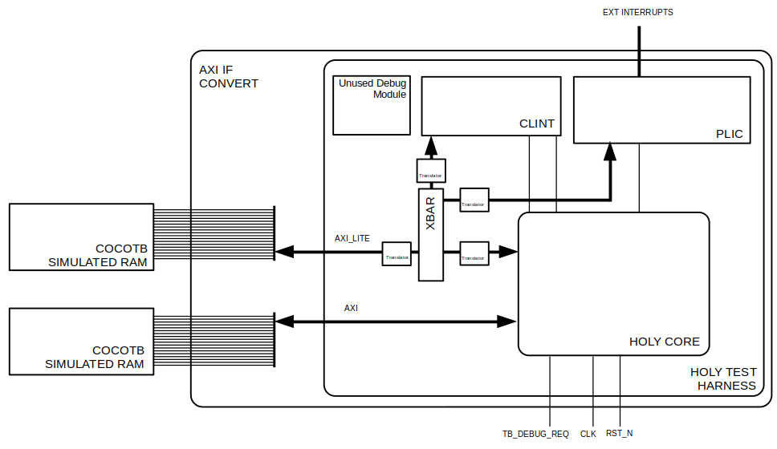
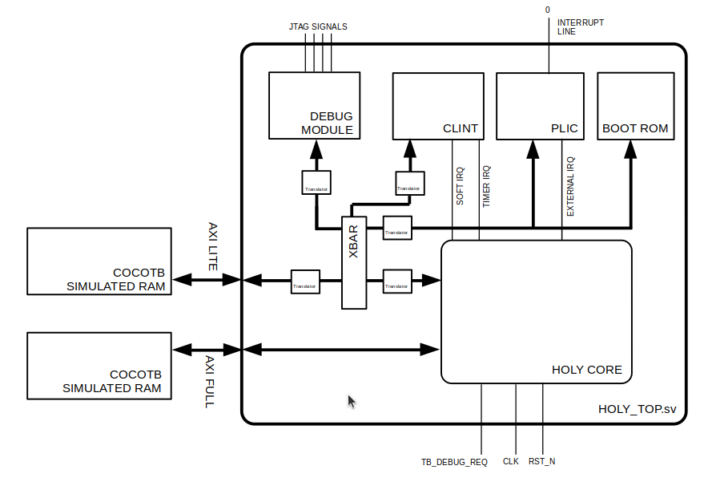

# Holy Core - Dev Docs

!!! Info
    As you may already know, most of the CPU architecture is documented through the **tutorials** around which the HOLY CORE Course project is built around.
    
    But this document aims at giving an overview of the **latest changes** by going **straight to the point** as brifly as possible to clear potential doubts on what's the potential role of each part of the CPU.

Welcome to the Dev's documentation, a quick reference guide on how the core works to quickly get up to speed.

You'll see the core is **extremely simple** as it's a :

- no frontend...
- ...no scoreboard...
- ...single fetch...
- ...single execution at a time...
- ...single cycle CPU.

You'll also find here some guidelines and simulation tips, as well as some notes for myself.

## RTL Contributions Guidelines

If you want to modify the HDL and contribute, please know that I am **not interrested in major architecture modifications** (e.g. pipelinning).

Typos fix are *welcome changes*.

Docs improvements, code optimisations or more efficient synth code structure that could save LUTs and FFs are **very welcome** **changes**.

!!! Tip
    You can check out the `todo.md` file at the root of the project to see what are the projects things that should be done if you are looking for quick ways to participate.

When making an RTL change to a module, make sure you run the module's testbench, eventually add testcases to the said testbench, run the HOLY CORE quick testbench and then run the riscof test suite.

This document will also guide you around all the simulation and verification tools available.

## Core Overview

### Scheme


As you can see, the HOLY CORE is simple. In fact, most of the important signals are on this scheme, though some subtle execution flows like **traps** or **debug request** are not made obvious here.

### I/O table

| Signal | Direction | Width | Description |
|--------|-----------|-------|-------------|
| `clk` | Input | 1 | System clock |
| `rst_n` | Input | 1 | Active-low asynchronous reset |
| `debug_req` | Input | 1 | Debug request signal from debugger |
| `debug_halt_addr` | Input | 32 | Address to jump to when entering debug mode (debug ROM base address) |
| `debug_exception_addr` | Input | 32 | Address to jump to for debug exceptions (typically debug ROM + offset) |
| `timer_itr` | Input | 1 | Machine timer interrupt (MTIP) |
| `soft_itr` | Input | 1 | Machine software interrupt (MSIP) |
| `ext_itr` | Input | 1 | Machine external interrupt (MEIP) |
| `m_axi` | Output | AXI Master | AXI master interface for main memory access (instructions & data) |
| `m_axi_lite` | Output | AXI-Lite Master | AXI-Lite master interface for peripheral/CSR access |

## Modules Functionalities

This part aims at brifly presenting the modules, what they do and their specificites.

!!! Note
    Modules' code can be found in the `hdl/` folder.

### External Requests Arbitrers

It's not explicitly detailled in the scheme, but there are two arbiters :

- `LITE ARBITRER`
- `FULL ARBITRER`

Because the HOLY CORE has CSRs to setup cached memory ranges ([see user guide](/#external-interfaces-cache-usage-for-the-user-via-csrs)), we have to have 2 interface per cache (I$ and D$) : an AXI one to retrieve cache data and an AXI LITE one to interact with non cachable ranges.

This means the holy core has 2 of each ! What the arbitrer do is **keep track of what cache is using the interface** (through the `serving` signal) and **routes that request to the outside world** until it's finished.

### Instruction Cache (I$)

The instruction cache is also not detailled in the scheme but it's actually 2 separate module :

- Instrution Cache
- Instruction No cache

This is because  the HOLY CORE has CSRs to setup cached memory ranges ([see user guide](/#external-interfaces-cache-usage-for-the-user-via-csrs)).

The Instruction cache can **only issue read requests**.

The core's data path determines if the requested PC is cachable or not and route the request to the right cache submodule ($ or NO$) using an handskae interface that look like this :

| Signal Name | Direction | Width | Type | Function |
|-------------|-----------|-------|------|----------|
| `address` | Input | [31:0] | Address | Memory address for read/write transaction |
| `read_data` | Output | [31:0] | Data | Data returned from memory read operation |
| `req_valid` | Input | 1 bit | Valid | CPU asserts to indicate valid address and request |
| `req_ready` | Output | 1 bit | Ready | Interface asserts to indicate ready to accept request |
| `read_valid` | Output | 1 bit | Valid | Interface asserts when read_data is valid and available |
| `read_ack` | Input | 1 bit | Handshake | CPU asserts to acknowledge/accept read_data |

!!! Tip
    Having an handshake interface with the CPU helps creating a more robust interface, which is essential when dealing whith cache that pretty much go on whith their life most of the time retriving and sending data around.

### Data Cache (D$)

The data cache is like the instruction cache, but the CPU also has a "write" handshake interface.

!!! Info
    Writes are non blocking and are accepted right away if the cache is idling, even if the cache misses.

Just like the data cache, there are 2 submodules :

- Instrution Cache
- Instruction No cache

This is because  the HOLY CORE has CSRs to setup cached memory ranges ([see user guide](/#external-interfaces-cache-usage-for-the-user-via-csrs)).

The core's data path determines if the requested data address is cachable or not and route the request to the right cache submodule ($ or NO$) using an handskae interface that look like this :

| Signal Name | Direction | Width | Type | Function |
|-------------|-----------|-------|------|----------|
| `address` | Input | [31:0] | Address | Memory address for read/write transaction |
| `read_data` | Output | [31:0] | Data | Data returned from memory read operation |
| `req_valid` | Input | 1 bit | Valid | CPU asserts to indicate valid address and request |
| `req_ready` | Output | 1 bit | Ready | Interface asserts to indicate ready to accept request |
| `read_valid` | Output | 1 bit | Valid | Interface asserts when read_data is valid and available |
| `read_ack` | Input | 1 bit | Handshake | CPU asserts to acknowledge/accept read_data |

The handshake delay can vary greatly depending if the cache missed or got a HIT.

### Stalling

The main stall signal depend on `i_cache_stall || d_cache_stall`, which both depends on their respective handshake state.

!!! Example
    If the control signal that we read from memeory (via `mem_read_enable`) but the `data_read_valid` is low (or we did not acknowleged it via `data_read_ack`, then we stall to "wait for the data request to be done", same for writing requests (with `mem_write_enable`, `data_req_ready` and `data_req_valid`)) and same for instruction read requests.

The stalling signal is **central** to his cpu, it is the only way (as there is no frontedn to decide how to feed the hardware with instruction) to **sto the execution flow** in order to wait for something to be done. 

The `stall` signal is also used by rising edge sensible module (alongside `instruction_valid`) to avoid writing data that is not valid yet because we'd have to wait for it to arrive.

### Control

The control modules acts as an instruction decoder and determines to different control signals all over the data path (e.g. the `pc_source`).

The control Unit also has the possibility to raise [excepetions and to set a cause](/data.md/#mcause-values-and-mtval-contents).

!!! Example
    An instruction can be invalid (Instruction memory corrupted) or an `ecall` was fetched...

This `exception` flag, along its cause are sent to the [csr file](#csr-file) to determine what to do.

### CSR File

The CSR file contains the CSRs.

But it also is the heart of all operations that goes betond the simple RV32I instruction set **like traps and debugging**.

It globally acts as the regular regfile in a way that it has register that we can read and write (addressable over 12 bits !) BUT it also outputs control signals to affect how the core behaves. For example : the CSR file has a control signal to flush the data cache, to mirror `mtvec`, `mepc` and `dpc` as a pc sources, or to set the cacheble ranges for I$ and D$.

    It also has a `trap` signal that can [cause the core to trap when conditions are met](#trap-execution-flow).

Using these signals, the CSR file is what controls (alongside the [`control` module](#control)) the execution flow.

#### Trap Execution Flow

Trapping occurs when :

- An exception occurs (flagged by the [control unit](#control))
- OR an interrupt request is recieved (mirrored in the csr file via `mip`) and the right trap flags are enable in `mie` and `mstatus`.
- AND the instruction fetched is flagged as valid.
- AND we are not curretly trapping (tracked by the `trap_taken` register).
- AND a debug request is not being processed / We are not currently in debug mode

```txt
trap = (( (|(mie & mip)) && mstatus[3]) || exception) && ~trap_taken && ~debug_mode && ~jump_to_debug;
```

!!! Note
    So yeah, debug request have priority over traps here.

If these conditions are met, the CSR file will assert its `trap` flag, set all the machine [CSRs to the right value](/data.md/#mcause-values-and-mtval-contents) (in a riscv compliant way) and the [control unit](#control) will use this `trap` flag to set `mtvec` as the `next_pc` source (where the trap handler code is).

!!! Info
    `mtvec` is set by the user in assembly, not our problem but that means having a trap handler, even when not needed, is important to avoid provoking a jump to 0x0 when an exception rises.

> Note that the `trap` flag is only high for 1 cycle, the control unit latches on that `trap` flag if needed (e.g. in case of a `stall` that lasts multiple cycles) so no worries but a better way would be to have some handshake there.. That's a todo but it works this way so I kinda don't care.

After that, the csr file will be in `trap_taken` mode and that will clear when `mret` is signaled by the control unit, in which case `pc_next` will also be set to `mepc` to resume normal program exection after that, the trap will be able to trap again.

#### Debug Execution Flow

!!! Info
    Learn more about the debugging flow in the [*External Debug Support* specs](https://riscv.org/wp-content/uploads/2024/12/riscv-debug-release.pdf), especially the "A.2 Execution Based" chapter.

Debug works like traps.

We can find similar elements:

- A `jump_to_debug` flag, sent to the control unit when the conditions are met.
- Some debug CSRs that are updated in a stard way when entring the debug mode
- etc ...

But there are a couple of specificities in the hardware implementation :

- Debug requests have a priority over all traps
- `ebreak` can jump to debug (instead of trap handler), considered as a software breakpoint depending on `dcsr[15:12]` values
- Exeptions in debug mode do not trap but jump to the debug module's exception handler.

### Register File

The register file is a standard async read, sync write register file addressable via 5bits and containing 32 registers.

The `x0` register is tied to GND and cannot have any other value than 0.

### Sign exender / Imm decoder

!!! Info
    Immediate decoder is also called "sign extender" because of legacy naming.

The immediate decoder's role is to extract the immediate out of the instruction being fetched.

The way the immediate is extracted depends on the control signal sent by the main instruction decoder ([the control unit](#control)).

### Second Adder

Below the main ALU is a second 32bits adder named "**second adder**" in the code base.

The second adder's role is to compute branch and jump targets and evey other pc-related values (e.g. values needed for `auipc`).

The second adder's result can also be used to access directly the immediate's result. This is not very intutive though and I could just have the immediate value wired to the write back MUX. I was not really clever on this one back then and that's a todo.

In thery, this second adder should only be used to compute pc related values and be embedded in a branching unit that would separate the bach logic from the main decoder, which makes more sense when pipelinning even though not mandatory.

Again, that is a refactorization todo but this whoe seconder adder thing works so I figured I would do that later. Chances are I'll never do it haha.

### ALU

The ALU is a standard one cycle ALU. It doe snot have any busy flags and **executes all operations in 1 cycle.**

This is not the best for performaces, but adding somy busy flags + a handshake would complexify the "execution part" and I though it was not really the priority.

### Load/Sotre decoder

The load store decoder's role is to compute the `byte_enable` mask for reads and writes.

In case of a write that is not a full word, it also aligns the data correctly before feeding it to the data memory.

### Reader

The reader'rs role is to **format the read data** comming from the data cache by alignning the data correctly and applying the `byte_enable` mask (if not a full word).

### Write Back Mux

The write back mux is not a module but is an important step as pieplined architecture givng it it's own stage.

It's role is to select the right data source to feed back in the registers and produce a valid signal to assert the data is valid.

The regfile then applies the read.

## Dev Workflow & Simulation

### Verification Software Stack

For the whole HOLY CORE course, we use **cocotb + verilator** for simulation and assertions.

You have a document to setup your work environment [in the repo : "**setup.md**"](https://github.com/0BAB1/HOLY_CORE_COURSE/blob/master/setup.md).

!!! Warning
    Make sure you're all setup correctly to verify the things you make, this is mandatory.

### Generic RTL Changes & Testing Worflow

#### Navigating and Using the tb/ Folder for submodules

When making improvements to the codebase, it is mandatory to verify the submodule you just modified.

You can earn more about how a basic cocotb testbench is structured and how it works in [this blog post](https://0bab1.github.io/BRH/posts/TIPS_FOR_COCOTB/) or on the [cocotb website](https://docs.cocotb.org/en/stable/quickstart.html). In a nutshell, you use a python file as a frontend that cocotb will use to run assertion by simulating the design in the backend using whatever simulator you want, in our case, **Verilator**.

To verify, `cd` into `<edition_root>/tb/<module_name>` and run `make`.

If you added significant changes, make sure you add the adequate test cases to the cocotb python file.

Once your changes are verified, cd back into `tb/` and run `pytest test_runner.py`, this will run all tests on all submodules.

!!! Note
    Running the cocotb testbench for `tb/holy_core` is slightly different, more infos [below](#verifying-the-holy-core-using-the-cocotb-testbench).

!!! Bug
    Sometimes, the tests fail with no real reason, cd back to the edition's roo and run `make clean` to cleaup up all simulation builds and retry `pytest test_runner.py` in the `tb/` folder.

#### Verifying the HOLY CORE using the cocotb testbench

##### Testbench Structure

When changing some elements in the code, it is important to have a quick way to verify if our chages broke something. Verifying the core is especially long with methods like the RISCOF framwork.

This is why a simple **cocotb HOLY CORE testbech** was developped.

Just like any oher submodule, you can verify the core running a simple make command : `make sim`.

Note, the `sim` added after make : this is because make alone builds the `test.S` program the core is tested againts.

Here is the `tb/holy_core/` file strcture in details :

```txt
tb/holy_core
├── axi_if_convert.sv       Top wrapper used to convert axi interfaces for cocotb to understand
├── holy_test_harness.sv    Harness wrapper embedding some peripherals. See it as a stripped down holy_top.sv
├── Makefile                Builds test.S into a .hex file and runs sim. 
├── old                     Misc
├── test_dmemory.hex        Legacy memory init file (still used)
├── test_holy_core.py       Cocotb assetions
└── test.s                  Actual test program
```

As you can see, there is a test harness and a top wrapper that goes around the HOLY CORE that embeddeds basic peripherals that the test program will use to test basic SoC interaction :



##### Test Program

The `test.S` programs runs the HOLY CORE through basic instructions and the cocotb testbench runs assertions to make sure these simple test cases executed as expected.

When running `make sim`, it is comiled into an elf and dumped into a `.hex` file, which cocotb can read, interpret and load into its simulatd memory that the core will then access as regular momory to fetch instruction and run data transactions.

It also runs the core through some basic trap and debug flow to check the core's behavior is correct and compliant as these are not tested by riscof and are complicated to test otherwise.

This basic testbench for the HOLY CORE is the best dev tool to quickly verify your changes did not break everything, once your changes are verified and this test passes, you can move on to [verifying using RISCOF](#verifying-the-core-using-riscof).

#### Verifying the core using RISCOF

The RISCOF verification framework is far more "heavyweight" than the basoc tests we detailled in ["*Verifying the HOLY CORE using the cocotb testbench*"](#verifying-the-holy-core-using-the-cocotb-testbench).

This document will not explain how [RICOF works](https://riscof.readthedocs.io/en/latest/intro.html). Nor how the plugin is built as this is too dense and detailled extensively in the tutorials.

The RISCOF verification happens in the `riscof/` folder :

```txt
riscof
├── config.ini          Riscof Hints
├── holy_core           Contains the HOLY CORE riscof plugin
├── holy_core_tb        Contains a holy core cocotb testbench, adapted especially for ricof
├── Makefile            Cleanup makefile
├── readme.md           Guide on how to setup and run RISCOF tests
├── riscof_work         (Once you run the test) contains all the results
├── riscv-arch-test     (Once you run the test) contains all the RV tests source code
├── spike               Contains the reference simulator riscof plugin
└── testlist.yaml       Not used
```

In the backstage, RISCOF will use a cocotb testbench to test each program and dump the tests results into a signature file, which will get compared to a reference signature file (from the SPIKE Risc-V simulator).

To run the tests, a guide already exists in the `riscof/readme.md` file.

!!! Note
    RISCOF tests executions (on the HOLY CORE) are all precedented by the execution of `riscof/holy_core_tb/test_startup.S`, which ironcally also contains a test end macro.

    The goal of this very small piece of code is to [setup the caches](/#external-interfaces-cache-usage-for-the-user-via-csrs) and set everything as non cachable, meaning all RISCOF tests run as fully cached.

    The test end makes sure to flush the cache before fully ending the test.

    This piece of code is entirely customizable to your need to ease begugging, make sure you builf it correctly with `make -f start.Makefile`

### RISCOF Debugging Guidelines

RISCOF runs tests and compares signatures, but it offers little to no debug utilities.

Fortunatly, we have excellent ways to debug the HOLY CORE if a test fails.

In the `ricof/riscof_work` folder lies all the tests results. Here's the `add` test sim results as an example:

```txt
riscof/riscof_work/rv32i_m/I/src/add-01.S
├── dut
│   ├── dump.vcd                        HOLY CORE waveforms
│   ├── DUT-holy_core.signature         Signature file (should be same as Reference-spike.signature)
│   ├── dut.log                         Spike-like CPU logs
│   ├── dut.symbols                     Test elf's symbols
│   ├── my.bin                          Test bin
│   ├── my.elf                          Test elf
│   ├── my.hex                          Test hex
│   └── tb_messages.log                 Cocotb logs
└── ref
    ├── my.elf                          Test elf
    ├── Reference-spike.signature       Spike ref signature
    └── ref.log                         Spike CPU logs
```

If you know the test fails from the report, you can use these results to inverstigate.

First of all, use `tb_messages.log` to check if the cocotb test went well, if it failed, investigate on this error first (*syntax ? forgot to cleanup ? error loading the program ? etc*).

Then, a great tool to know **exactly when the HOLY FAILED to follow a "compliant execution flow"** is to use `dut.log` and `ref.log`.

These logging files trace back all register, csr, memory and pc transaction / evolutions, which allows the dev (you) to **pinpoint exactly when the CPU failed to execute the program in a compliant way** and therefore fail the test.

Once the exact failure point in the simulation has been identified, you can use the waveform and your knowledge of the RISC-V specs to patch the HDL accordingly.

###  Simulating Real Program Execution

Sometimes, RICOF tests passes but bugs (unexpected exceptions) occur when testing a piece of software on FPGA.

It may not always be due to hardware bugs, but it may be and sometimes, all the software debugging tools are not enough to clear that doubt.

A good solution to clear that doubt (or shed light on a specific edge case bug) is to simulate the actual software execution.

To do so, in `fpga/`, you have access to another cocotb testbench : `test_run_lint.py`. (*named "lint" as it was first bult to lint `holy_top.sv`*).

This tesbench simulates the holy_top.sv internal base SoC directly and the whole exterls are just cocotb simulated RAM slaves :



What this testbench do is load whatever `.hex` dump file you specify in the simulated memory and release reset.

#### Prepare your Program

To siulate your program, you first need to get it into an hex dump format. [The `example_program` folder](/#write-build) allows you to build software and automatically generate the said hexdump in the right format.

Once this is done, you can specify the following in `test_run_lint.py` :

```txt
hex_path = "path_to_your_hex.hex"
```

#### Prepare the `holy_top.sv` SoC

The real `holy_top.sv` gets simulated with your rogram in memory here.

BUT :

- The program gets loaded at address 0x80000000
- The CPU start (boots) at PC = 0x00000000
- The code at 0x00000000 is the one in the BOOT ROM

And remember, by default, the ROM implement an FPGA park loop to wait for the User to connect with a debugger.

That means you should [**modify** the boot rom](/#default-boot-sequence) to jump to 0x80000000 with a program that looks like this:

```
    .global _start

_start:
    # ==============================================
    # for TestBench : Jump to Main program directly
    # ==============================================

    # Example of sim start sequence : setup cache if needed
    # data cache setup
    li t0, 0x0
    li t0, 0x7FFFFFFF
    csrrw x0, 0x7C1, t0
    csrrw x0, 0x7C2, t1

    # instr cache setup
    li t0, 0x0
    li t1, 0x7FFFFFFF
    csrrw x0, 0x7C3, t0
    csrrw x0, 0x7C4, t1

    // jump to program in cocotb's ram
    la t0, 0x80000000
    jalr x0, t0, 0   
```

And your program should start executing.

You ca of course modify `test_run_lint.py` to fit your need and sto the test whenever a condition is met (e.g. an exception has been met or a predefined PC has been reached...)

You can use this useful simulation tool to :

- Profile a program's performance (e.g. IPC/CPI)
- Reproduce software bugs in simulation
- test SoC components behavior (CLINT, PLIC, ...)


!!! Note
    Make sure you restom `rom.s` and rebuild it like it was bofore to avoid unexpected bugs for future FPGA users.