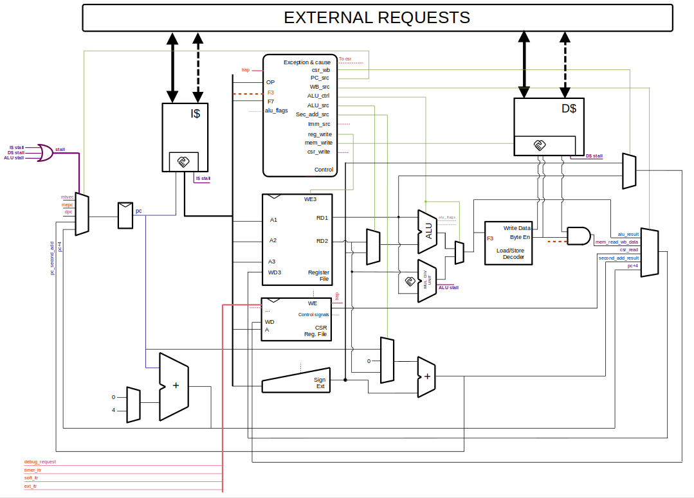

# Holy Core - Dev Docs

!!! Info
    As you may already know, most of the CPU architecture is documented through the **tutorials** around which the HOLY CORE Course project is built around.
    
    But this document aims at giving an overview of the **latest changes** by going **straight to the point** as brifly as possible to clear potential doubts on what's the potential role of each part of the CPU.

Welcome to the Dev's documentation, a quick reference guide on how the core works to quickly get up to speed.

You'll see the core is **extremely simple** as it's a :

- no frontend...
- ...no scoreboard...
- ...single fetch...
- ...single execution at a time...
- ...single cycle CPU.

You'll also find here some guidelines and simulation tips, as well as some notes for myself.

## RTL Contributions Guidelines

If you want to modify the HDL and contribute, please know that I am **not interrested in major architecture modifications** (e.g. pipelinning).

Typos fix are *welcome changes*.

Docs improvements, code optimisations or more efficient synth code structure that could save LUTs and FFs are **very welcome** **changes**.

!!! Tip
    You can check out the `todo.md` file at the root of the project to see what are the projects things that should be done if you are looking for quick ways to participate.

When making an RTL change to a module, make sure you run the module's testbench, eventually add testcases to the said testbench, run the HOLY CORE quick testbench and then run the riscof test suite.

This document will also guide you around all the simulation and verification tools available.

## Core Overview

### Scheme



As you can see, the HOLY CORE is simple. In fact, most of the important signals are on this scheme, though some subtle execution flows like **traps** or **debug request** are not made obvious here.

### I/O table

| Signal | Direction | Width | Description |
|--------|-----------|-------|-------------|
| `clk` | Input | 1 | System clock |
| `rst_n` | Input | 1 | Active-low asynchronous reset |
| `debug_req` | Input | 1 | Debug request signal from debugger |
| `debug_halt_addr` | Input | 32 | Address to jump to when entering debug mode (debug ROM base address) |
| `debug_exception_addr` | Input | 32 | Address to jump to for debug exceptions (typically debug ROM + offset) |
| `timer_itr` | Input | 1 | Machine timer interrupt (MTIP) |
| `soft_itr` | Input | 1 | Machine software interrupt (MSIP) |
| `ext_itr` | Input | 1 | Machine external interrupt (MEIP) |
| `m_axi` | Output | AXI Master | AXI master interface for main memory access (instructions & data) |
| `m_axi_lite` | Output | AXI-Lite Master | AXI-Lite master interface for peripheral/CSR access |

## Modules Functionalities

This part aims at brifly presenting the modules, what they do and their specificites.

!!! Note
    Modules' code can be found in the `hdl/` folder.

### External Requests Arbitrers

It's not explicitly detailled in the scheme, but there are two arbiters :

- `LITE ARBITRER`
- `FULL ARBITRER`

Because the HOLY CORE has CSRs to setup cached memory ranges ([see user guide](/#external-interfaces-cache-usage-for-the-user-via-csrs)), we have to have 2 interface per cache (I$ and D$) : an AXI one to retrieve cache data and an AXI LITE one to interact with non cachable ranges.

This means the holy core has 2 of each ! What the arbitrer do is **keep track of what cache is using the interface** (through the `serving` signal) and **routes that request to the outside world** until it's finished.

### Instruction Cache (I$)

The instruction cache is also not detailled in the scheme but it's actually 2 separate module :

- Instrution Cache
- Instruction No cache

This is because  the HOLY CORE has CSRs to setup cached memory ranges ([see user guide](/#external-interfaces-cache-usage-for-the-user-via-csrs)).

The Instruction cache can **only issue read requests**.

The core's data path determines if the requested PC is cachable or not and route the request to the right cache submodule ($ or NO$) using an handskae interface that look like this :

| Signal Name | Direction | Width | Type | Function |
|-------------|-----------|-------|------|----------|
| `address` | Input | [31:0] | Address | Memory address for read/write transaction |
| `read_data` | Output | [31:0] | Data | Data returned from memory read operation |
| `req_valid` | Input | 1 bit | Valid | CPU asserts to indicate valid address and request |
| `req_ready` | Output | 1 bit | Ready | Interface asserts to indicate ready to accept request |
| `read_valid` | Output | 1 bit | Valid | Interface asserts when read_data is valid and available |
| `read_ack` | Input | 1 bit | Handshake | CPU asserts to acknowledge/accept read_data |

!!! Tip
    Having an handshake interface with the CPU helps creating a more robust interface, which is essential when dealing whith cache that pretty much go on whith their life most of the time retriving and sending data around.

### Data Cache (D$)

The data cache is like the instruction cache, but the CPU also has a "write" handshake interface.

!!! Info
    Writes are non blocking and are accepted right away if the cache is idling, even if the cache misses.

Just like the data cache, there are 2 submodules :

- Instrution Cache
- Instruction No cache

This is because  the HOLY CORE has CSRs to setup cached memory ranges ([see user guide](/#external-interfaces-cache-usage-for-the-user-via-csrs)).

The core's data path determines if the requested data address is cachable or not and route the request to the right cache submodule ($ or NO$) using an handskae interface that look like this :

| Signal Name | Direction | Width | Type | Function |
|-------------|-----------|-------|------|----------|
| `address` | Input | [31:0] | Address | Memory address for read/write transaction |
| `read_data` | Output | [31:0] | Data | Data returned from memory read operation |
| `req_valid` | Input | 1 bit | Valid | CPU asserts to indicate valid address and request |
| `req_ready` | Output | 1 bit | Ready | Interface asserts to indicate ready to accept request |
| `read_valid` | Output | 1 bit | Valid | Interface asserts when read_data is valid and available |
| `read_ack` | Input | 1 bit | Handshake | CPU asserts to acknowledge/accept read_data |

The handshake delay can vary greatly depending if the cache missed or got a HIT.

### Stalling

The main stall signal depend on `i_cache_stall || d_cache_stall`, which both depends on their respective handshake state.

!!! Example
    If the control signal that we read from memeory (via `mem_read_enable`) but the `data_read_valid` is low (or we did not acknowleged it via `data_read_ack`, then we stall to "wait for the data request to be done", same for writing requests (with `mem_write_enable`, `data_req_ready` and `data_req_valid`)) and same for instruction read requests.

The stalling signal is **central** to his cpu, it is the only way (as there is no frontedn to decide how to feed the hardware with instruction) to **sto the execution flow** in order to wait for something to be done. 

The `stall` signal is also used by rising edge sensible module (alongside `instruction_valid`) to avoid writing data that is not valid yet because we'd have to wait for it to arrive.

### Control

The control modules acts as an instruction decoder and determines to different control signals all over the data path (e.g. the `pc_source`).

The control Unit also has the possibility to raise [excepetions and to set a cause](/data.md/#mcause-values-and-mtval-contents).

!!! Example
    An instruction can be invalid (Instruction memory corrupted) or an `ecall` was fetched...

This `exception` flag, along its cause are sent to the [csr file](#csr-file) to determine what to do.

### CSR File

The CSR file contains the CSRs.

But it also is the heart of all peration that goes betond the simple RV32I instruction set like traps and debugging.

It globally acts as the regular regfile in a way that it has register that we can read and write (addressable over 12 bits !) BUT it also outputs control signals to affect how the core behaves.

!!! Example
    The CSR file has a control signal to flush the data cache, to mirror `mtvec`, `mepc` and `dpc` as a pc sources, or to set the cacheble ranges for I$ and D$.

    It also has a `trap` signal that can [cause the core to trap when conditions are met](#trap-execution-flow).

Using these signals, the CSR file is what controls (alongside the [`control` module](#control)) the execution flow.

#### Trap Execution Flow

Trapping occurs when :

- An exception occurs (flagged by the [control unit](#control))
- OR an interrupt request is recieved (mirrored in the csr file via `mip`) and the right trap flags are enable in `mie` and `mstatus`.
- AND the instruction fetched is flagged as valid.
- AND we are not curretly trapping (tracked by the `trap_taken` register).
- AND a debug request is not being processed / We are not currently in debug mode

```txt
trap = (( (|(mie & mip)) && mstatus[3]) || exception) && ~trap_taken && ~debug_mode && ~jump_to_debug;
```

!!! Note
    So yeah, debug request have priority over traps here.

If these conditions are met, the CSR file will assert its `trap` flag, set all the machine [CSRs to the right value](/data.md/#mcause-values-and-mtval-contents) (in a riscv compliant way) and the [control unit](#control) will use this `trap` flag to set `mtvec` as the `next_pc` source (where the trap handler code is).

!!! Info
    `mtvec` is set by the user in assembly, not our problem but that means having a trap handler, even when not needed, is important to avoid provoking a jump to 0x0 when an exception rises.

> Note that the `trap` flag is only high for 1 cycle, the control unit latches on that `trap` flag if needed (e.g. in case of a `stall` that lasts multiple cycles) so no worries but a better way would be to have some handshake there.. That's a todo but it works this way so I kinda don't care.

After that, the csr file will be in `trap_taken` mode and that will clear when `mret` is signaled by the control unit, in which case `pc_next` will also be set to `mepc` to resume normal program exection after that, the trap will be able to trap again.

#### Debug Execution Flow

Debug works like traps.

We can find similar elements:

- A `jump_to_debug` flag, sent to the control unit.

## Simulation Tips

> For advance software debugging tips when using on FPGA, see the User docs : "**Using the Fpga/ Folder to build and Debug**" Section

### Navigating and Using the tb/ Folder

Fr those who did not go through  the entire course, here is how to simulate modules and the core to validate changes

### Debugging RISCOF tests when sh*t goes south

todo : redirect to riscof readme, then explain the debug process

### Using the `fpga/` Folder to Simulate Software Execution=

The HOLY CORE codebase provides both unit testbenches