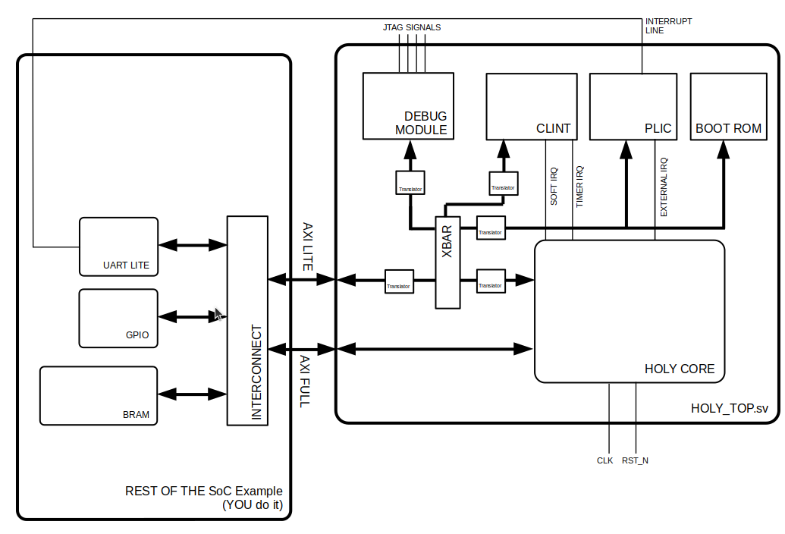
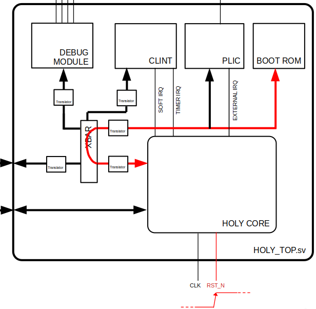
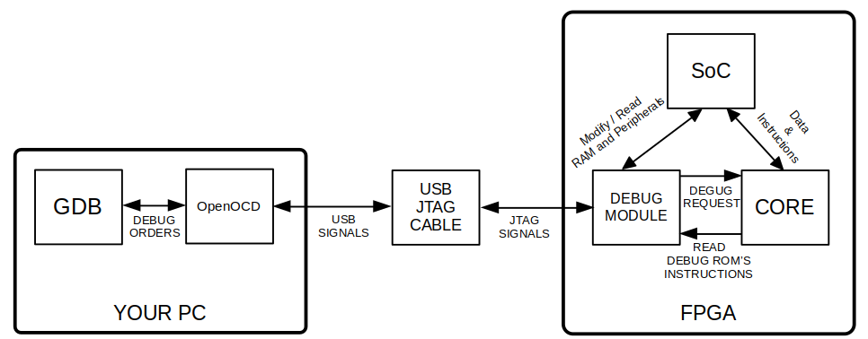

# Holy Core - User Docs


## Overview

The HOLY CORE is an **MCU class** open-source core, made for learning and experimentation purposes, targetting hobbyists and very high stakes and critical industrial applications, like running **PONG** or **DOOM**.

!!! note "Target Adience"
    The target audience of this document are people who **just want to use the core in their own project** (for whatever reason) or simply learn more about the HOLY CORE before building it / out of curiosity.

    **If you are an RTL dev** looking to modify the inner HDL of the HOLY CORE, refer to the [**DEV DOCS**](./dev_docs/).
    
    **If you are a learner** and just want to **build the core yourself**, go back to [the repo](https://github.com/0BAB1/HOLY_CORE_COURSE) and read the main "`readme`" file to start learning.

The system is not very configurable. It provides a fixed, slow and unefficient platform. Its only strength is that **it works**, is **100 % Compliant to RISC-V** and is somewhat fast enough to **run DOOM** at slideshow grade speeds.

Are you still here ? Do you still want to use this core ? Good, *we don't need speed anyway, do we ?*.

Jokes aside, even though the HOLY CORE was not built with any sort of optimisation in mind, it was build to work and actually be usable while still being as simple as it can be in its architecture.

You can easily modify it on the fly if you take a couple hours to figure out how the project is layed out, **which is exactly what is explained in this document**.

### Project Key Features

#### The Platform / SoC

The project comes with a `fpga/holy_top.sv` file. The main wrapper provides all the basics that surrounds the core.

- The HOLY CORE
- A debug module (from Pulp PLatform)
- A CLINT (to have soft interrupts, timers and all that jazz)
- A PLIC (to have external interrupts support)
- A boot ROM
- A software framework (*a shitty and non flexible library*)
- External access AXI & AXI LITE interface for integration on larger SoCs with actual peripherals
- The HOLY CORE Platform has **no custom peripherals** other than the one listed above. Generic peripherals **are yours to add** depending on your needs. Guidelines are given in the document, see [Getting Started](#getting-started).

#### The Core Itself

- A 32-bit RISC-V CPU
- 100% RISC-V compliant (according to the RISCOF framework)
- A single cycle CPU, so simple in its architecture that even I wonders how it even run any program at all without breaking.
- Supports base ISA + privileged ISA (RV32I_Zicsr Privileged)
- Machine mode only

### Project Folder Structure

The HOLY CORE's repo is kinda special for you, user, as it was built primarly to *teach* its contents. The repo is thus divided in **chapters** but as a user, you'll mostly be interrested in the latest one, in this case : the folder **3_perf_edition/**.

Each chapter is a "CPU project" in itself and you you only be concerned about what is in this subfolder.

```txt
HOLY CORE COURSE
├── 0_single_cycle_edition          Not suitable for real use
│   ├── ...
├── 1_fpga_edition                  Not suitable for real use
│   ├── ...
├── 2_soc_software_edition          Contains bugs on advanced programs
│   ├── ...
├── 3_perf_edition
│   ├── Dockerfile                  Helper to quickly run RISCOF tests
│   ├── example_programs            Contains exmaple sofwtware and a makefile to build it 
│   ├── fpga                        Contains the holy_top.sv wrapper & real program simulation utils for debugging
│   ├── hc_lib                      Holy Core's library
│   ├── Makefile                    To cleanup the project when needed
│   ├── packages                    Holy Core interface and types definitions
│   ├── readme.md                   informative document
│   ├── requirements.txt            some CI bloat
│   ├── riscof                      Compliance test utils
│   ├── src                         Actual HDL code is here
│   ├── tb                          Module unit testing and basic CORE testing (quicker than riscof for quick validations)
│   └── vendor                      Vendor pulled code
├── LICENSE                         
├── readme.md                       
├── setup.md                        
├── todo.md                         
├── user_docs
│   ├── docs
│   └── mkdocs.yml
```

### Getting Started

It depends on what you want to know.

If you want to know how to get the HOLY CORE platform running on your FPGA, whithout caring about the actual usage yet, go to the [Practical FPGA Usage Guidelines](#fpga-usage-guidelines) section.

If you have the holy core platform up and running and just want to know how to make in run some program, start with [Using the Holy Core Platform](#holy-core-platform).

## Holy Core Platform

### Description & Top I/Os

Here is a scheme that recaps everything provided by the `holy_top.sv` top module :



As stated earlier, the project "only" provides a `holy_top.sv` file that contains all mandatory peripherals to ensure the debug, interrupts and timer support, as well as a fixed boot ROM.

So let's just say **you have complete freedom over the platform** (*manily because you have to add the basics like UART or GPIO __by yourself__*).

Here are the ports you will have to compose with :

| Port | Direction | Width | Description |
|------|-----------|-------|-------------|
| `clk` | input | 1 | CPU clock |
| `rst_n` | input | 1 | Active low reset |
| `periph_rst_n` | input | 1 | Peripheral reset (active low) |
| `m_axi_*` | in/out | - | AXI4 Full interface to external RAM |
| `m_axi_lite_*` | in/out | - | AXI4-Lite interface (crossbar to external peripherals) |
| `irq_in` | input | NUM_IRQS | External interrupt requests |
| `tck_i` | input | 1 | (for debug module) JTAG clock |
| `tms_i` | input | 1 | (for debug module) JTAG mode select |
| `trst_ni` | input | 1 | (for debug module) JTAG reset (active low) |
| `td_i` | input | 1 | (for debug module) JTAG data in |
| `td_o` | output | 1 | (for debug module) JTAG data out |
| `...`  | output | - | Some misc on chip debug signals (I gotta get rid of these one day but these are useful sometimes, so they remain) |
| `tb_debug_req` | input | 1 | "FPGA" test debug request to provoke a debug jump in a simulation environement |

Note that we separate peripheral and CPU reset. This is because I did not succeed in having one single reset signal. I gotta make a propre reset controller that handles this but for now, when using this platform, it is better to hold CPU reset and perform a proper complete peripheral reset before releasing the CPU.

!!! Question "Where are the parameters ?"
    "Paramters" are not described here, the reason is in the next sub section ;)

### External interfaces : Cache Usage for the User (Via CSRs)

Also note that we have **2 interface to exchange data** with the "outside world" (i.e. the rest of your SoC) : `m_axi_*` and `m_axi_lite_*`.

This is because the HOLY CORE has a small yet existent cache system, one for instructions (I$) and one for data (D$).

!!! note
    You can disable D$ by setting the **ONLY PARAMETER OF THE ENTIRE HOLY CORE** : `DCACHE_EN` to 0 in the holy core's instantiation in `holy_top.sv`. You can also set the cache sizes depending on avalable FPGA resources in `holy_core.sv` in the cache instatiations. This is a pretty straight forwrd process if you alredy did some HDL work before. Otherwise, go and follow the holy core course ;)

These caches MAY cause problems when trying to exchange data with MMIOs (data wise) and the debug module (instruction wise). These need to NOT be cached. This is why the HOLY CORE platforms allow the user to set **uncached ranges** using the following CSRs:

| CSR NAME | ADDRESS | ROLE |
|---|---|---|
| `flush_cache` | 0x7c0  |  write 1 to flush the data cache  |
| `data_non_cachable_base` | 0x7c1  |  base addr of non cachable data space  |
| `data_non_cachable_limit` | 0x7c2  |  limit addr of non cachable space  |
| `instr_non_cachable_base` | 0x7c3  |  base addr of non cachable instruction space  |
| `instr_non_cachable_limit` | 0x7c4  |  limit addr of non cachable instruction space   |

!!! note
    See [Address space section](#address-space) for generic address layout.

For example, this code sets up averything exepct RAM space (starting at 0x80000000) and up as non cachable (this also sets PLIC as cachable, I gotta do something about that... but yeah who cares ?)

```
# cache setup

li t0, 0x00000000
li t1, 0x7FFFFFFF
csrrw x0, 0x7C1, t0
csrrw x0, 0x7C2, t1
csrrw x0, 0x7C3, t0
csrrw x0, 0x7C4, t1
```

When you make a request to an uncache memory region, the request will be routeed to the AXI LITE interface and if the requested address is in the cached range, it take the AXI FULL route.

### Address space

The `holy_top.sv` module is considered a basic SoC as it already has some peripherals. It comes with a basic fixed memory map.

Your own peripherals will be accessed via the "external" adress space, through the TOP axi interfaces.

| Region | Start Address | End Address | Do you have to add this ? |
|--------|---------------|-------------|--------|
| Boot ROM | `0x00000000` | `0x0FFFFFFF` | No, it's in `holy_top.sv` |
| External Peripherals | `0x10000000` | `0x2FFFFFFF` | YES, **LITE** requests here will go STRAIGHT to the outside world ! |
| Debug Module | `0x30000000` | `0x3FFFFFFF` | No, it's in `holy_top.sv` |
| CLINT | `0x40000000` | `0x7FFFFFFF` | No, it's in `holy_top.sv` |
| External RAM | `0x80000000` | `0x8FFFFFFF` | YES, **LITE** requests here will go STRAIGHT to the outside world ! |
| PLIC | `0x90000000` | `0xFFFFFFFF` | No, it's in `holy_top.sv` |

!!! warning
    This `holy_top.sv` internal address map only applies to the **AXI_LITE** interface.
    
    That's because, in theory, **AXI FULL** being **ONLY USED to retrieve RAM stored data**.
    
    Therefore, **AXI FULL requests coming from the HOLY CORE will ALL be DIRECTLY ROUTED to the main extermal `m_axi` interface**. Refer to the little scheme in the intro description above if not clear.

### Cloking

My tests on a Zybo Z7-20 and Arty S7-50 resulted in a max speed of **32MHz**, I usually run it at **30MHz** to make sure I close timing. This is slow but who cares ?

internal AXI "busses" runs at the same speed than the HOLY CORE. Overall, the whole system runs at the same speed and a single clock is needed.

Because the CORE uses AXI interfaces, you can run the rest of you SoC at different clock speeds, as long as you have correct CDC techniques in place so that the axi handshakes happen without problems.

### Trapping

When a trap is triggered, the HOLY CORE jumps to the `mtvec` CSRs stored address, no offset will be applied and the trap handler has to test `mcause` to dertermine what to do.

!!! Example "Trap Example"
    You have the `example_programs/pong` example if you need software guidance on building interrupt software or guidance on handling exceptions.

The HOLY CORE will then be flagged as in "**trap mode**" and will only exit that mode when `mret` is detected.

!!! Bug "Watch Out when Debugging !"
    This means if you trigger a trap or an exception during debugging, reset the core after debugging and before restarting your program to reset the trap mode and avoid weird execution problems.

### Interrupts

**The HOLY CORE supports all types of machine mode interrupts** and you can configure these by the usual standard RISC-V procedure using the associated CSRs (mstatus, mie, etc..). Refer to the CSR list in this document or the RISC-V specs for more infos and this will not be detailled here.

!!! Example "Interrupt Example with UART"
    You have the `example_programs/pong` example if you need software guidance on building interrupt software.

If you read the top ports table, you saw that the `holy_top.sv` module has a `irq_in` port (`NUM_IRQS` wide). These are external interrupts commnig from whatever peripheral you want, this can be a UART controller, a GPIO interface, etc.

These feed directly into the PLIC.

#### Platform Level Interrupt Controller (PLIC)

Assrts `ext_irq` on the core.

The PLIC takes external, async requests from `irq_in` and formulate a singl clear and synchronous external interrupt request for the HOLY CORE.

In the trap handler, the HOLY CORE should then consult the PLIC to figure what perpheral caused the trap, handle it and then signal the PLIC this trap has been handled.

!!! Example "Interrupt Example with UART"
    This procedure is used in the `example_programs/pong` example if you need software guidance on building interrupt software.

Here is the `PLIC` memory map :

| Address Offset | Register                  | Description                                                                            |
| -------------- | ------------------------- | -------------------------------------------------------------------------------------- |
| `0x0000`       | `ENABLE`                  | Bitmask: enables/disables each interrupt source. Bits `[NUM_IRQS-1:0]`.                |
| `0x0004`       | `CONTEXT_CLAIM_COMPLETE`  | Read: claim highest priority pending IRQ. Write: complete IRQ by writing same ID back. |

!!! Info
    This PLIC module is **not 100% Compliant to the PLIC specs** but implements all the basic to handle interrupts in a standards "ready to go" way. It lacks advanced setting like priorities but who cares.

!!! Info
    Note this PLIC **latches** on incomming request when IDLING, meaning the **RISING EDGE** on `irq_in` is what causes an external interrupt request, even if it goes down before the core had time to handle it. This behavior can be modifiied in th HDL pretty easily if needed, as it was quickly added after inital developement (way more practical and adapted).

#### Core Level INTerrupt controller (CLINT)

Assrts `soft_irq` and `timer_irq` on the core.

The CLINT is a standard one, pretty straight forward to use.

Some timer and time comparator register are here to assert a timer interrupt (`timer_irq`). And a soft interrupt register will automatically assert `soft_irq`.

Here is the `CLINT` memory map :

| Address Offset | Register                  | Description                                                                            |
| -------------- | ------------------------- | -------------------------------------------------------------------------------------- |
| `0x0000`       | `msip`  | Sofware interrupt, only the LSB will trigger the output interrupt request. Others will be ignored.|
| `0x4000`       | `mtimecmp[31:0]`  | Low word for the 64 bits `mtimecmp` |
| `0x4004`       | `mtimecmp[63:32]`  | High word for the 64 bits `mtimecmp` |
| `0xBFF8`       | `mtime[31:0]`  | Low word for the 64 bits `mtime` |
| `0xBFFC`       | `mtime[63:32]`  | High word for the 64 bits `mtime` |

#### Nested traps

No nested traps support, did you really think I would implement that ?

### Default BOOT sequence

When booting (after releasing CPU reset), **the default PC will be 0x0** and **All cache related CSRs** will be set to declare the entre memory as non-cachable.

This means the first requests (instructions fetch) will go directly to the boot ROM through the internal AXI LITE interface.



**By default, the BOOT ROM contains an infinite loop** (*with some GPIO interaction to turn and LED on and off, to clearly signals the CPU is alive when using it on FPGA*).

The boot ROM can be modified in `./fpga/ROM/rom.S` where you'll have to run `make` to generate a verilog ROM from your assembly code. **The ROM changes will only "apply" once your re-run the synthesis and implementation process.**

Having an infinite loop there "parks" the HOLY CORE and allows the user (you) to connect via OpenOCD/GDB and do whatever you want (especially load a program).

!!! Info
    More information on debugging in [On-chip Debugging Solutions](#on-chip-debugging-solutions).

> *TODO : add a real bootloading solution.*

### On-chip Debugging Solutions

#### Context

Here is a little scheme of the setup (Explanations below):



The debug module is a great tool here, it acts as a master in the SoC, meaning, while connected to it via a debugger, we can poke registers to inspect what is going on int the peripherals, read memeory to check correcption or load an entirly new program in said memory ! **This is both extremely powerful and useful.**

This debug module can also send debug requests to the core, making the HOLY CORE jump to the debug module's address space where we can make the core do whatever we want, but this complexity is abstracted away to the user, all the user actually do is send GDB debug commands to poke around and control the core.

As stated before, by default, the CORE boots on the boot ROM where some infinite LED on/off loop await to put the core in a "parked" state (i.e. it will not go anywhere and stay stable).

To get out of this loop, one can use a debugger.

If you look closely at the SoC scheme or the top I/O table, you'll see seom "JTAG SIGNALS" Signals comming in and out of the `holy_top.sv` module.

These JTAG signals talk directly with the debug module, which is not mine and pulled from a [pulp platform's repo](https://github.com/pulp-platform/riscv-dbg).

The debug module's job is to translate JTAG debugging instructions into real CPU interactions to apply the said debugging instructions. This whole part is abstracted away for the user and is not relevant here.

#### Debugging Setup

!!! warning
    Before doing all this, a working SoC with memory and some perpherals available is mandatory ! Follows the [Practical FPGA Usage Guidelines](#fpga-usage-guidelines) if you do not have this yet.

To debug the core, you need the system to be **running** (i.e. no reset) and the core to be in a stable state (e.g. running a program or parked in an infinite loop).

!!! note
    The section "**Practical FPGA Usage Guidelines**" will help you fulfil the first step of getting the core running and parked.

Once this is done, you need a way to generate *los famosos* "JTAG Signal" to debug the the core. This will be done by a piece of software called **OpenOCD**. **OpenOCD**'s role is to serve as a translation layer between your main debugger (we'll come to that in a sec) and your system.

This software will run on your very own PC, from which you will conduct all debugging operations.

**But**, you may already know that  your computer do not have any way to transport JTAG signals. This is a very important observation, in fact, all our computers have is USB ports. Well, lucky us ! Some cbles exist for that (called JTAG programming cables). This module will translate USB signal into real JTAG signals that the on chip debug module will understand.

!!! note 
    I recommend the [HS2](https://digilent.com/shop/jtag-hs2-programming-cable/?srsltid=AfmBOopRQKkynhoaMc44hei6l6Xxn9C1UhXUiuifWvg7NbQkenarzsPX) because it's what I use, but you can use any cable that claims to convert USB into JTAG, just make sure it is supported by OpenOCD. I will not details how to adapt the setup to other programming cables.

To recognize and use this cable, OpenOCD needs a config file, that is already written, but you may have to adapt it depending on your exact JTAG programming cable. You'll also need to route the JTAG singals from the cable into the `holy_top.sv` top ports using some FPGA constraints.

Once everything is plugged in corectly, run :

```Makefile
openocd -f ./fpga/arty_S7/holy_core_openocd.cfg 
```

With `holy_core_openocd.cfg ` being the configuration file you adapted to your cable. **Openocd should signal you it found the HOLY CORE**'s debug module and that it's waiting for instructions.

You will then open gdb with an elf program you want to execute and connect like so :

```sh
riscv64-unknown-elf-gdb ./example_programs/pong/pong.elf

(gdb)target remote :3333

Remote debugging using :3333
0x800004a4 in main ()

(gdb) load

Loading section .text, size 0x72c lma 0x80000000
Loading section .rodata, size 0x10f lma 0x8000072c
Loading section .rodata.str1.4, size 0x3 lma 0x8000083c
Start address 0x80000000, load size 2110
Transfer rate: 294 KB/sec, 703 bytes/write.

(gdb) c
Continuing.
```

And the program will then execute. You can use various GDB tricks to debug you programs, but these practical aspects are discussed in the software guidelines.

## FPGA Usage Guidelines

This part of the user guide is made to guide SoC designers integrate the HOLY CORE into their system and get it running.

Recommended FPGA board : **Arty S7-50**. More details below.

### How to actually flash the HOLY CORE platform on my FPGA ?

This sub-part will be divided in 2 use cases (Xilinx and non-xilinx) so you can start exploring solutions right away.

!!! Info
    Before jumping into this part, take a minute to read the [SoC description](#description-top-ios) section to know what "*product*" you are dealing with and what you actually need to implement.

!!! Warning "Point of Attention Before Running Synthesis"
    The `holy_top.sv` top module comes whith a bootROM to feed the the core with some basic instructions when releasing the CPU reset. Y**ou should build the said ROM** before running synth to get a verilg ROM output. Make sure you check the code being built before building. I suggest you create a nop loop or a LED on/off loop. More info in [BOOT ROM the dedicated section](#default-boot-sequence).

#### If you use xilinx FPGAs

Using Xilinx's fpgas will greatly simply the task for you. Even though the `holy_top.sv` module is the main output product here, the care had to be ported to FPGA to be tested, and lucky you, I use Xilinx tools, more specifically, an arty s7-50 embedding a Spartan7 FPGA, some RAm, etc...

That means you have a full TCL scripts to build an entire pre-made SoC that has

- RAM support using (see warning below)
- UART (and UART interrupts)
- I2C controller
- SPI controller
- An huge AXI interconnect
- An ILA for extreme debugging scenarios
- etc...

!!! warning
    The RAM is only compatible with the **ARTY S7-50**, you'll need to get rid of this and add you own memory solution if you do not use this exact board.

To get this "starter SoC" going :

```sh
(HOLY_CORE_COURSE/)$ vivado -source vivado -source ./3_perf_edition/fpga/arty_S7/holy_vivado_setup.tcl
```

!!! tip
    The entire libraries were built for this specific SoC configuration (with Xilinx's IPs) as well !

If your board is not an arty, which is more than likely, you can still run the script, change the target and modify the few board dependant aspects, like the constraints and the RAM solution.

If you still want to build an SoC from scratch, import all the source files (don't forget package and vendor folders !) and use `holy_top.sv` or its plain verilog wrapper `holy_top.v` in your SoC. Then it's just a matter of connecting tohe top signals and intreface just like you would do with any softcore on the market.

!!! Tip "FPGA Targets Contributions"
    Contributions on this part are very welcome : If you make an SoC that works, don't hesitate to create a PR with a tcl script targeting your specific setup.

#### If you use other tools than Xilinx's

In this use case, import all the source files (don't forget package and vendor folders !) and use use the `holy_top.sv` or its plain verilog wrapper `holy_top.v` in your HDL / Design tool.

Then connect the top singals according to the [top signals table](./#description-top-ios) (clock, resets, debug module signals if needed, ...) and connect periherals using the AXI interfaces.

AXI Full interface is (in theory) only used to retrieve RAM data, you can connect that directly to a RAM slave.

If your synthesis tool do not provide any AXI LITE interconnect solutions, you will find some AXI Lite crossbar in the `vendor/` folder.

!!! example
    Use `holy_top.sv` to see an exmaple of using the **AXI Lite crossbar**.

### Integration in an SoC Guidelines

This part aims at giving a quick easy to follow guide to get a basic demo running as quickly as possible.

You'll need to connect the following top pins like so:

| Port | What to do ? | 
|------|-----------|
| `clk` | **30MHz clock** generated by whatever clocking solution (max is 32MHz, safe is 25MHz) | 
| `rst_n` | Active low push button, preferably comming from an reset controller (should wait for `periph_rst_n` to be fully reset) |
| `periph_rst_n` | Active low switch, preferably comming from an reset controller |
| `irq_in` | Nothing / GND for basic applications |
| `tck_i` | Nothing / GND for basic applications |
| `tms_i` | Nothing / GND for basic applications |
| `trst_ni` | High (1) for basic applications | 
| `td_i` | Nothing / GND for basic applications | 
| `td_o` | Nothing / GND for basic applications |
| `pc/pc_next/instruction`  | useful basic debug signal, plug in an ILA to see if the core runs at first |

**Regarding the AXI interfaces**, you'll need an interconnect solution.

- The `AXI` interface only needs to be plugged to RAM (not mandatory as [cache is disabled in CSRs](#external-interfaces-cache-usage-for-the-user-via-csrs) by default)
- The exernal `AXI LITE` needs to go to a basic peripherals, like a GPIO controller connected o an LED (default GPIO address in holy core library is 0x10010000)

Once this basic setup synths, you are ready to go, you should start to worry about what happens once you release the `rst_n`, the default BOOT scenario is described [here](#default-boot-sequence). Write a basic assebly program in the [ROM](#default-boot-sequence) that turns the LED on and off to check if the core is indeed running.

First troubleshooting solutions if the HOLY CORE shows no signs of life is to leverage the simple yet useful debug signals like `pc` or `instruction` with an **ILA**, these signals mirror what the HOLY CORE pc is and what instruction is currently fetched.

Tools like Vivado provides easy "plug and play" AXI interconnect solutions. Here is an examaple of a working basic SoC built around `holy_top.sv` and the associated memory map :


### FPGA Resources Usage (Core, Caches and SoC)

!!! note
    This data was gathered through Synthesis & Implementation runs made on Vivado, targetting an ARTY S7-50 board.

The Holy Core itslef is pretty small and uses 4K LUTs and 6K FFs.

With caches (noted '$' with I = Instruction and D = Data):

- D$ : Add 604 LUts + 500 FFs (and some BRAM ofc)
- I$ : Add 3520 LUTs + 2296 FFs (no BRAM)

I$ is way larger because **the HOLY CORE has no "Frontend",** there is no speculative regime nor "prefetching" nonsense. Instead, instructions are fetched "on the fly", meaning the I$ behaves as a normal cache except we read in an **async** fashion (to avoid the BRAM's 1 cycles dealys on each instruction fetch HIT, thus literraly doubling performances of the I$), forcing the FPGA to syth the cache data as LUTs and FFs. I$ Size thus has a hug impact on the system's footprint and performances.

!!! Warning
    Note that caches also have `no_cache` version in the core's data path. This allows users to [set non cachable range (using custom CSRs)](#external-interfaces-cache-usage-for-the-user-via-csrs), when a Instruction fetch or a data request happens in these ranges, caches are bypassed and the request goes through these "no cache" modules. Both af these uses around 600 LUTs and 50 FFs.

!!! Note
    Note that the I$ is mandatory and the D$ is optional. Both caches can be modified in size (not the number of ways though).

Regaring th **SoC**, here is a more generic utilization report:

| Module | LUTs | FFs |
|--------|------|-----|
| ALL COMBINED | 8651 | 5975 |
| clint | 129 | 226 |
| core | 6381 | 4528 |
| internal AXI LITE crossbar | 794 | 152 |
| plic | 35 | 75 |
| debug_module + its AXI converter | 1600| 1000 |

The final occupation will be determined by your peripherals. In vivado, everything is heavy, especially AXI smartconnects. My final SoC built by the TCL script is **25K+ LUTs and FFs**, which is pretty heavy, but this depends on your own SoC layout.

## Software Guidelines

### Write & Build

The HOLY CORE platform is as bare-metal as it gets.

Software is very "primitive", yet you can build (almost) any bare metal C program an run it.

Once you have a running SoC, the best way to get started is not through an extensive block of test but through exmaples.

You'll find many exmaples in the `example_programs/` folder. As well as a Makefile with all the right flags.

To build a program :

```sh
(exmaple_programs/)$ make APP=<hello_world>
```

You can replace **hello_world** with your app's folder name. You need a `startup.S` assembly file that will do all the neceassy stack and cache setup.

More complex apps will oviously need more setup, you can consult the `exmaple_program/doom-riscv` DOOM example to see how larger apps can be set up.

### Executing software

Once you have a valid `.elf` file you want to run, you'll need to load it into your system and order the HOLY CORE to execute it.

!!! Note
    If you didn't read the [boot](#default-boot-sequence) section, read it to have better context.

By default, the core should be executing whatever is in the **BOOT ROM** once you release reset, hopefully, an infinite loop.

The best way to load some other program if you didn't not add any bootloading solution (like me), you should use the [debugger](#on-chip-debugging-solutions).

In the `holy_core.sv` top module, the debug module is a bus master by default and has the power of accessing your SoC through the `AXI_LITE` external interface, including your memory solution (e.g. BRAM, DRAM controller, etc). [GDB and OpenOCD](#on-chip-debugging-solutions) will works as expected and will allow you to frelly control the execution flow.

Adding a better bootloading solution is on my todo list.

## Acknowledgements

This User docs file was inpired (in its layout) by stnolting's one you can find [here](https://stnolting.github.io/neorv32/).